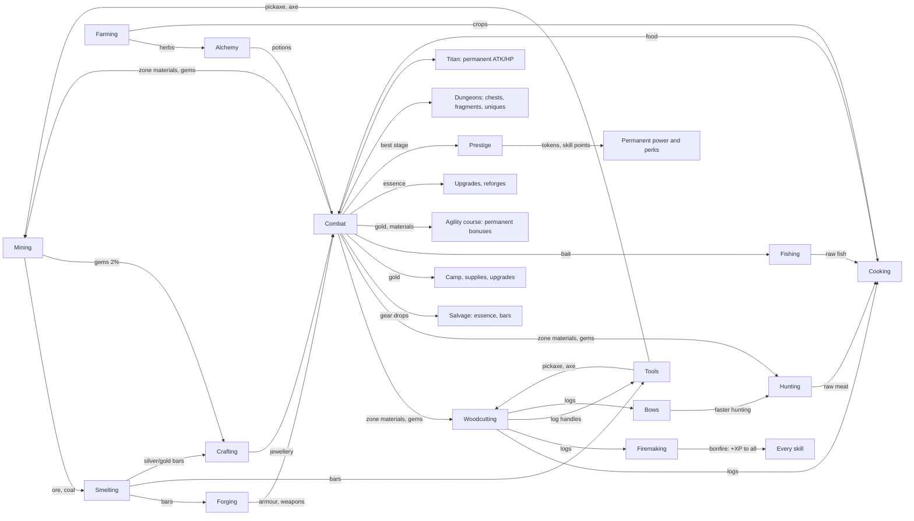

# Fantasy Idle — Game Design (v2)

This is the design the code in `src/` implements. Every number here comes from the code or from the
tools in `tools/`; if they disagree, the code is right and this file is stale. The evidence behind
each decision is in [`docs/reports/Fantasy Idle game design research.md`](reports/Fantasy%20Idle%20game%20design%20research.md)
and the six note files under `docs/research_notes/`. Nothing here is final — it is a tuned starting
point that the simulator can move.

**Contents:** [1 Vision](#1-vision-and-pillars) · [2 Core loop](#2-the-core-loop) · [3 Systems](#3-systems) ·
[4 Modifier pipeline](#4-the-modifier-pipeline) · [5 Balance](#5-balance-targets-measurements-and-knobs) ·
[6 Divergences from the research report](#6-where-this-differs-from-the-research-report) ·
[7 What was cut](#7-what-was-cut-from-the-concept) · [8 Code map](#8-code-map)

---

## 1. Vision and pillars

A browser idle RPG in the Melvor Idle / RuneScape tradition: you train gathering and production
skills, turn what you gather into gear, and use that gear to push through combat zones — then
prestige for permanent power and push further.

1. **Everything feeds something.** Every resource has at least one consumer, and combat hands
   materials back to the skills. No dead-end items (the prototype had five unused woods).
2. **Gear tiers are the spine.** Each metal tier roughly doubles power; a new tier is the big
   milestone of each stretch of play. Rarity adds flavour and affixes, never a bigger jump than a tier.
   Combat drops and dungeons are a second route to the same tiers, tuned to run beside crafting
   rather than past it.
3. **Idle is first-class, active is a bonus.** Leaving the game running (or closed, up to the
   offline cap) is the main way to progress, and leaving it alone for a minute earns the Focus bonus.
   Clicking and mini-games help — at most ~1.5× — but are never required.
4. **No permanent walls.** Every stall has at least two ways out: better gear (skills or drops), more
   combat levels (fighting), camp upgrades (gold), dungeons and the Titan, or prestige tokens.
5. **Honest numbers.** Every bonus shown in the UI goes through one modifier pipeline, so what the
   UI says is what the game does (the prototype's achievement rewards were text only).

## 2. The core loop



**Minute to minute:** one action runs at a time — a skill node, a workshop recipe, or combat
(starting one stops the other, like Melvor). **Hour to hour:** gather → smelt → forge the next
armour piece → push a zone → when a boss stops you, farm a dungeon, train the skill that gates your
next metal, or prestige. **Day to day:** prestige when a run stalls (the first one comes at about an
hour), spend skill points on perks, challenge the Titan when it wakes, claim banked daily crates,
let offline progress run overnight.

## 3. Systems

### 3.1 Skills and the XP curve

- **Curve:** the Old School RuneScape / Melvor table, `XP(L) = floor(¼ · Σ_{l=1}^{L-1} floor(l + 300·2^(l/7)))`,
  cap 99 (`src/core/xp.js`). Level 92 is the halfway point to 99 (13,034,431 XP). The prototype's
  `nextXp × 1.5` put mining 50 at 322 years of play; this puts it at ~2.5 hours.
- **Skills (12):** Mining, Woodcutting, Fishing, Hunting (gathering); Cooking, Firemaking, Alchemy
  (production); Farming (parallel, on the clock); Agility (a course you build); Smithing, Crafting
  (workshop); Combat (earned by fighting). Every skill's level matters — workshop levels gate recipes,
  farming levels open plots, agility levels open course slots, combat level gates wearing gear.
- **Nodes** (`src/data/skills.js`): base XP per action grows ~15× across a skill while intervals
  grow only 1.4–2×, so base XP/hour roughly doubles every 15 levels. At Melvor pace an action opening
  past level 20 gives less than its base (runite 62 instead of 130; `src/data/pace.js`, §5.1).
  Example (mining, base XP):

| Node | Level | Interval | XP | | Node | Level | Interval | XP |
|---|---|---|---|---|---|---|---|---|
| Copper | 1 | 3.0 s | 8 | | Mithril | 40 | 3.4 s | 48 |
| Iron | 10 | 3.0 s | 14 | | Gold | 50 | 3.6 s | 65 |
| Coal | 15 | 3.0 s | 18 | | Adamantite | 60 | 3.8 s | 88 |
| Silver | 30 | 3.2 s | 32 | | Runite | 75 | 4.2 s | 130 |

- **Interval model:** `interval = max(250 ms, base / (1 + Σ speed bonuses))` (`actionInterval`
  in `src/core/modifiers.js`). Speed bonuses add within the skill: tools, the Forager perk,
  achievements, pets, agility obstacles, weekend events, mini-game boosts and Focus, plus the
  action's own mastery (§3.20).
- **Gems:** every mining action has a 2% chance to also yield a gem of roughly the rock's tier.
- **Skill capes** (`src/data/capes.js`, Melvor's skillcapes): level 99 in a skill earns its cape
  for good. Each gives a small bonus to its own skill, counted whichever cape is worn: a second ore,
  log, fish, catch, dish, bar, herb or potion 10% more often (a log burning twice, for firemaking),
  +10% crops a harvest, +10% quality on everything made (crafting), +3% speed in every skill
  (agility), +5% attack and defence (combat). The hero puts the new cape on as it is earned (a DCSS
  cloak in the cape's own cloth with a gold hem, `hero/capes/<skill>`); in Settings, once one is
  earned, any earned cape or the rank's cloak can be worn, with the next cape (the skill nearest 99)
  as a silhouette. Capes are worked out from the levels; the save keeps only the one worn
  (`hero.cape`). The 99 card shows the hero in it, and the chronicle's line wears it too.

### 3.2 Resources and dependencies

`src/data/resources.js` defines 73 resources, and a test checks that every one has a consumer. Who
consumes what:

| Resource | Made by | Consumed by |
|---|---|---|
| Ores, coal | Mining, zone drops | Smelting (coal: 0 / 1 / 2 / 2 / 3 per bar for copper / iron / mithril / adamant / runite) |
| Bars | Smelting, salvaging crafted gear | Forging (1–5 per piece), tools, bows, jewellery (silver/gold only) |
| Gems | Mining (2%), zone drops, chests | Jewellery |
| Logs | Woodcutting, zone drops | **Cooking fuel (1 per dish)**, Firemaking, tool handles, bows and rods, agility obstacles, Defense potion (oak) |
| Raw meat | Hunting, zone drops | Cooking; Evasion potion (raw fox) |
| Raw fish | Fishing, zone drops | Cooking |
| Crops | Farming | Cooking (one potato, or two of the others, per dish) |
| Food | Cooking (meat, fish, farm dishes) | Combat auto-eat (smallest dish that fills the gap); Health potion (roast boar) |
| Herbs | Alchemy foraging, Farming, zone drops | Potions |
| Fishing bait | Zone drops (Marsh, Ruins, Frozen Wastes), the Shop | Fishing: one per catch, 50% chance of a second fish |
| Potions | Alchemy | Combat buffs (15 charges each) |
| Essence | Combat, salvaging drops, dungeon chests, the Titan, daily crates | Gear upgrades and reforges |

Sell prices: `base[category] × 1.6^(tier−1)` with bases ore 3, bar 8, gem 25, log 2, raw 3, food 6,
herb 4, crop 3, potion 30. Selling is a bootstrap; combat gold is the real economy (§3.8).

### 3.3 Tools

Crafted, not bought (`src/data/workshop.js`): pickaxes, axes, tinderboxes and hoes are forged in
Smithing; bows and fishing rods are made in Crafting. Each tier gives **+5% speed and +5% "double"
chance** to its skill (tier 5 pickaxe: +25% speed, 25% doubles). For the tinderbox the double is a log
that burns twice (XP and bonfire time); for the hoe, speed is crop growth and the double is a double
harvest. Tools are the main reason a gathering player visits the workshop and a smith visits the woods.

### 3.4 Workshop

- **Smelting:** 2.0–2.6 s per bar; smithing level 1 / 10 / 20 / 35 / 45 / 55 / 75 for copper / iron /
  silver / mithril / gold / adamant / runite; 10–90 XP per bar.
- **Forging:** 3 s per piece. Each metal has a base level (1 / 10 / 35 / 55 / 75) and each piece adds
  to it — Weapon +0, Boots +1, Gloves +2, Head +3, Shield +5, Legs +7, Body +9 — so a new metal starts
  with a sword and ends with a platebody, the way RuneScape's smithing ladder works. Bars per piece:
  Weapon 3, Shield 3, Head 2, Body 5, Legs 4, Boots 1, Gloves 1 (19 for a full set). XP = bars × 18 /
  30 / 57 / 90 / 135 per metal.
- **Jewellery:** 1 silver or gold bar + 1 gem → Ring, Earring or Amulet. The gem sets the base level
  (1 / 10 / 25 / 40 / 55 / 70), the tier and the power (0.8 × the tier's power, like dropped
  jewellery); a gold setting adds 20%. Earrings add +2 and Amulets +4 levels; gold bars need crafting
  30. Silver and gold are jewellery-only metals. (Power used to average the bar and the gem, which
  made a gold-and-amethyst ring a tier-1 item stronger than mithril.)
- **Crafted gear rolls Common to Rare.** Epic and Legendary come only from combat (§3.5).

### 3.5 Equipment

`src/data/items.js`, generator in `src/core/formulas.js`, bag and actions in `src/systems/inventory.js`.

- **Base stats** = `5 × material power × slot multiplier × quality × variance(0.95–1.05)`.
  Material power: copper 1, iron 2.2, mithril 4.8, adamant 10.6, runite 23.4, and the two
  **drop-only tiers** Dragonbone 51 and Abyssal 112 (×2.2 per tier). Slot multipliers (ATK / DEF):
  Weapon 4/0, Shield 0/3, Body 0/3, Legs 0/2, Head 0/1.5, Gloves 0.7/0.7, Boots 0.3/1, Ring 0.8/0.8,
  Neck 1.2/1, Ear 0.6/0.6. Twelve slots (two rings, two earrings).

| Tier | Weapon ATK | Weapon + armour ATK / DEF (common) | Same, legendary | Wear at combat |
|---|---|---|---|---|
| Copper | 20 | 25 / 56 | 35 / 78 | 1 |
| Iron | 44 | 55 / 123 | 77 / 172 | 10 |
| Mithril | 96 | 120 / 269 | 168 / 376 | 25 |
| Adamant | 212 | 265 / 594 | 371 / 831 | 40 |
| Runite | 468 | 585 / 1,310 | 819 / 1,835 | 60 |
| Dragonbone (drop only) | 1,020 | 1,275 / 2,856 | 1,785 / 3,998 | 75 |
| Abyssal (drop only) | 2,240 | 2,800 / 6,272 | 3,920 / 8,781 | 90 |

- **Rarity = quality + affixes**, never a raw multiplier: Common ×1.00 / 0 affixes, Uncommon ×1.08 / 1,
  Rare ×1.16 / 2, Epic ×1.25 / 3, Legendary ×1.40 / 4. Because tiers are ×2.2 apart, **a common of
  tier N always beats a legendary of tier N−1** (a test enforces this). The prototype multiplied stats
  by up to 64× and let legendary copper beat runite.
- **Affixes** (8 kinds): crit chance, crit damage, attack speed, dodge, lifesteal, gold find, combat
  XP, max HP. Values roll once and scale +8% per tier. Totals are capped in the pipeline (§4).
- **Upgrades:** +5% base stats per level, max +10. Cost: `2 × level × tier` essence plus
  `4 × level × (gold per kill at your best stage)` gold, so the price keeps pace with gold income.
- **Reforge:** rerolls an item's affixes (not its rarity or base stats) for `3 × tier × min(10, 1 +
  reforges so far)` essence and 10 kills of gold.
- **Salvage:** dropped gear → essence (`ceil(0.8 × tier × (rarity rank + 1))`), crafted gear → ~40% of
  its bars back (whole bars, fair on average). Either way, half of the essence spent upgrading the
  item comes back.
- **Bag and lock:** 40 rolled items. Overflow auto-salvages the weakest unlocked item, but never the
  best upgrade for a slot — if nothing else can go, the bag overflows instead (a bag full of locked
  items once made every new drop, however good, salvage on arrival). An auto-salvage filter (off /
  common / uncommon / rare) salvages low drops on arrival unless they are upgrades. Locked items are
  never sold or salvaged. Nothing is ever silently deleted.

### 3.6 Combat

`src/systems/combat.js`, formulas in `src/core/formulas.js`, stats in `src/core/modifiers.js`.

- **Timers:** player and enemy attack on independent timers (player 1.5 s base, min 0.5 s; enemy
  2.2 s at stage 1, −8 ms per stage, min 1.3 s). Large time steps resolve attacks in time order.
- **Player stats:** `ATK = (5 + gear ATK) × (1 + Σ ATK%) × token layer × camp layer`; DEF likewise
  without the unarmed 5; `max HP = (100 + 12 × (combat level − 1)) × (1 + Σ HP%) × token layer × camp layer`.
  Combat level gives +1.2% ATK and DEF per level (×2.18 at 99).
- **Damage taken:** `dmg = max(ATK_e² / (ATK_e + DEF), 10% of ATK_e, 1)`. DEF equal to the enemy's ATK
  halves damage, and no amount of DEF blocks more than 90%. The prototype subtracted DEF flat, which
  made the player immune until a boss's ×2 ATK suddenly killed them — every wall was a boss.
- **Crits:** 5% × 1.5 base; affixes and combo add. **Dodge**, **lifesteal** from affixes/potions.
- **HP:** no refill between enemies. Regen 0.1% of max HP per second in combat, 2% per second out of
  combat. **Auto-eat** below 50% HP (Gourmet perk raises it), "Auto" picks the smallest food that
  fills the gap. **Potions** hold 15 charges; one is used per player attack.
- **Clicks and combo:** clicking the enemy lands a half-damage hit (at most ~5 clicks/s count) and
  adds a combo stack (diminishing, max 30, decays after 1.5 s idle). Each stack is +3% damage; 10+
  stacks give +10% crit, 20+ give +15% lifesteal, 30 gives 20% echo strikes.
- **Boss timer:** a boss must fall within **30 seconds of fighting** (the clock only runs while you
  fight, so it works the same offline). If it holds out you step back one stage and farm there for
  60 seconds before it is retried automatically; beating it sooner (by stepping forward) ends the
  wait. Bosses are the DPS checks; regular stages test survival.
- **Death** retreats to the start of the zone (from a zone's first stage, one stage back, never onto
  the previous zone's boss) with half HP. The hero then rests at the campfire until his health is full
  (about 25 s) and goes back into the fight by himself (`combat.recovering`); "Stay at camp", starting
  work or entering the fight at once call that off. Offline replay does the same, so a fall early in a
  long absence costs a rest, not the absence.
- **Death:** retreat to the start of the zone (a boss death sends you back 9 stages), HP set to 50%,
  a rest to full health, then the fight goes on from there. **Farm mode** ("Stay on this stage") keeps you on the current stage; the map, and the stones on
  the scene's stage path, take you back to any stage reached this run.
- **Boss payouts:** a boss pays its bonus (gold ×3, XP ×5, its loot table) only on its **first fall
  in a run** — the kill that moves you on — and the Titan always does. A boss you farm after beating
  it, and every dungeon boss, pays like the regular monsters its health is worth (a ×3-health boss
  rolls regular loot three times). Parking on a boss is never the best farm.
- **Modes:** the same loop runs the stage ladder, a dungeon run or a Titan fight
  (`state.combat.mode` = `stages` / `dungeon` / `titan`).

### 3.7 Zones, enemies and loot

`src/data/zones.js`. Ten authored zones of ten stages; stage 10 of each is a boss. After stage 100
the Abyss repeats with a depth counter and steeper growth.

- **Enemy HP** = `25 × 1.075^(s−1)` to stage 100 (×2.06 per zone), then ×1.085 per stage.
  **Enemy ATK** = `5 × 1.065^(s−1)`, then ×1.075. **Bosses** ×3 HP, ×1.6 ATK.
- **Two tiers per zone.** `tier` is the zone's richness (material quantities, gems, boss essence);
  `gearTier` is the tier of gear that drops there. Prestige carries players through the early zones
  far faster than they can smith (stage 60 in ~1.5 h, mithril in ~2–4 h), so the gear tier follows
  the crafting timeline instead of the zone number: each zone drops about the tier a typical player
  crafts when they first get there, and a drop one tier up is the lucky case. The drop-only tiers
  live in the Abyss: Dragonbone from depth 3 (stage 121), Abyssal from depth 5 (stage 141).
- **Deeper Abyss drops keep pace.** Past depth 5 there is no new tier, so every further depth makes
  dropped gear **×1.8** stronger (an item level; the card shows "depth N"). Monsters grow ×2.26 per
  depth (×1.085 per stage), so gear alone never quite keeps up and the climb slows as it goes, but
  it never stops: without this, every simulated player stalled for good at the stage 200 boss.

| Stage | Zone | Enemy | HP | ATK | Gold (first fall) | Combat XP | Loot tier | Tokens if best |
|---|---|---|---|---|---|---|---|---|
| 1 | Sunlit Meadow | Slime | 25 | 5 | 6 | 3 | 1 | 0 |
| 10 | Sunlit Meadow | Goblin Chieftain (boss) | 143 | 14 | 107 | 168 | 1 | 1 |
| 30 | Glimmering Caves | Crystal Golem (boss) | 610 | 49 | 458 | 533 | 2 | 11 |
| 50 | Stormy Highlands | Orc Warlord (boss) | 2,594 | 175 | 1,946 | 912 | 2 | 27 |
| 70 | Ember Volcano | Ember Drake (boss) | 11,021 | 616 | 8,266 | 1,299 | 3 | 46 |
| 90 | Skyreach Spire | Thunder Roc (boss) | 46,818 | 2,173 | 35,114 | 1,691 | 4 | 70 |
| 100 | The Abyss | Abyss Warlord (boss) | 96,493 | 4,080 | 72,370 | 1,888 | 4 | 82 |
| 120 | Abyss — Depth 2 | Abyss Warlord (boss) | 493,280 | 17,332 | 369,960 | 2,287 | 5 | 110 |
| 130 | Abyss — Depth 3 | Abyss Warlord (boss) | 1,115,299 | 35,723 | 836,474 | 2,487 | 6 | 125 |
| 150 | Abyss — Depth 5 | Abyss Warlord (boss) | 5,701,460 | 151,748 | 4,276,095 | 2,891 | 7 | 156 |

- **Rewards per kill:** gold `0.25 × enemy max HP` (a boss's first fall ×3 on top of its ×3 HP);
  combat XP `3 × stage^1.05` (first fall ×5); a zone material with 35% chance (first-fall bosses
  always), quantity `1 + floor(zone tier / 3)`; a gem 3% (first-fall bosses 30%); essence 10% for 1–2
  (first-fall bosses 3–6 × zone tier / 2).
- **Gear drops:** 0.2% of regular kills, 50% of a boss's first fall. Tier = the zone's gear tier −1
  (60%) / same (35%) / +1 (5%). Rarity weights common → legendary: regular 50 / 35 / 12 / 2.5 / 0.5,
  boss 20 / 40 / 28 / 9 / 3, with epic and legendary ×(1 + 0.15 × (tier − 1)). An AFK fighter sees a
  few drops an hour and salvages most of them.
- **Zone loot tables** feed the skills at the zone's tier — e.g. the Forest drops iron ore, coal,
  oak logs and raw fox; the Volcano drops runite ore, yew logs and raw bear. Combat is never a dead end.
- **Gilded monsters:** one regular monster of the stage ladder in 150 comes gilded (never a boss, a
  dungeon elite or the Titan): the same fight for 5× gold, 2× XP, a gem and 3–6 × zone tier / 2
  essence for certain. The scene turns it gold with a banner and a chime as it arrives; it counts
  toward its kind in the bestiary and in `stats.gildedKills`, and the Gold Rush medal (25 of them)
  makes them come 50% more often (`gildedMult`). About +3% gold over a run: in the simulator the
  runs with and without them land within each other's spread (DESIGN §5.2 is chaotic past 50 h).

### 3.8 Economy: gold, camp and supplies

- **Sources:** combat kills (dominant), the Titan, selling materials and items, daily crates.
- **Sinks:** camp upgrades, gear upgrades and reforges (with essence), supplies, farming seeds, and
  agility obstacles and their upgrades — the long-term sink. In the simulator over 90% of gold is spent
  while the course is being built (the first ~50–90 hours), mostly on gear upgrades and agility; see
  §5.3 for the late game.
- **Camp** (`src/data/camp.js`) — the run-scoped power layer, bought with gold and **reset on
  prestige**: Whetstone +5% ATK, Armour Rack +5% DEF, Hearth +4% HP per level, multiplicative, max
  25 levels each (×3.39 / ×3.39 / ×2.67 when maxed), cost `base × 1.30^level` (60 / 60 / 50 base).
  It turns each new run into a climb and gives gold a job.
- **Supplies** (gold shop): coal, logs, herbs, rabbits, bait and the Essence Cache (10 essence for 80
  kills — the open-ended late-game sink) priced in "kills at your best stage" (25–40 regular kills;
  a boss stage prices like its regular monsters), so the price scales with income and can never be
  resold at a profit (the prototype's Coal Wagon printed +350 gold per purchase).
- **Gold resets on prestige.** It is run currency, like Clicker Heroes' gold.

### 3.9 Prestige, tokens, skill points and perks

`src/systems/prestige.js`, `src/data/perks.js`.

- **Available** from stage 10, once the run has lasted **10 minutes** (otherwise a run that starts
  past stage 10 could be prestiged again at once, forever). Resets: stage (restart at 10% of your
  all-time best), gold, camp.
  Keeps: skills and mastery, gear, tools, materials, essence, achievements, tokens, perks, pets,
  dungeon clears and fragments, Titans defeated, the agility course and farming plots.
- **Tokens** = `floor(((best stage this run − 5) / 5)^1.5)`: 1 at stage 10, 27 at 50, 82 at 100,
  156 at 150. Tokens are **held, never spent**; each is a permanent +0.5% ATK and DEF and +0.25% HP,
  in its own multiplicative layer. The Eternity achievement adds +10% tokens.
- **Skill points:** 1 per prestige for a run that reached at least half your all-time best, plus 1
  for every 25 stages of all-time best (each threshold pays once). Spent on eight perks: Knight (+4% ATK), Warlord (+4% HP), Rogue (+3% attack speed), Forager
  (+3% skill speed), Scholar (+3% XP), Endurance (+2 h offline cap), Gourmet (+5% auto-eat threshold
  and food healing), Fortune (+5% gold and drop chance), and Paragon (+1% ATK, DEF and HP, 200 levels)
  so skill points always have a use once the others are full.
- **Why polynomial tokens:** see §6.1 — an exponential token formula ran away in the simulator.
- **A name** (`state.hero.name`, set in Settings, sanitised by `heroName` in `src/core/text.js`:
  one line of plain text, up to 20 characters; empty is "You") shows over the hero in the fight and
  on his panel in the Inventory.
- **Ranks** (`src/data/ranks.js`): prestiges earn the hero a title worn as his cloak's colour, the
  gear rarities' colours and then past them: Recruit (red), Adventurer (1, green), Veteran (5, blue),
  Champion (15, purple), Hero (40, gold), Legend (100, white), Mythic (250, black), at about 1, 5,
  12, 30, 60 and 150 hours of play in the simulator. No bonus: a mark of how far he has come. A rank
  badge sits by the hero in the Inventory and on the Prestige panel (with the count to the next), and
  a prestige that earns one is a card of its own with the hero in his new cloak.
- **Looks and name** (`src/data/looks.js`, `state.hero`): the player names the hero and picks one of
  ten looks (DCSS player bases and hairstyles: men and women of three skin tones, an elf pair, a
  dwarf), on the title card (arrows beside the hero) or in Settings (portraits). Six more are earned
  with medals (an orc for Dungeon Delver, a gold djinni for Gold Rush, a gargoyle for Titan Slayer,
  a mummy for Monster Scholar, a demonspawn for Abyss Walker, a ghoul for the secret Unbroken): the
  medal's card shows the hero in it, and Settings shows the next one as a silhouette naming its medal
  (never a secret one's). Cosmetic only; the gear and the rank's cloak go on top. Text addresses
  "your hero", never a pronoun.

### 3.10 Fishing, Firemaking, Farming and Agility

- **Fishing** (`src/data/skills.js`): seven spots from Shrimp Shallows (1) to Leviathan Deep (90),
  paced like Hunting. Fish cook into the best food per level (~10% more healing than meat). Each catch
  uses one **bait** if you have any, for a 50% chance of a second fish; bait drops in the wetter zones
  and the Shop sells tins. Rods (Crafting) are its tool.
- **Firemaking:** burns logs for XP (the log sink) and feeds the **bonfire**: each log adds 15 s × its
  tier, up to an hour, on the wall clock. While it burns every skill — combat included — earns +5% XP,
  rising to +10% at Firemaking 99. Tinderboxes (Smithing) are its tool.
- **Farming** (`src/data/farming.js`, `src/systems/farming.js`) — the first **parallel** skill: up to
  six plots (opening at levels 1, 1, 15, 30, 50, 70) grow on the wall clock while any other action runs
  and while the game is closed. Planting is a click and buys the seed at a flat price (25 gold for
  potatoes to 4,000 for starfruit); harvesting pays the crop and XP per unit. Eight crops: four herbs
  for Alchemy and potatoes, cabbages, pumpkins and starfruit for four new dishes. Harvest XP per
  plot-hour roughly doubles every ~15 levels. "Harvest ready & replant" replants the same crops.
  Hoes (Smithing) speed growth and can double a harvest.
- **Agility** (`src/data/agility.js`, `src/systems/agility.js`): a course of six slots (opening at
  levels 1, 10, 25, 40, 55, 70), each holding one of three obstacles. Building costs a fixed amount of
  gold — 20k, 200k, 1.5M, 10M, 60M, 300M, about an hour of one run's income where the slot opens — plus
  logs and bars (the last slot also 5 diamonds). Every obstacle is a **permanent bonus that survives
  prestige** (gathering or production speed, ATK/DEF/HP, gold, drops, crit, offline hours, workshop
  speed, farming yield, XP, attack speed, dodge, all-skill speed). Obstacles upgrade to **level 5**:
  each level adds the bonus again, costs the slot's price × 2^level and needs 7 more agility levels.
  Running the course is an action that takes as long as its obstacles together and pays their XP
  (+25% per obstacle level). Replacing an obstacle has no refund.

### 3.11 Dungeons and unique items

`src/data/dungeons.js`, `src/systems/dungeon.js`. A dungeon is an authored gauntlet: elite
monsters (×1.4 HP, ×1.15 ATK) and a boss (×1.5 on top of the boss multipliers) with a **60-second
timer**, fought with the gear you walk in with — gear is locked inside, and the run starts at full
health. Dying, leaving or running out of time loses the run; clearing it (the boss falls) is a win
that opens a chest. **After the first clear of a visit the hero waits at the open chest** (it stands in
the boss's place on the scene) and a dialog offers **Keep going** (the run starts again after every
clear, until the hero leaves; an ∞ marks it) or **End the dungeon** (back to the stage the hero left,
fighting on). A player watching goes back to the Dungeons tab when a visit is over: after End the
dungeon, Leave dungeon, or a lost run (a fall or the boss's timer, once the defeat has shown); map
Travel, the Titan and a prestige keep the fight on screen, and a player on another tab stays there. With no answer in `DUNGEON_CHOICE_MS` (30 s), or with nobody there while away, the hero
keeps going, so idle time is never lost; leaving while waiting is not a failure, as the run is won.
There is no standing repeat switch any more (old saves drop `combat.autoRepeat`). During a run the
fight's dock leads with a panel of its own: the clears, the unique's fragments (Assemble once there are
50), the choice while waiting with its countdown, and the run's orders (Leave dungeon, Map).

| Dungeon | Opens at | Like stages | Boss (HP / ATK) | Chest loot tier | Unique |
|---|---|---|---|---|---|
| Goblin Warren | 20 | 25–31 | 984 / 52 | 2 | Goblin King's Crown (Head, tier 2) |
| Crystal Depths | 50 | 55–62 | 9,269 / 372 | 3 | Crystal Heart (Amulet, tier 3) |
| Orc Stronghold | 80 | 85–93 | 87,243 / 2,625 | 4 | Warlord's Cleaver (Weapon, tier 4) |
| Dragon's Lair | 120 | 125–135 | 2,515,540 / 51,285 | 6 | Dragonheart Plate (Body, tier 6) |
| Void Citadel | 160 | 165–175 | 65,738,659 / 925,413 | 7 | Void King's Aegis (Shield, tier 7) |
| Abyssal Maw | 210 | 215–227 | 4,572,642,334 / 39,771,879 | 7 (at depth 12) | Starless Band (Ring, tier 7) |

- **Worn, a unique shows on the hero:** the Goblin King's Crown as a gold crown, the Warlord's
  Cleaver as an executioner's axe, the Dragonheart Plate as red dragon armour and the Void King's
  Aegis as a violet tower shield (`hero/<layer>_unique/<id>` in the atlas; the Crystal Heart, an
  amulet, has no layer of its own).
- **Placement:** each dungeon sits about where a typical player reaches its unique's tier by crafting,
  so a unique rewards farming a little early instead of skipping tiers.
- **Monsters pay like ladder monsters of the same health** (the boss too, §3.6), so the chest is the
  whole bonus: one **fragment** (3% chance of three), `0.5 × zone tier` essence, three material
  picks from the zone, a gem 50% of the time, and boss-quality gear of the chest tier 4% of the time,
  as strong as the dungeon's depth in the Abyss makes it (like its monsters' own drops: ×3.2 in the
  Citadel, ×61 in the Maw; before, chest gear ignored the depth and was weaker than the drops beside
  it). A strong hero clears a run in well under a minute, so a chest is never a jackpot.
- **Uniques:** 50 fragments assemble the dungeon's unique; a chest holds it outright 0.2% of the time.
  Uniques are Legendary with fixed affixes (the Crown: +15% gold find, +4% crit, +5% HP) and 10% more
  base power than their tier — the best piece of that tier, not a tier skip. The first copy starts
  locked; a spare (assembled or found again) arrives unlocked, to salvage for essence. Uniques cannot
  be reforged.
- **The Abyssal Maw** is the long game's dungeon: it opens at stage 210, about 83 hours into the
  simulator's play at Melvor pace, and its careful player first clears it at about 177: twelve horrors of the deep Abyss and the Devourer. Its unique, the Starless Band, is
  worth its affixes rather than its power, since gear dropped that deep is dozens of times stronger
  than any tier's base: +8% prestige tokens, +15% combat XP, +10% drop chance, +30% crit damage. Its
  painting (`maw`) is a cavern like an open maw: black stone fangs at the edges, motes of dying light
  and a ring of cold teal light around the chasm, over a ledge of cracked basalt.
- **Clear milestones** per dungeon, permanent: 25 clears +2% ATK and DEF, 100 clears +3% gold and drop
  chance, 250 clears +3% max HP.
- **Readiness:** the Dungeons tab estimates the boss fight (time to kill vs the timer, and how long you
  last without food), coloured green / amber / red.

### 3.12 The Titan

Once an hour (from stage 20) you may challenge the Titan: a **60-second damage race** at full health
against a boss with ten times a boss's health. Titan level L fights like stage `10 × (L + 1)` (level 1:
2,963 HP; level 10: 2.2 M HP). A win is permanent: **+2% ATK and max HP** per Titan defeated, plus
`8 × L` essence, 30 kills of gold at your best stage and two gems; the next Titan is stronger. A loss
pays essence for the share of health you took off. A Titan fight never survives a reload.

### 3.13 Pets and the collection

`src/data/pets.js`. One pet per skill (twelve, combat included), found at random while training and
kept forever. Melvor's formula: the chance per action is `action seconds × skill level / 25,000,000`, so the
expected wait is about `25,000,000 / level` seconds of training (~70 h at level 99) whatever the
action's speed; combat rolls once per kill as a 4-second action and farming once per harvest as an
action as long as the crop's growing time. Each pet gives +3% speed to its skill (Fang, the combat
pet: +3% ATK and DEF; Sprout, the farming pet: +3% growth speed). The Achievements tab lists pets and uniques as a collection.
A pet found also keeps the hero company: Fang (or, until he comes, the first pet found) stands at his
feet in the fight, and each skill's pet beside him on that skill's stage, bobbing gently.

**The bestiary** (`src/data/bestiary.js`). Every kind of monster (76: the ten zones' five each, then
the dungeons' own, each listed once where it is first met; the Titans are left out, as each falls
only once) has a portrait in the Achievements tab's Bestiary (beside the Medals, the Collection and the
hero's Records: lifetime numbers as big figures, and the chronicle, the hero's firsts with their
dates, noted from the game's events as they happen, offline too, by `src/systems/chronicle.js`), with how many have fallen and up to three
stars: one at 10 defeats, two at 100, three at 1,000 (228 in all). Defeats are counted per kind in
`stats.killsByMonster` (dungeon elites count too), and the stars total is `stats.bestiaryStars`,
recounted from the table when a save loads; old saves start with an empty table and see the kinds
they have stood beside as met. A star is a toast with the monster's sprite. Two medals ride on it:
Naturalist (25 stars, +5% gold) and Monster Scholar (100 stars, +5% drop chance). The places reached
are shown, the next as silhouettes; a kind not met yet is a black shape and "???".

### 3.14 Achievements, unlocks and the daily crate

- **Achievements** (`src/data/achievements.js`): 36 open and 3 secret, each with a named reward applied through the
  pipeline **plus** +1% ATK, DEF and skill speed per achievement (Antimatter Dimensions / Cookie
  Clicker "milk" pattern). Dungeon clears, Titans, pets, uniques, the new skills, a finished agility
  course and mastery (500 and 2,500 levels, a first 99) have their own. A test checks that every bonus in the data is well-formed (the Forager perk
  once had a malformed bonus and did nothing). Three are **secret** (`secret: true`): not shown nor counted in the Hall
  until earned (pat your pet 25 times, open a great crate, get back up after 100 falls), so finding
  one is a small surprise; the Hall's count is of the medals shown.
- **The gear codex** (`state.codex`, `CODEX_TYPES` in `src/data/items.js`): a page per kind of gear
  and tier, 70 in all, filled by `addItem` whenever a piece arrives (kept or salvaged on landing);
  shown in the Hall's Collection. The Armourer medal comes at 40 pages.
- **Unlocks** (`src/data/unlocks.js`): tabs appear when a predicate on the state becomes true —
  Smithing after mining 5 times, Woodcutting after the first bar, Hunting at stage 5, Cooking after the
  first hunt, Fishing after 5 dishes, Firemaking after 20 logs, Alchemy / Shop / Prestige /
  Achievements at stage 10, Dungeons at stage 20, Agility at stage 30, Farming after 10 Alchemy actions
  or Cooking 15, Crafting at mining 20 or the first gem (but never before the first bar: jewellery
  needs bars, and a lucky gem in the first minute used to open Crafting ahead of Smithing). Each goal
  carries a `task` in a few words and the `tab` where the work happens; the sidebar's Next card
  shows it with its progress. Settings has a developer switch (and `?dev=1`) that unlocks all.
- **Daily crates** (`src/systems/daily.js`): one ripens every 20 hours and **up to three wait for
  you**, so a missed day costs nothing; no streaks. A crate holds 40 kills of gold at your best stage,
  12 materials and a gem from that zone, and `3 × zone tier` essence. Every seventh crate opened
  (a count, not consecutive days, so still no streak to lose) is a **great crate**: three times the
  gold, twice the rest, and a gem of the next tier besides (+29% over a week). The crate's dialog
  shows seven little crates for the way there.
- **No suggestions.** There used to be an advisor: notes on what to do next (forge this, plant
  that, the Titan is awake, spend your skill points), first as a quest board and then as a strip
  under the scene. It was taken out to keep the screen simple. What is ready shows where it lives
  instead: the next unlock in the sidebar's Next card, a ▲ on gear that beats what you wear (and
  a one-tap Equip in the fight), a lit camp upgrade you can afford, a glowing Perks button when
  there are skill points, a crate button when one is ripe, and a badge on a place's tab in the
  sidebar when something waits there: the count of ripe plots on Farming, a gold "!" on Dungeons
  when the Titan is awake and the hero can beat him (a badge always on would say nothing) or a
  unique can be assembled, a ▲ on Inventory for better gear. The browser tab's title says what the
  hero is doing ("Ember Volcano stage 64", "Copper Vein"), with a ★ when a crate or crops wait.

### 3.15 Active play: mini-games and Focus

- **Mini-games** (`src/systems/minigame.js`) are **opportunities**, not a job: while you train a
  gathering or production skill, a first chance appears after 45–90 seconds and then one every 3–6
  minutes, each open for 20 seconds.
  A win gives +35% skill speed for 90 seconds (+5% per consecutive win, up to +55%); a miss costs
  nothing but the streak. A fully attentive player gains roughly +15% on average.
- **Focus** (Clicker Heroes' idle ancients): after **60 seconds without a click or key press** the hero
  settles in — +15% skill speed and +15% attack speed until the next input. It also applies to offline
  progress, so leaving the game alone is never strictly worse than clicking.

### 3.16 Offline progress

`src/systems/offline.js`. On load (and when a tab wakes after a minute or more) the game replays the
time away with **the same code as online play**, silently: skill actions complete one by one
(consuming inputs, stopping when they run out), workshop actions forge real items, and combat —
including a dungeon run on repeat — is replayed in 1-second steps with food, potions, the boss timer
and death (after a fall the hero rests to full health and fights on, as online, so one early fall
doesn't waste the absence). The replay runs on the clock, so the bonfire burns out, Focus starts and a weekend event
begins or ends when it really did. Farming plots run on timestamps and need no replay. A tab that
ticks less often (browsers slow hidden tabs to once a minute) is simulated in 5-second steps, and a
kill hands the rest of a step to the next monster, so the step size never changes the result. Capped at
**12 hours** (+2 h per Endurance perk, up to 24 h, +1 h from the Zipline). Absences under a minute
are ignored. The "Welcome back" summary lists gains, materials used, levels, dungeon clears, pets,
plots ready to harvest, how often the hero fell and got up, and why work stopped early.

### 3.17 Saves, cloud and the API

- **Local save** (`src/core/save.js`): `localStorage['fantasyIdle.save.v2']`, versioned
  (`state.version = 3`), autosaved every 15 s and when the tab is hidden or closed. Prototype saves
  (`fantasyIdleSaveLocal`) are migrated on first load; v2 saves gain the banked daily crate.
  Broken records (an unknown dungeon, a missing Titan or pet record) load as defaults. Loading also
  takes each value only if it has the default's type, drops keys the game doesn't know (including
  `__proto__`, which could otherwise reach every object on the page or the server), and rebuilds
  every item from the game's own tables. A shared save string can't inject markup or break the save.
- **Backups:** three rotating automatic backups (every 10 minutes) plus one on load, one before each
  prestige and one before a hard reset, restorable from Settings.
- **Export/import:** `FI3:` compressed text (or `FI2:` base64 JSON); saves from a newer version are
  refused.
- **Cloud (optional):** the game works as a guest. Signing in uses the real API (`api/index.js`):
  bcrypt passwords, JWTs that expire after 30 days, validated usernames and passwords, 1 MB body cap,
  version-checked saves. The client uploads every 60 s. When a local and a cloud save disagree it
  prefers more play time, and asks the player if the save times disagree with that (compared from
  before offline progress) or if the saves come from two different games. Nothing is uploaded while
  the question is open. On a static host without the API, sign-in says cloud saves are unavailable
  instead of failing.
- **Server secret:** `JWT_SECRET` must be set outside local development (`NODE_ENV=development`);
  tokens are HS256 only.
- **Time away is measured on the server's clock** for cloud saves: `/api/load` returns the time of the
  last upload and the server's current time, and the client replays exactly that gap, so changing the
  device clock doesn't buy offline progress.
- **Plausibility flags:** every ranked number (best stage, Titans, dungeon clears, total XP, tokens)
  may grow only as fast as play could in the real time since the previous upload, and none may pass
  a ceiling no save reaches (checked on the first upload too). Going back, as when restoring a
  backup, is not flagged. Nothing is rejected (the save belongs to the player), but flagged accounts
  are left out of leaderboards and of clan boss sizing for 30 days. A determined cheat can still
  fake a save that grows plausibly; that is the limit of a client-side game.

### 3.18 Clans and leaderboards

`api/index.js` (routes), `api/store.js` (all SQL), `src/core/power.js` (the numbers). Everything is
asynchronous and **every number another player sees is computed on the server from the stored save**
with the game's own stat code; the client never submits damage or scores.

- **Clans** of up to 20, with a name, tag, description and "looking for" line; the longest-serving
  member takes over if the owner leaves, and the last one out closes the clan. Members hold numbered
  places (unique per clan), so parallel joins can't overfill a clan. The owner can remove a member.
- **The weekly clan boss** (ISO weeks, UTC). Its health is set when the week's boss first appears:
  12 × the combined attack of members who aren't flagged, capped so no save can overflow it. Every
  member has **three attacks a day** (enforced by a unique
  per-player-per-day slot, so parallel requests or switching clans don't add more); an attack uploads
  the save and deals what that hero does in 60 seconds (`expectedDps × 60`, no dice, Focus, potions or
  timed boosts). Rewards, claimed from the Clan tab: 100 essence and 2 diamonds to everyone who fought
  when the boss falls, 50 essence and a diamond for the last hit, and when the week ends 50 essence for
  taking part plus 100 / 60 / 30 essence and a diamond for the top three. Claiming twice pays once; a
  week is settled by whichever request claims it first, and weekly, kill and last-hit rewards are paid
  once per player per week even for someone who fought for several clans.
- **Leaderboards** are opt-in with a plain-language consent line: username plus best stage, total
  level, Titans or dungeon clears, all time or this week (from each player's first save of the week).
  The numbers are computed once per upload and stored, so a board is one query.
- **Polling:** the Clan tab refreshes on opening and then at most once a minute, only while it is open.
  A Discord invite link appears if `DISCORD_INVITE` (`src/data/social.js`) is set — there is no in-game
  chat.

### 3.19 Weekend events

`src/data/events.js` (content), `src/systems/events.js` (logic). A template for timed content that
needs no server: the schedule is the UTC calendar, so events run offline too.

- **When:** every weekend, Friday 00:00 to Monday 00:00 UTC. Six events rotate week by week:
  **Harvest Festival** (+25% farming yield, +15% cooking and fishing speed), **Titan's Fury** (+20%
  combat XP and gold, +10% drop chance), **Miner's Rush** (+20% gathering speed, +10% XP in every
  skill), **Guild Fair** (+20% smithing, crafting and firemaking speed, +5% crafted quality) and
  **Gold Fever** (gilded monsters three times as often, +10% gold from combat), and from 16 October
  2026 **Lucky Paws** (pets three times as likely, +10% XP in every skill). An event joins as a new era
  of the rotation (`ROTATION_ERAS` in `src/systems/events.js`) starting at a future weekend, so no
  weekend already run changes its event and nobody loses a running event's milestones. The
  bonuses go through the modifier pipeline like any other source. None of them touch combat stats, so
  clan damage is the same during an event.
- **Festival Tokens:** every 20 skill actions or kills earn one (a harvest counts as 5), up to 60 a
  day (UTC), so a weekend pays at most 180 and nobody has to grind past a normal session. Tokens keep
  between events.
- **Milestones** per event, paid automatically: 50 tokens → 100 essence, 100 → 200 essence and a
  diamond, 150 → 300 essence and two diamonds.
- **The event shop** (open only while an event runs): 60 essence for 20 tokens, a diamond for 40,
  100 bait for 10, ten of each herb for 15, ten runite bars for 60.
- **Adding an event** is one entry in `EVENTS` (id, name, icon, colour, description, `mods`). For
  testing, `?dev=1&event=<id>` runs one immediately; it is never kept in the save.

### 3.20 Mastery

`src/data/mastery.js` (rules and numbers), `src/systems/mastery.js`. Melvor's mastery without the
pool: every repeatable action has its own level from 1 to 99, earned by doing it.

- **Which actions:** every gathering, cooking, firemaking and alchemy node, every smelting recipe, and
  one mastery per metal for forging and per gem for jewellery (all pieces of that metal or gem share
  it) — 77 in all. Tools, the agility course and farming have none.
- **Mastery XP** per action = the action's base time in seconds, so an hour on anything is worth the
  same; faster actions (tools, boosts) master faster. Levels use the skill XP table ÷ 72: level 25
  after about two minutes, 50 after ~25 minutes, 75 after ~5 hours, 90 after ~21 hours and 99 after
  ~50 hours on one action at base speed. Players reach 99 in a skill long before its best action is
  mastered, so mastery is the long tail after 99.
- **What each level gives** (above level 1, linear, so every level counts): +0.1% speed on that
  action (+9.8% at 99); +0.25% chance to double its output (+24.5%) when it produces resources —
  gathering, cooking, alchemy, smelting, and a log burning twice in Firemaking; +0.2% chance to keep
  the ingredients and fuel (+19.6%) when it has any, forging and jewellery included. These add to the
  skill's own speed and double chance.
- **Skill-wide:** the skill header shows the mastery levels gained out of the maximum. Three
  achievements reward the total: Well Practised (500 levels: +5% speed in every skill), Polymath
  (2,500: +5% double chance in every skill) and Grandmaster (a first 99: +5% XP).
- **Kept through prestige**, replayed offline (the replay speeds up as levels come), and on each save
  load unknown actions are dropped and the mastery stats are rebuilt from the levels.

### 3.21 Presentation: the battle scene

The Combat tab opens on a stage (`src/ui/scene.js`) rather than a table of numbers. The rules it
keeps:

- **Read-only.** It reads the state and the tick's events (`hit`, `enemyHit`, `dodge`, `kill`,
  `itemDropped`, `death`, `bossTimeout`, `levelUp`, `titan`, `dungeonClear`, `prestige`); the player's
  clicks go back through the same `Game` actions as every button (strike, enter or leave, go to a stage).
- **Built once.** The tab re-renders several times a second; the scene is a separate element that
  only updates text, widths and classes, so an animation is never cut short by a re-render.
- **Two layers of motion.** Idle loops (breathing, bobbing, particles) are CSS on inner elements;
  one-shot moves (lunge, knockback, entrances, the fall) are Web Animations on the outer one, ranked
  so a monster's entrance isn't interrupted by the first hit.
- **Bounded.** At most 8 effects per frame and 14 coins in flight, nothing while the tab is hidden, and
  no floating effects under reduced motion (the setting or the system preference).
- **Clicks on the real clock.** A strike first runs the game up to the current time, so the
  auto-clicker guard (120 ms) measures real time rather than the last 100 ms tick; the first input
  after a long absence gets its welcome-back report the same way.
- **Places.** Each zone has a palette and two silhouette layers (hills, pines, stalactites, reeds,
  peaks, drowned columns, the volcano, ice, cloud spires, void crystals); each dungeon has its own
  painting (a goblin warren under the roots, a crystal lake, an orc courtyard, a dragon's hoard;
  `DUNGEON_ART` in `src/ui/features.js`), shown on its card too, and the Titan looms behind its fight.

Reward moments (`src/ui/rewards.js`) follow the same rules. A level-up gets a celebration card only
when it is a milestone (every tenth level, and 99) or opens something, and the card names what
(`unlocksAtLevel` reads the nodes, recipes, metals, gems, crops, tools and obstacle slots); other
levels stay a toast, so the cards keep their weight. Cards queue one at a time (at most four waiting,
merged by key, so a burst of levels shows the highest). A new place's card carries its painting and
stays long enough to read (seven seconds, or until tapped); its tab also gets a "New" badge until it
is opened (remembered in the browser, not the save). Two more moments get a card on a painting: the
first step ever into a zone (`zoneReached`: its ruler a silhouette, its stages, its drops) and a
dungeon's lasting bonus at 25, 100 and 250 clears (`dungeonMilestone`). A dungeon clear itself is a
banner on the scene with the chest's contents popping out as pictures. Offline replay is silent, so
none of these queue up behind the welcome-back report.

The skill stage (`src/ui/stage.js`) is the same idea for work: a strip of the place's painting above
every skill tab, built once, with the hero holding that skill's tool and facing what he works on. His
swing follows the real action progress and lands on the beat. Farming and Agility have it too: on the
farm he hoes while anything grows (crops grow on the clock, so the hoe keeps its own time) and the ring
is the nearest crop's growth; on the course he runs empty-handed, a bounce every stride and a leap at
the end of each lap. At rest he faces the place's own picture, dimmed, with a line on what to pick.

### 3.22 Presentation: a screen that grows with the player

A new player used to meet everything at once: nineteen tabs (fifteen padlocked), four currencies
(three at zero), seven combat numbers, and under the first fight a camp, prestige, a world map,
potions and a log. The game hid *tabs* until they were earned, but drew every *piece* inside a
screen from the first second. Now the same rule holds inside the screens. The rules:

- **Hidden, not locked.** The sidebar lists the places that are open and one "next" slot (the
  place's painting, its name, the task and a bar). Group headings come when the list is seven long.
  Inside a screen, a piece opens the first time it means something (`src/systems/disclosure.js`):
  a currency when you hold some, the camp with the gold for its first upgrade, the food row with
  Cooking, the potion row with Alchemy, "Stay on this stage" after the first defeat, the world map
  with the second zone, the jewellery slots with Crafting, the bag's tools once there is a bag to
  tidy, mastery after 20 mastery levels, the mini-game with the first chance to play. What has
  opened is saved (`state.seen`) and never closes again: a currency spent to zero keeps its place.
  A loaded save opens with what it has earned, without fanfare; a piece that opens during play
  glows once where it appears.
- **One step ahead, no further.** A ladder shows what is unlocked and the next rung as a
  silhouette: mining shows two cards on day one, not eight; the smithy three, not eighteen. The
  same goes for farm plots, agility slots and dungeons.
- **Each thing is said once.** The next goal lives in the sidebar's Next card, not also in the
  header. The crate has one button. The battle scene starts the fight; the tab below only
  holds the orders. The header says what the hero is doing only when the tab in view doesn't show
  it. The hero's numbers are in the Inventory, by the hero.
- **Cards are quiet at rest.** An action card shows its art, its name, what it needs and how long
  it takes. The card being worked opens up: the pile it has made, XP, luck, mastery, the progress
  bar. The rest is in the tooltip. Smithing is three steps (Smelt, Forge, Tools), one on screen.
  What an action needs is a row of chips, each the item's icon and how many you hold of how many it
  takes ("0/1", red when short); hovered (tapped on a phone), a chip names its item in the game's own
  tooltip, with where it comes from ("Raw Fox · needs 1, you have 11 · from Hunting"). The figures
  of the card being worked name themselves the same way: XP and time (with what the bonuses make of
  the base), the double chance (what doubles, and how much comes from tools and from mastery), the
  keep chance and the mastery bar. Anything with
  a `data-tip` gets that tooltip at once on a mouse (`tipAttrs` in render.js, main.js), and holds
  back the browser's slower one of the card beneath.
- **Every action card has its own picture.** A small painting runs across the card's top, the
  medallion set on its lower edge: the vein, the tree, the fish leaping, the animal, the herb, the
  potion, the ingot, the piece on the anvil, the dish (ninety in all, `assets/paint/cards/`).
  Gemini paints them nine to a sheet and `tools/cards.py` cuts them out; `src/data/cardart.js`
  lists the ones that exist, so a card without its own uses its workshop's (the smithy, the
  jeweller's bench, the kitchen hearth) or none. A locked card shows its picture in grey, and a
  planted farm plot shows its crop's (dimmed while it grows).
- **No plain panels.** Every panel stands on a painting (`painted()` in `src/ui/render.js`, CSS
  `.painted`): a skill's panel continues its stage's painting, the other places reuse their card
  pictures, and nine rooms (`ROOMS` in `tools/paint.py`: the guild hall behind the page, the
  armory, chest, storeroom and vault of the inventory, the perks' library, the settings' study, the
  fight's supply table and war table) cover the rest. A shade lighter at the top keeps titles on the
  painting and cards readable; cards let a little of it through. The sidebar stands on the hall's
  own painting (its red banner behind the mark, its trophy cabinet behind the places); only the
  header is smoked glass over the guild hall. In the sidebar each place is a medallion ringed in its
  skill's colour (gold for the rest) with its XP bar in that colour and its level on a gold-rimmed
  badge (solid gold at 99); the place being worked breathes, its tool bobs and its bar shines.
- **Places have pictures; rules live behind a "?".** `src/ui/features.js` holds, for every place,
  its painting, one line and the rules in a few short points. That one entry is the card shown when
  the place opens, the banner on tabs without a scene or a skill stage (shop, achievements, events,
  clan, dungeons) and the About card behind every "?", which is where the "How it works"
  paragraphs went.
- **Pictures, not emoji.** Everything the player handles has a sprite: perks are DCSS spell and god
  icons in a gold frame, the tools are items (two from DCSS, four drawn in its manner), each agility
  obstacle has its own picture, the daily crate is a DCSS chest and Settings a cog (`build_icons` in
  `tools/resource_art.py`). Controls that are switches rather than things (sound, cloud save, the
  map, retreat, resting, full screen) are drawn line icons in `src/ui/render.js`. Toasts take a
  sprite beside their text.
- **One card per moment.** Places that open together share a card (the first boss opens five), so
  nothing queues up. A card is a button: it goes to the place.
- **The world map** (`src/ui/worldmap.js`) is a painting with the ten zones as pins, opened from
  the zone's name on the scene or the Map button. A pin puts its zone under the map (stages, drops,
  gear tier) with a Travel button; on a phone the pins lose their labels and the zone card names them.
  Once the Dungeons tab has opened, the dungeons stand on it too as arched gates (`DUNGEON_PINS`):
  the open ones and the next as a silhouette, as on the tab. A gate's card has the run's estimate,
  the unique's fragments and Enter. The map opens in a dungeon run too (from the dock, the title or M),
  on that dungeon's gate; Travel from there gives the run up (`travelTo`). Not during the Titan's fight.
  The hero himself, dressed as in the fight, stands beside the pin of where he is.

### 3.23 Presentation: the fight on the whole screen

Entering combat lets the fight take the screen (`battleMode` in `src/ui/render.js`; `main.js` sets
`body.battle-full`). The sidebar and the phone hotbar go out of sight, the header becomes a thin bar,
the battle scene takes all the room that is left with the fighters drawn bigger (whole-number scales,
sized by the room the scene has), and the tab under it becomes a dock. The point is that a run never
needs another screen: fight, spend, prestige and fight on.

- **The dock holds the loop.** The food and the potion with what drops here below them, the orders
  on the side (retreat, the map, stay on this stage),
  the camp as three tokens to tap, and the loop's own buttons: Prestige with what it would pay now,
  Perks (a window over the fight, so skill points are spent there), and the best piece of gear
  waiting in the bag as a one-tap Equip. On a wide screen the groups sit in one row; on a phone they
  stack with prestige and the camp first, and the dock scrolls while the scene keeps its share.
- **Prestige walks on.** `Game.prestige({ resume: true })` starts the new run's first fight if the
  hero was fighting, so the screen never drops back to the menu between runs.
- **The way out is always there.** On the top bar, "Menu" (with a dot when a new place is
  waiting) and the leave-full-screen button both fold the fight back into the page while it goes
  on, and so does Esc; a Full screen button on the combat tab brings it back, and the next fight
  opens full again (a fold is remembered across a reload until then). Retreat ends the fight and
  the mode. "Full screen" means the game fills the browser's window. It does not ask the browser
  for its own full screen: that was tried and taken out, because its button read as the way *out*
  of the full-screen fight, and on a Mac the system menu bar slides over the top bar there.
- **The perks window is everywhere skill points are.** The SP chip in the header opens it on any
  screen, and so do Perks buttons beside Prestige (the fight's dock, the combat tab's prestige strip);
  the Shop shows the same list. Every level costs one point, so the price is said once above the
  list and each row's button says what it does: Learn, then Upgrade, lit only while there are points.
- **Dialogs stay on top.** The map, the prestige confirmation, perks and About cards open over the
  fight; toasts move under the top bar so they never cover the dock.

## 4. The modifier pipeline

`collectModifiers(state)` in `src/core/modifiers.js` gathers every bonus — gear and affixes, combat
level, perks, achievements, pets, skill capes, dungeon milestones, Titans defeated, agility obstacles
(× their level), potions, tools, mini-game boosts, the bonfire, a running weekend event and Focus — into one
object; `deriveStats` turns it into the numbers combat and skilling use. Mastery is the one bonus
that belongs to a single action rather than a skill: `resolveAction` attaches it to the action, and
`intervalFor` and `completeAction` add it on top of the skill's numbers.
Rules:

1. **Inside a layer, percentages add.** All of the sources above add into `ATK%`, `DEF%`, `HP%`,
   `skillSpeed[skill]` and so on.
2. **Layers multiply:** content layer × **token layer** (`1 + 0.005 × tokens`) × **camp layer**.
3. **Caps:** crit chance 75%, dodge 60%, lifesteal 30% (combo bonuses included), attack speed +100% (attack interval ≥ 0.75 s),
   damage mitigation 90%, action interval ≥ 250 ms.
4. **Derived values are never saved** — they are recomputed from state, so a balance change applies
   to existing saves on the next load.

## 5. Balance: targets, measurements and knobs

### 5.1 Pure skill pacing

`node tools/pacing.mjs` — hours of continuous training with the best node, no boosts:

| Skill | Lv 10 | Lv 20 | Lv 30 | Lv 50 | Lv 75 | Lv 90 | Lv 99 |
|---|---|---|---|---|---|---|---|
| Mining | 7m | 17m | 42m | 3.3h | 28h | 105h | 250h |
| Mining + tools | 7m | 16m | 39m | 2.9h | 23h | 86h | 202h |
| Woodcutting | 6m | 18m | 43m | 3.5h | 29h | 106h | 248h |
| Woodcutting + tools | 6m | 17m | 39m | 3.1h | 25h | 87h | 200h |
| Fishing | 6m | 19m | 45m | 3.8h | 33h | 125h | 252h |
| Fishing + tools | 6m | 18m | 41m | 3.3h | 27h | 98h | 195h |
| Hunting | 6m | 20m | 47m | 3.9h | 34h | 124h | 250h |
| Hunting + tools | 6m | 19m | 43m | 3.4h | 27h | 97h | 194h |
| Cooking | 3m | 10m | 23m | 2.4h | 26h | 109h | 223h |
| Firemaking | 2m | 8m | 18m | 2.0h | 21h | 80h | 191h |
| Firemaking + tools | 2m | 7m | 17m | 1.7h | 17h | 65h | 154h |
| Alchemy (foraging only) | 7m | 20m | 43m | 3.2h | 24h | 98h | 237h |
| Smithing (smelting only) | 4m | 10m | 24m | 2.4h | 25h | 102h | 244h |
| Smithing (forging, bars in the bank) | 1m | 3m | 6m | 30m | 4.4h | 17h | 39h |
| Crafting (jewellery, bars and gems in the bank) | 3m | 8m | 19m | 2.0h | 21h | 85h | 204h |
| Smithing (mine → smelt → forge) | 4m | 15m | 43m | 5.1h | 55h | 248h | 606h |
| Farming (every plot, harvested on time) | 31m | 1.4h | 2.9h | 9.4h | 39h | 125h | 286h |
| Agility (a full course at each level) | 6m | 18m | 44m | 3.8h | 27h | 99h | 233h |

Targets from the research: Lv 20 ≤ 15 min (close: 10–20 min), Lv 50 in 2–4 h (met), Lv 99 in
150–400 h (met: 190–290 h, the owner's choice of **Melvor pace**). Before it, 99 took 58–129 h for
most skills. Each skill's late actions give less than their base XP: an action opening at level 20
or below keeps it all, one opening at 75 or above gives it divided by the skill's factor in
`PACE` (`src/data/pace.js`: mining 2.1, woodcutting 2.0, fishing 2.15, hunting 2.05, cooking 3.2,
firemaking 3.4, alchemy 1.1, smithing 2.3, crafting 4, agility 1.2, farming 1), and the division grows
evenly in between. The factors are applied once as the data loads, so every card, pop, the simulator
and this tool see the same XP; old saves keep their levels. Farming and Agility were already on
target. Forging from banked bars is the quick way to smithing 99 (39 h), but the bars come from
smelting or mining, which is the long part (the whole pipeline is ~600 h, mining 99 on the way).
The table leaves out mastery, which makes an action up to ~10% faster the longer it is trained
(§3.20), and the XP boosts a player earns (the simulator's player has +60% XP by 150 h from perks
and achievements): with them, 99 comes sooner.

Where the division would make a newer action pay less XP per hour than an older one of its kind
(the same first input: raw meat and fish, crops, herbs, ore; or gathering), the newer one is raised
to match, so the old one is never the better choice: emerald jewellery pays what sapphire does.
A skill that is not slowed (farming) keeps its XP as authored.

**Combat** is paced by the hero's combat level (`BALANCE.rewards.xpPace` in `src/core/formulas.js`):
up to level 60 a kill pays its full XP, from level 95 a twenty-fifth, evenly in between. A first try
paced it by the monster's stage instead, and that made stage 30 pay the most XP per kill of any
stage, so farming a shallow stage beat pushing; by level, a deeper stage always pays more. The
levels up to 60 (which open tier 5 gear) come as quickly as ever; combat 75 comes at ~30 h of the
simulator's play, 90 at ~88 h, 99 at 161–209 h (before, 99 came at 20–40 h). The simulator's player
fights about a third of the time, so a player who mostly fights gets there sooner.

### 5.2 Whole-game simulation

`node tools/simulate.mjs --hours=150 --seed=N` plays the game through the same `Game` API as the UI,
with a "sensible player" policy: gear up (forging a piece only if it beats what it wears), keep food
stocked, fight until stalled; when stalled, alternate between farming the deepest dungeon it clears
comfortably (while its chests or unique still help — otherwise it keeps fighting at the wall for half
an hour) and training whatever gates the next metal tier; challenge the Titan whenever it wakes; tend
the farm; build and upgrade the agility course (training agility up to a quarter of the time);
prestige when a run stalls and adds a fair share of the tokens it holds (15% early, ~2% at 7,000
tokens). Three seeds, 150 hours each:

| Milestone | Seed 1 | Seed 2 | Seed 3 |
|---|---|---|---|
| First prestige | 1.1 h (stage 40, +18 tokens) | 1.2 h (stage 40, +18) | 1.2 h (stage 40, +18) |
| Stage 50 / 100 / 120 | 1.8 / 5.0 / 8.4 h | 1.8 / 5.8 / 10.7 h | 1.6 / 5.0 / 9.0 h |
| Stage 150 / 200 · best at 150 h | 22.5 / 55.9 h · 238 | 22.0 / 60.1 h · 270 | 19.9 / 53.7 h · 250 |
| Weapon tier 4 / 5 / 6 / 7 | 8.1 / 20.9 / 31.6 / 94.0 h | 8.1 / 20.9 / 34.6 / 83.9 h | 9.0 / — / 28.8 / 87.7 h |
| Crown / Heart / Cleaver / Plate / Aegis | 2.5 / 4.2 / 8.0 / 25.0 / 72.0 h | 2.5 / 5.0 / 8.1 / 35.1 / 57.4 h | 2.2 / 4.0 / 8.9 / 28.8 / 55.5 h |
| Titans defeated by 12 h · by 150 h | 10 · 20 | 9 · 21 | 9 · 20 |
| Agility obstacles 1 / 4 / 6 | 2.2 / 27.0 / 56.7 h | 2.2 / 27.6 / 56.9 h | 1.9 / 24.5 / 56.8 h |
| Mining 50 · Smithing 50 / 75 | 20.8 · 23.6 / 48.7 h | 18.9 · 23.8 / 49.8 h | 19.2 · 21.4 / 47.6 h |
| Farming 50 / 75 · Agility 50 / 75 | 9.6 / 31.4 · 29.8 / 60.9 h | 10.0 / 32.1 · 28.8 / 62.9 h | 9.7 / 29.8 · 26.2 / 61.6 h |
| Combat 60 / 75 / 90 / 99 | 3.7 / 31.5 / 93.9 / 161 h | 4.1 / 34.6 / 83.7 / 209 h | 3.5 / 28.6 / 87.5 / 184 h |
| Prestiges in 150 h | 227 | 256 | 243 |
| Deaths on non-boss stages | 35% | 45% | 37% |

Measured at Melvor pace (§5.1); combat 99 comes from 300-hour runs of the same seeds. Tier 6 and 7
gear wait for combat 75 and 90, so they arrive with those levels (before the pace: 16–23 h for tier
7), and stage 200 moved from ~40–47 h to ~54–60 h. Past stage 200 the climb continues: roughly 5–10
stages every 10 hours, with the odd 20-hour plateau at a boss. The three 300-hour runs end at stages
328, 336 and 327 (before the pace: 327 and 321). Mining stops in the 60s because Abyss drops
outpace forging, so the bot stops needing ore.

These runs include every fix from the code review (prestige needs a 10-minute run; kills keep the
rest of a time step; prices follow regular monsters) and the Abyss drop scaling. Earlier fixes found
by the mastery pass: a spare unique used to arrive locked, and a bag full of locked spares salvaged
every new drop on arrival; the bot also hunted gems in rocks whose gems it couldn't use.

**Play styles.** The same simulator with other policies, to check that no style dominates
(`--no-dungeons --no-titan` = a skiller who only fights to push; `--no-dungeons` = the same with the
Titan; `--farm-ladder=push` = an AFK player who keeps fighting at the wall instead of running dungeons;
`--farm-ladder` = farm the highest comfortable stage instead):

| Style (seeds 1–3) | Stage 100 | Stage 120 | Stage 150 | Stage 200 | Best at 150 h | Weapon tier 5+ |
|---|---|---|---|---|---|---|
| Skiller | 14.8–17.1 h | 52–97 h | — | — | 129–137 | 77–132 h |
| Skiller with the Titan | 9.9–10.9 h | 24–30 h | 82–117 h | — | 160–170 | 31–96 h |
| Ladder farmer | 7.7–10.7 h | 10.5–37 h | 26–117 h | 71–76 h, or never | 188–230 | 16–109 h |
| AFK pusher | 7.0–9.5 h | 10.5–14.7 h | 20–25 h | 57–65 h | 226–239 | 17–22 h |
| Sensible (dungeons + Titan) | 5.0–5.8 h | 8.4–10.7 h | 20–23 h | 54–60 h | 238–270 | 21–29 h |

Dungeons and the Titan put the sensible player ahead (dungeons were tuned to about 1.5× the
progress of pushing for the same time): stage 200 a few hours sooner and a higher best stage at
150 h than the AFK pusher. The Titan alone moves a skiller's stage 100 forward
by 4–7 hours. Farming a comfortable stage is weaker than pushing, because each boss's first fall is
worth the risk. Melvor pace hit the skiller hardest: its runite waits for smithing 75 and mining for
its ore, which now take twice as long. (The ladder farmer used to stall for good: when the Titan woke
during a farm, the bot left farm mode on and farmed one stage for the rest of the run. Fixed in the
simulator; the game was not at fault.)

The fifth dungeon, the Void Citadel (stage 160, chests of the top tier), changed the bot: it farmed a
dungeon while its chests could hold gear *at least as good as* its weapon, and a top-tier chest
always can, so it farmed the Citadel for the last 90 hours instead of pushing (best stage 219 and 226
on seeds 1 and 2). Now it stops once it holds the dungeon's unique and its weapon is already of the
chest's tier. With that rule the Citadel's Aegis comes at 41–46 h and the 150-hour runs end higher
than before the Citadel (best stage 258 and 295, against 236 and 277), with the milestones up to stage
200 in the same bands.

### 5.3 Known risks

- **The Abyss is a slow climb on purpose.** Tokens grow polynomially and monsters ×2.26 per depth,
  so late power comes mostly from deeper drops (×1.8 per depth). The climb slows as it goes: stage
  ~200 at 54–60 h, 238–270 at 150 h, 327–336 at 300 h. `BALANCE.abyss.dropGrowth` sets the pace: at
  2.0 the seeds spread from 250 to 334 at 150 h, and at 2.2 it runs away (390–470). A player who
  stops prestiging stops moving; the simulator prestiges after an hour stuck at the wall.
- **Late-game gold piles up.** Sinks keep pace while the agility course is being built (finished at
  about 57 h in the simulator); after that income dwarfs the bounded sinks, and over 150 hours only
  7–14% of all gold earned is spent. Most of the rest resets with the run. That is what run
  currency does; the Essence Cache (Shop) is the open-ended place for it, and the prestige screen
  says so.
- **Gear waits for combat levels.** At Melvor pace the wear levels (60, 75 and 90 for tiers 5, 6
  and 7; `TIER_WEAR_LEVEL` in `src/data/items.js`) are the gates for drop-only gear. The sensible
  player wears Abyssal (tier 7) at 84–94 h; the AFK pusher, who kills slowly at the wall, wears
  Dragonbone at 36–39 h but reaches combat 90 only at ~150 h. A player carries tier 7 drops for
  dozens of hours before wearing them, as in Melvor (gear above your level is a goal), but watch it:
  lowering the two top wear levels is the knob if it feels like a wall.
- **Bosses and regular stages share the walls.** Bosses are the DPS checks (a 30-second timer, and a
  boss that outlasts it is not a death), while regular stages test survival: 35–45% of the sensible
  player's deaths happen on regular stages, close to the Phase 1 target of half. In the deep Abyss the
  pusher dies more on regular stages (38–62%), as monsters' attack outgrows its defence.
- **Melvor pace is long** (§5.1), and it applies to old saves too: they keep their levels, but the
  XP still to come is slower, most of all for combat past level 60.
- **The simulator's player is simple.** It never uses mini-games, clicks or potions, buys perks in a
  fixed order, and only enters dungeons it clears comfortably. Treat its numbers as a floor for an
  engaged player.

### 5.4 Tuning knobs

| What you want | Change | File |
|---|---|---|
| Faster/slower skills | node `xp` / `interval` | `src/data/skills.js` |
| How long the late game is (Melvor pace) | `PACE` (a factor per skill), `PACE_FROM`, `PACE_TO`; combat: `BALANCE.rewards.xpPace` (`from`, `to`, `slow`) | `src/data/pace.js`, `src/core/formulas.js` |
| When gear can be worn | `TIER_WEAR_LEVEL` (combat level per tier) | `src/data/items.js` |
| Walls earlier/later | `BALANCE.enemy.hpGrowth`, `atkGrowth`, boss multipliers, `bossTimeMs` | `src/core/formulas.js` |
| Bigger gear jumps | `GEAR_TIERS` power | `src/data/items.js` |
| More/fewer gear drops | `GEAR_DROP_CHANCE`, `DROP_*` weights; zone `gearTier` | `src/data/items.js`, `src/data/zones.js` |
| Dungeon rewards | `CHEST_*`, `FRAGMENTS_PER_UNIQUE`, `DUNGEON_MILESTONES`, placement | `src/data/dungeons.js` |
| The Titan | `TITAN_*` | `src/data/dungeons.js` |
| Pet rarity | `PET_BASE` | `src/data/pets.js` |
| Farming | crop `growMs`, `yield`, `xp`, `seedGold`; `FARMING_PLOTS` | `src/data/farming.js` |
| Agility | slot `costGold`, `materials`, obstacle `mods`; `MAX_OBSTACLE_LEVEL` | `src/data/agility.js` |
| Mastery | `MASTERY_XP_DIVISOR` (how slow), `MASTERY_PER_LEVEL` (what each level gives) | `src/data/mastery.js` |
| The deep Abyss | `BALANCE.abyss.dropGrowth` (drop power per depth), `dropScalingFrom` | `src/core/formulas.js` |
| Prestige pacing | `BALANCE.prestige.minRunMs`, `fullRunFraction` | `src/core/formulas.js` |
| Weekend events | `EVENTS` (bonuses), `EVENT_DAILY_CAP`, `EVENT_MILESTONES`, `EVENT_SHOP` | `src/data/events.js` |
| The bonfire | `BASE.bonfire*` | `src/core/modifiers.js` |
| More/less gold | `BALANCE.rewards.goldPerHp`; camp `growth`, `max` | `formulas.js`, `src/data/camp.js` |
| Stronger prestige | `BALANCE.prestige.token*`; `BASE.tokenAtk` | `formulas.js`, `src/core/modifiers.js` |
| Offline length | `BASE.baseOfflineHours`; Endurance perk | `modifiers.js`, `src/data/perks.js` |
| Active-play weight | `BALANCE.minigame`; `BASE.focus*` | `formulas.js`, `modifiers.js` |

After any change: `node --test test/*.test.mjs test/*.test.cjs`, `node tools/pacing.mjs`, and a
couple of `node tools/simulate.mjs --hours=150 --seed=N` runs (add `--farm-ladder=push` and
`--no-dungeons` to compare play styles).

## 6. Where this differs from the research report

The report ([Redesign section](reports/Fantasy%20Idle%20game%20design%20research.md#the-redesign-change-these-formulas-add-these-systems-cut-these))
recommends formula *shapes* and asks for them to be tuned in a simulator. Where the simulator
disagreed, the implementation follows the simulator:

1. **Prestige tokens.** The report proposes `tokens = 2^((S−10)/5)` with +10% power per token, so
   prestige power grows at the enemy's rate. An exponential formula of this kind
   (`0.75 × 2^(S/10)`, +1% per token) was implemented first; within 20 simulated hours it reached
   10¹¹ tokens and stage 350, because camp upgrades and HP-proportional gold compound on top of it.
   The game uses `((S−5)/5)^1.5` with +0.5% per token instead, and relies on gear tiers and the camp
   for within-run growth.
2. **Enemy growth.** The report keeps ×1.15 HP per stage. This design uses ×1.075 (×2.06 per zone)
   for the authored stages so the ×2.2 gear tiers set the pace and numbers stay readable (a stage 100
   boss has 96k HP instead of 5×10⁷), then ×1.085 in the Abyss.
3. **Boss timer** (30 s) as the report suggests, but a timeout steps back one stage for a 60-second
   regroup instead of resetting the zone; dying still retreats to the zone start.
4. **One gold currency, reset on prestige,** instead of separate skilling and combat gold. Material
   sale prices are small enough that the split wasn't needed yet.
5. **Skill points kept** as eight perks (the report folds them into achievements) — they are the
   main build choice in the game right now. The token shop is gone: tokens are held, not spent.
6. **Camp capped** at 25 levels with ×1.30 cost growth (report: ×1.07, uncapped with milestones) —
   the uncapped version ran away in the simulator.
7. **Coal per bar** 1 / 2 / 2 / 3 for iron / mithril / adamant / runite (report: 4 / 6 / 8 for the top
   three), because smithing was the bottleneck.
8. **Tools are crafted, not bought** — more interlock between skills than a gold shop.
9. **Fewer gear drops.** The report suggests trash tables with ≤ 1% gear and bosses at 100%. Regular
   kills drop gear 0.2% of the time and a boss's first fall 50%, and each zone's gear tier follows the
   crafting timeline rather than the zone number, because prestige carries players through zones far
   faster than the report's model assumed and 1% let an AFK fighter out-gear crafting by two tiers.
10. **Fragments:** 50 per unique at one per dungeon clear (report: 10 per item at 3–12% per kill) —
    a similar number of kills (~450 vs 80–330) with a steadier bar.
11. **Boss payouts by health** — not in the report; added when the simulator showed that farming a
    boss (or a dungeon's) beat every other way to farm.
12. **Offline cap 12 h** (+2 h per Endurance level, up to 24 h) instead of a flat 24 h, so the perk
    has something to give.
13. **Mini-game numbers:** +35–55% for 90 s every 3–6 min (report: +50–100% for 60–120 s every
    3–8 min), plus the idle Focus bonus so that active play stays optional.
14. **Seeds cost a flat price** and **agility obstacles fixed gold amounts**, not "kills at your best
    stage" like the gold shop: gold resets on prestige and a new run earns far below best-stage rates,
    so best-stage pricing made permanent purchases nearly impossible to save for (and made farming
    depend on combat progress). Fixed prices also gate the later obstacles by progress naturally.
15. **Clan boss damage is a formula, not a replayed fight:** the server multiplies the hero's expected
    DPS by 60 seconds. It is deterministic and cheap, and nobody can reroll it.
16. **Events use the calendar, not the server:** a fixed weekend window in UTC with a daily token cap,
    so they work offline and cost no requests. A player can move their clock to reach one early;
    that only buys tokens for essence and diamonds, which don't show on any leaderboard.
17. **Mastery without the pool.** Melvor gives each skill its own mastery table (rock HP, cook success,
    potion tiers) and a mastery pool with checkpoints. Here every action gets the same three linear
    bonuses and the skill-wide reward is three achievements: one rule to learn, and the numbers stay
    small enough not to disturb the pacing in §5.

## 7. What was cut from the concept

| Cut | Why |
|---|---|
| `nextXp × 1.5` XP curve | Levels above ~25 were unreachable in a lifetime |
| Rarity multipliers 1–8× (applied twice) | Legendary copper beat common runite; ×64 stats |
| Flat DEF subtraction, HP refill on every spawn | Made every wall a boss; food had no job |
| `stage^1.5` tokens spent in a doubling-cost shop | Plateaued after 3–6 prestiges |
| Token shop ("Blade of Damocles", "Book of Shadows") | Replaced by held tokens + perks |
| Coal Wagon at a loss-making price, Healing Potion | Infinite gold loop; HP already refilled |
| Mock login ("Local Login Success") | Replaced by guest play + a real optional account |
| Clan tab with fake players and chat, "Clan War Raid" | Placeholder UI implied features that don't exist; a clan system is on the roadmap |
| Fish foods in the auto-eat list, duplicate `auto-eat-select` | Items that didn't exist |
| Forced unlock override and hidden tutorial banner | Replaced by predicate unlocks and a goal hint |
| "Combat Lv" = highest prestige stage | Combat is now a real skill |
| Drag-and-drop inventory ordering | Dropped in the rewrite; inventory is sorted by power instead. Easy to bring back if wanted |
| `alert()` errors | Replaced by toasts |

## 8. Code map

```
index.html            page shell (sidebar, header, scene, stage, tab, toasts, modals)
style.css             styles: theme tokens and components (dark fantasy), the battle scene, reward moments,
                      phone layout, reduced motion
src/main.js           browser bootstrap: loop, render-on-change, saves, backups, cloud, window.FI handlers
src/game.js           Game facade: state + tick + every player action (no DOM)
src/core/             xp · rng · state (defaults, migration) · modifiers · formulas · save (backups, export,
                      cloud client) · power (server-side numbers) · text (articles for names)
src/data/             resources · skills · workshop · items · zones · camp · perks · achievements · unlocks
                      · dungeons (dungeons, uniques, the Titan) · pets · farming (plots, crops) · agility
                      · events (weekend events, milestones, shop) · mastery (rules, actions) · social (clan settings)
                      · bestiary (every kind of monster, its stars) · pace (Melvor pace: late actions' XP)
                      · capes (skill capes at 99)
                      · sprites, cardart (generated: the atlas's cells, the cards that have a picture)
src/systems/          skilling · combat · dungeon (runs, chests, Titan) · inventory (bag, salvage, reforge)
                      · farming · agility · prestige · camp · minigame · offline · daily
                      · events · mastery · social (clan rewards) · progress (XP, pets, log)
                      · disclosure (which pieces of the screens have opened for the player)
src/ui/               render.js (HTML per tab, the sidebar, the armory, the battle dock, the phone hotbar) · scene.js (the
                      battle scene above the Combat tab) · stage.js (the hero at work above each skill tab) ·
                      features.js (each place's painting, one line and rules: unlock cards, banners, About cards) ·
                      worldmap.js (the zones and the dungeons as pins on the painted map) ·
                      sprites.js (atlas cells for monsters, items, perks, tools, glyphs and the hero's layers, in the look picked) · sound.js (synthesized
                      sounds and haptics) · rewards.js (celebrations, the daily crate) · actionfx.js (what each
                      finished action makes, popping off its target) · format.js
assets/               sprites.png (the atlas, CC0 tiles from Dungeon Crawl Stone Soup) · backdrops/ (painted
                      parallax layers per place, WebP) · paint/ (hand-made paintings, when present) · CREDITS.md
api/                  Express API for Vercel on Vercel Postgres: index.js (routes: accounts, saves, clans,
                      rewards, leaderboards) · store.js (every query) · database.js (the connection)
test/                 node:test suites (game, loot, endgame, skills, mastery, events, disclosure, card pictures, bestiary, saves, API; the API suite runs on an
                      in-memory store, or on a real Postgres with API_TEST_DATABASE_URL set)
tools/                simulate.mjs (whole-game balance sim, play styles) · pacing.mjs (skill pacing table) ·
                      atlas.py (packs assets/sprites.png and src/data/sprites.js from the DCSS tiles) ·
                      resource_art.py (the 73 resource icons: recolored DCSS tiles and drawn pixel art; the perk
                      badges, tools, crate, gear and the hero's hoe) ·
                      backdrops.py (paints assets/backdrops/*.webp from noise, gradients and the DCSS floor tiles) ·
                      paint.py (imports hand-made paintings into assets/paint/ and the paint block of style.css) ·
                      cards.py (cuts the action cards' pictures from sheets of nine, writes src/data/cardart.js) ·
                      icons.py (the app icons in assets/icons/, the hero on the meadow; manifest.json installs them) ·
                      serve.py (the local server: no stale modules after a change) ·
                      shots.mjs (screenshots at desktop and phone widths, fails on sideways scroll or errors)
docs/                 DESIGN.md (this) · ROADMAP.md · art/gemini.md (prompts for the paintings) · reports/ ·
                      research_notes/
```
