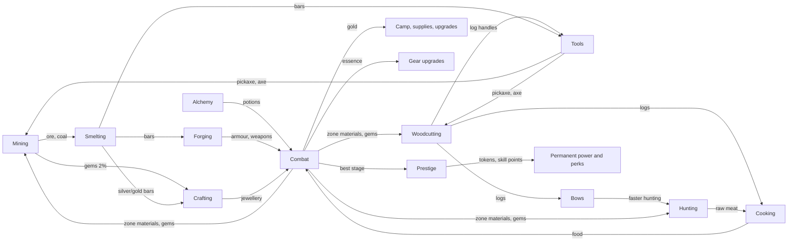

# Fantasy Idle — Game Design (v2)

This is the design the code in `src/` implements. Every number here comes from the code or from the
tools in `tools/`; if they disagree, the code is right and this file is stale. The evidence behind
each decision is in [`docs/reports/Fantasy Idle game design research.md`](reports/Fantasy%20Idle%20game%20design%20research.md)
and the six note files under `docs/research_notes/`. Nothing here is final — it is a tuned starting
point that the simulator can move.

**Contents:** [1 Vision](#1-vision-and-pillars) · [2 Core loop](#2-the-core-loop) · [3 Systems](#3-systems) ·
[4 Modifier pipeline](#4-the-modifier-pipeline) · [5 Balance](#5-balance-targets-measurements-and-knobs) ·
[6 Divergences from the research report](#6-where-this-differs-from-the-research-report) ·
[7 What was cut](#7-what-was-cut-from-the-concept) · [8 Code map](#8-code-map)

---

## 1. Vision and pillars

A browser idle RPG in the Melvor Idle / RuneScape tradition: you train gathering and production
skills, turn what you gather into gear, and use that gear to push through combat zones — then
prestige for permanent power and push further.

1. **Everything feeds something.** Every resource has at least one consumer, and combat hands
   materials back to the skills. No dead-end items (the prototype had five unused woods).
2. **Gear tiers are the spine.** Each metal tier roughly doubles power; a new tier is the big
   milestone of each stretch of play. Rarity adds flavour and affixes, never a bigger jump than a tier.
3. **Idle is first-class, active is a bonus.** Leaving the game running (or closed, up to the
   offline cap) is the main way to progress. Clicking and mini-games help — at most ~1.5× — but are
   never required.
4. **No permanent walls.** Every stall has at least two ways out: better gear (skills), more combat
   levels (fighting), camp upgrades (gold), or prestige tokens.
5. **Honest numbers.** Every bonus shown in the UI goes through one modifier pipeline, so what the
   UI says is what the game does (the prototype's achievement rewards were text only).

## 2. The core loop



**Minute to minute:** one action runs at a time — a skill node, a workshop recipe, or combat
(starting one stops the other, like Melvor). **Hour to hour:** gather → smelt → forge the next
armour piece → push a zone → when a boss stops you, go train the skill that gates your next metal.
**Day to day:** prestige when a run stalls (first one at ~2 h), spend skill points on perks, claim
the daily crate, let offline progress run overnight.

## 3. Systems

### 3.1 Skills and the XP curve

- **Curve:** the Old School RuneScape / Melvor table, `XP(L) = floor(¼ · Σ_{l=1}^{L-1} floor(l + 300·2^(l/7)))`,
  cap 99 (`src/core/xp.js`). Level 92 is the halfway point to 99 (13,034,431 XP). The prototype's
  `nextXp × 1.5` put mining 50 at 322 years of play; this puts it at ~2.5 hours.
- **Skills:** Mining, Woodcutting, Hunting (gathering); Cooking, Alchemy (production); Smithing,
  Crafting (workshop); Combat (earned by fighting). Every skill's level now matters — smithing and
  crafting levels gate recipes, combat level gates wearing gear.
- **Nodes** (`src/data/skills.js`): XP per action grows ~15× across a skill while intervals grow
  only 1.4–2×, so XP/hour roughly doubles every 15 levels. Example (mining):

| Node | Level | Interval | XP | | Node | Level | Interval | XP |
|---|---|---|---|---|---|---|---|---|
| Copper | 1 | 3.0 s | 8 | | Mithril | 40 | 3.4 s | 48 |
| Iron | 10 | 3.0 s | 14 | | Gold | 50 | 3.6 s | 65 |
| Coal | 20 | 3.0 s | 22 | | Adamantite | 60 | 3.8 s | 88 |
| Silver | 30 | 3.2 s | 32 | | Runite | 75 | 4.2 s | 130 |

- **Interval model:** `interval = max(250 ms, base / (1 + Σ speed bonuses))` (`actionInterval`
  in `src/core/modifiers.js`). Speed bonuses add within the skill: tools, Forager perk,
  achievements, mini-game boost.
- **Gems:** every mining action has a 2% chance to also yield a gem of roughly the rock's tier.

### 3.2 Resources and dependencies

`src/data/resources.js` defines 50 resources. Who consumes what:

| Resource | Made by | Consumed by |
|---|---|---|
| Ores, coal | Mining, zone drops | Smelting (coal: 0 / 1 / 2 / 3 / 4 per bar for copper / iron / mithril / adamant / runite) |
| Bars | Smelting | Forging (1–5 per piece), tools, bows, jewellery (silver/gold only) |
| Gems | Mining (2%), zone drops | Jewellery |
| Logs | Woodcutting, zone drops | **Cooking fuel (1 per dish)**, tool handles, bows, Defense potion (oak) |
| Raw meat | Hunting, zone drops | Cooking; Evasion potion (raw fox) |
| Food | Cooking | Combat auto-eat; Health potion (roast boar) |
| Herbs | Alchemy foraging, zone drops | Potions |
| Potions | Alchemy | Combat buffs (15 charges each) |
| Essence | Combat only | Gear upgrades |

Sell prices: `base[category] × 1.6^(tier−1)` with bases ore 3, bar 8, gem 25, log 2, raw 3, food 6,
herb 4, potion 30. Selling is a bootstrap; combat gold is the real economy (§3.8).

### 3.3 Tools

Crafted, not bought (`src/data/workshop.js`): pickaxes and axes are forged in Smithing (2 bars + a
log handle), bows are made in Crafting (3 logs + a bar). Each tier gives **−5% interval and +5%
double-yield chance** to its skill (tier 5 pickaxe: +25% speed, 25% doubles). Tools are the main
reason a gathering player visits the workshop and a smithing player visits the woods.

### 3.4 Workshop

- **Smelting:** 2.0–2.6 s per bar; smithing level 1 / 10 / 20 / 35 / 45 / 55 / 75 for copper / iron /
  silver / mithril / gold / adamant / runite.
- **Forging:** 3 s per piece; the metal sets the level (1 / 10 / 35 / 55 / 75) and the power band.
  Bars per piece: Weapon 3, Shield 3, Head 2, Body 5, Legs 4, Boots 1, Gloves 1 (19 for a full set).
  XP = bars × 12 / 20 / 38 / 60 / 90 per metal.
- **Jewellery:** 1 silver or gold bar + 1 gem → Ring, Amulet or Earring. Gem sets the level
  (1 / 10 / 25 / 40 / 55 / 70) and most of the power; gold bars need crafting 30. Silver and gold
  are jewellery-only metals.

### 3.5 Equipment

`src/data/items.js`, generator in `src/core/formulas.js`.

- **Base stats** = `5 × material power × slot multiplier × quality × variance(0.95–1.05)`.
  Material power: copper 1, iron 2.2, mithril 4.8, adamant 10.6, runite 23.4 (×2.2 per tier).
  Slot multipliers (ATK / DEF): Weapon 4/0, Shield 0/3, Body 0/3, Legs 0/2, Head 0/1.5, Gloves 0.7/0.7,
  Boots 0.3/1, Ring 0.8/0.8, Neck 1.2/1, Ear 0.6/0.6. Twelve slots (two rings, two earrings).

| Metal | Weapon ATK | Full armour set ATK / DEF (common) | Same set, legendary |
|---|---|---|---|
| Copper | 20 | 25 / 56 | 35 / 78 |
| Iron | 44 | 55 / 123 | 77 / 172 |
| Mithril | 96 | 120 / 269 | 168 / 376 |
| Adamant | 212 | 265 / 594 | 371 / 831 |
| Runite | 468 | 585 / 1,310 | 819 / 1,835 |

- **Rarity = quality + affixes**, never a raw multiplier: Common ×1.00 / 0 affixes (62.9%),
  Uncommon ×1.08 / 1 (25.2%), Rare ×1.16 / 2 (8.8%), Epic ×1.25 / 3 (2.5%), Legendary ×1.40 / 4 (0.6%).
  Because tiers are ×2.2 apart, **a common of tier N always beats a legendary of tier N−1** (a test
  enforces this). The prototype multiplied stats by up to 64× and let legendary copper beat runite.
- **Affixes** (8 kinds): crit chance, crit damage, attack speed, dodge, lifesteal, gold find, combat
  XP, max HP. Values roll once and scale +8% per tier. Totals are capped in the pipeline (§4).
- **Upgrades:** +5% base stats per level, max +10. Cost: `2 × level × tier` essence plus
  `4 × level × (gold per kill at your best stage)` gold, so the price keeps pace with gold income.
- **Wear requirement:** combat level 1 / 10 / 25 / 40 / 60 for tiers 1–5 (the prototype's
  "(Lv N)" label was cosmetic).

### 3.6 Combat

`src/systems/combat.js`, formulas in `src/core/formulas.js`, stats in `src/core/modifiers.js`.

- **Timers:** player and enemy attack on independent timers (player 1.5 s base, min 0.5 s; enemy
  2.2 s at stage 1, −8 ms per stage, min 1.3 s). Large time steps resolve attacks in time order.
- **Player stats:** `ATK = (5 + gear ATK) × (1 + Σ ATK%) × token layer × camp layer`; DEF likewise
  without the unarmed 5; `max HP = (100 + 12 × (combat level − 1)) × (1 + Σ HP%) × token layer × camp layer`.
  Combat level gives +1.2% ATK and DEF per level (×2.18 at 99).
- **Damage taken:** `dmg = max(ATK_e² / (ATK_e + DEF), 10% of ATK_e, 1)`. DEF equal to the enemy's ATK
  halves damage, and no amount of DEF blocks more than 90%. The prototype subtracted DEF flat, which
  made the player immune until a boss's ×2 ATK suddenly killed them — every wall was a boss.
- **Crits:** 5% × 1.5 base; affixes and combo add. **Dodge**, **lifesteal** from affixes/potions.
- **HP:** no refill between enemies. Regen 0.1% of max HP per second in combat, 2% per second out of
  combat. **Auto-eat** below 50% HP (Gourmet perk raises it), "Auto" picks the smallest food that
  fills the gap. **Potions** hold 15 charges; one is used per player attack.
- **Clicks and combo:** clicking the enemy lands a half-damage hit (at most ~8 clicks/s count) and
  adds a combo stack (diminishing, max 30, decays after 1.5 s idle). Each stack is +3% damage; 10+
  stacks give +10% crit, 20+ give +15% lifesteal, 30 gives 20% echo strikes.
- **Death:** retreat to the start of the zone (a boss death sends you back 9 stages), HP set to 50%,
  combat stops. **Farm mode** keeps you on the current stage; the stage arrows let you move back.

### 3.7 Zones, enemies and loot

`src/data/zones.js`. Ten authored zones of ten stages; stage 10 of each is a boss. After stage 100
the Abyss repeats with a depth counter and steeper growth.

- **Enemy HP** = `25 × 1.075^(s−1)` to stage 100 (×2.06 per zone), then ×1.085 per stage.
  **Enemy ATK** = `5 × 1.065^(s−1)`, then ×1.075. **Bosses** ×3 HP, ×1.6 ATK.

| Stage | Zone | Enemy | HP | ATK | Gold / kill | Combat XP | Tokens if best |
|---|---|---|---|---|---|---|---|
| 1 | Sunlit Meadow | Slime | 25 | 5 | 6 | 3 | 0 |
| 10 | Sunlit Meadow | Goblin Chieftain (boss) | 143 | 14 | 107 | 168 | 1 |
| 30 | Glimmering Caves | Crystal Golem (boss) | 610 | 49 | 458 | 533 | 11 |
| 50 | Stormy Highlands | Orc Warlord (boss) | 2,594 | 175 | 1,946 | 912 | 27 |
| 70 | Ember Volcano | Ember Drake (boss) | 11,021 | 616 | 8,266 | 1,299 | 46 |
| 100 | The Abyss | Abyss Warlord (boss) | 96,493 | 4,080 | 72,370 | 1,888 | 82 |
| 120 | Abyss — Depth 2 | Abyss Warlord (boss) | 493,280 | 17,332 | 369,960 | 2,287 | 110 |
| 150 | Abyss — Depth 5 | Abyss Warlord (boss) | 5,701,460 | 151,748 | 4,276,095 | 2,891 | 156 |

- **Rewards per kill:** gold `0.25 × enemy max HP` (bosses ×3 on top of their ×3 HP); combat XP
  `3 × stage^1.05` (bosses ×5); a zone material with 35% chance (bosses always), quantity
  `1 + floor(zone tier / 3)`; a gem 3% (bosses 30%); essence 10% for 1–2 (bosses 3–6 × zone tier/2).
- **Zone loot tables** feed the skills at the zone's tier — e.g. the Forest drops iron ore, coal,
  oak logs and raw fox; the Volcano drops runite ore, yew logs and raw bear. Combat is never a dead end.

### 3.8 Economy: gold, camp and supplies

- **Sources:** combat kills (dominant), selling materials and items, the daily crate.
- **Sinks:** camp upgrades, gear upgrades (with essence), supplies.
- **Camp** (`src/data/camp.js`) — the run-scoped power layer, bought with gold and **reset on
  prestige**: Whetstone +5% ATK, Armour Rack +5% DEF, Hearth +4% HP per level, multiplicative, max
  25 levels each (×3.39 / ×3.39 / ×2.67 when maxed), cost `base × 1.30^level` (60 / 60 / 50 base).
  It turns each new run into a climb and gives gold a job.
- **Supplies** (gold shop): coal, logs, herbs and rabbits priced in "kills at your best stage"
  (25–40 kills), so the price scales with income and can never be resold at a profit (the
  prototype's Coal Wagon printed +350 gold per purchase).
- **Gold resets on prestige.** It is run currency, like Clicker Heroes' gold.

### 3.9 Prestige, tokens, skill points and perks

`src/systems/prestige.js`, `src/data/perks.js`.

- **Available** from stage 10. Resets: stage (restart at 10% of your all-time best), gold, camp.
  Keeps: skills, gear, tools, materials, essence, achievements, tokens, perks.
- **Tokens** = `floor(((best stage this run − 5) / 5)^1.5)`: 1 at stage 10, 27 at 50, 82 at 100,
  156 at 150. Tokens are **held, never spent**; each is a permanent +0.5% ATK and DEF and +0.25% HP,
  in its own multiplicative layer. The Eternity achievement adds +10% tokens.
- **Skill points:** 1 per prestige, plus 1 for every 25 stages of all-time best (each threshold pays
  once). Spent on eight perks: Knight (+4% ATK), Warlord (+4% HP), Rogue (+3% attack speed), Forager
  (+3% skill speed), Scholar (+3% XP), Endurance (+2 h offline cap), Gourmet (+5% auto-eat threshold
  and food healing), Fortune (+5% gold and drop chance).
- **Why polynomial tokens:** see §6.1 — an exponential token formula ran away in the simulator.

### 3.10 Achievements, unlocks and the daily crate

- **Achievements** (`src/data/achievements.js`): 20, each with a named reward applied through the
  pipeline **plus** +1% ATK, DEF and skill speed per achievement (Antimatter Dimensions / Cookie
  Clicker "milk" pattern).
- **Unlocks** (`src/data/unlocks.js`): tabs appear when a predicate on the state becomes true —
  Smithing after mining 5 times, Woodcutting after the first bar, Hunting at stage 5, Cooking after the first
  hunt, Alchemy / Shop / Prestige / Achievements at stage 10, Crafting at mining 20 or the first gem.
  The header shows the next goal. Settings has a developer switch (and `?dev=1`) that unlocks all.
- **Daily crate** (`src/systems/daily.js`): every 20 h, worth 20 kills of gold at your best stage plus
  12 materials from that zone. No streaks, nothing lost by missing a day.

### 3.11 Mini-games

`src/systems/minigame.js`. The prototype's mini-games could be replayed back to back, so optimal
play meant clicking forever. Now they are **opportunities**: while you train a gathering or
production skill, a chance appears after 45–90 s and then every 3–6 minutes, and stays open for 20 s.
A win gives +35% skill speed for 90 s (+5% per consecutive win, up to +55% on a five-win streak); a miss costs nothing but
the streak. A fully attentive player gains roughly +15% on average — a bonus, not a job.

### 3.12 Offline progress

`src/systems/offline.js`. On load (and when a tab wakes after a minute or more) the game replays the
time away with **the same code as online play**: skill actions complete one by one (consuming
inputs, stopping when they run out), workshop actions forge real items, and combat is replayed in
100 ms steps with food, potions and death. Capped at **12 hours** (+2 h per Endurance perk, up to
24 h). Absences under a minute are ignored. The "Welcome back" summary lists gains, materials used,
levels, and why work stopped early if it did.

### 3.13 Saves, cloud and the API

- **Local save** (`src/core/save.js`): `localStorage['fantasyIdle.save.v2']`, versioned
  (`state.version = 2`), autosaved every 15 s and when the tab is hidden or closed. Prototype saves
  (`fantasyIdleSaveLocal`) are migrated on first load: resources (renamed), gold, skill levels
  (converted to XP on the new curve), stages, tokens, skill points, perks and achievements.
- **Export/import:** `FI2:` + base64 JSON; saves from a newer version are refused.
- **Cloud (optional):** the game works as a guest. Signing in uses the real API (`api/index.js`):
  bcrypt passwords, JWTs that expire after 30 days, validated usernames and passwords, 1 MB body cap,
  version-checked saves. The client uploads every 60 s. When a local and a cloud save disagree it
  prefers more play time, and asks the player if the save timestamps disagree with that.
- **Server secret:** `JWT_SECRET` must be set in production; the old hard-coded fallback is gone.

## 4. The modifier pipeline

`collectModifiers(state)` in `src/core/modifiers.js` gathers every bonus into one object;
`deriveStats` turns it into the numbers combat and skilling use. Rules:

1. **Inside a layer, percentages add.** Gear affixes, combat level, perks, achievements and potions
   all add into `ATK%`, `DEF%`, `HP%`, `skillSpeed[skill]` and so on.
2. **Layers multiply:** content layer × **token layer** (`1 + 0.005 × tokens`) × **camp layer**.
3. **Caps:** crit chance 75%, dodge 60%, lifesteal 30%, attack speed +100% (attack interval ≥ 0.5 s),
   damage mitigation 90%, action interval ≥ 250 ms.
4. **Derived values are never saved** — they are recomputed from state, so a balance change applies
   to existing saves on the next load.

## 5. Balance: targets, measurements and knobs

### 5.1 Pure skill pacing

`node tools/pacing.mjs` — hours of continuous training with the best node, no boosts:

| Skill | Lv 10 | Lv 20 | Lv 30 | Lv 50 | Lv 75 | Lv 90 | Lv 99 |
|---|---|---|---|---|---|---|---|
| Mining | 7m | 19m | 39m | 2.6h | 16h | 54h | 123h |
| Mining + tools | 7m | 18m | 36m | 2.3h | 14h | 44h | 99h |
| Woodcutting | 6m | 18m | 43m | 2.9h | 18h | 57h | 129h |
| Hunting | 6m | 20m | 47m | 3.2h | 21h | 65h | 126h |
| Cooking | 3m | 10m | 24m | 1.8h | 12h | 38h | 74h |
| Alchemy (foraging only) | 7m | 20m | 43m | 3.2h | 23h | 93h | 224h |
| Smithing (smelting) | 4m | 10m | 24m | 1.8h | 14h | 48h | 109h |

Targets from the research: Lv 20 ≤ 15 min (close: 10–20 min), Lv 50 in 2–4 h (met), Lv 99 in
150–400 h (**faster**: 74–129 h for most skills — raise node XP less steeply if 99 should take longer).

### 5.2 Whole-game simulation

`node tools/simulate.mjs --hours=150 --seed=N` plays the game through the same `Game` API as the UI,
with a simple "sensible player" policy (gear up, keep food stocked, fight until stalled, then train
whatever gates the next metal tier, prestige when a run stalls). Three seeds, 150 hours each:

| Milestone | Seed 1 | Seed 2 | Seed 3 |
|---|---|---|---|
| First prestige | 2.1 h (stage 44, +21 tokens) | 2.1 h (stage 45, +22) | 2.1 h (stage 44, +21) |
| Stage 50 / 100 | 3.6 h / 18.5 h | 3.6 h / 30.0 h | 3.6 h / 17.4 h |
| Iron / mithril / adamant weapon | 2.1 / 7.8 / 57.6 h | 2.1 / 8.0 / 58.7 h | 2.1 / 7.9 / 58.7 h |
| Mining 50 / 75 | 11.8 / 42.9 h | 12.0 / 44.2 h | 11.9 / 43.5 h |
| Smithing 50 | 54.0 h | 55.1 h | 55.1 h |
| Best stage at 150 h | 120 | 118 | 120 |
| Walls on non-boss stages | 28% | 77% | 56% |

### 5.3 Known risks

- **Smithing is the bottleneck.** Adamant arrives ~50 hours after mithril in the sim, because
  smithing 55 needs a lot of smelting and each mithril bar costs three mining actions. The bot only
  smelts what it needs, so a player who smelts every ore will get there sooner — but this is the
  first place to tune (smelting XP, coal per bar, or the adamant level requirement).
- **Prestige gains are uneven.** Seed 3's runs gained +17, +9, +10, +10 stages; seed 1 had a run that
  gained nothing. Runs then stall at stages 90–100 until the next metal tier. That is by design (gear tiers are the spine), but the research
  target was a steady +10–15 per prestige.
- **The simulator's player is simple.** It never uses mini-games, clicks, potions or farm mode, and
  it buys perks in a fixed order. Treat its numbers as a floor for an engaged player.
- **Level 99 is fast** relative to Melvor (see §5.1).

### 5.4 Tuning knobs

| What you want | Change | File |
|---|---|---|
| Faster/slower skills | node `xp` / `interval` | `src/data/skills.js` |
| Walls earlier/later | `BALANCE.enemy.hpGrowth`, `atkGrowth`, boss multipliers | `src/core/formulas.js` |
| Bigger gear jumps | bar/gem `power` | `src/data/resources.js` |
| More/less gold | `BALANCE.rewards.goldPerHp`; camp `growth`, `max` | `formulas.js`, `src/data/camp.js` |
| Stronger prestige | `BALANCE.prestige.token*`; `BASE.tokenAtk` | `formulas.js`, `src/core/modifiers.js` |
| Offline length | `BASE.baseOfflineHours`; Endurance perk | `modifiers.js`, `src/data/perks.js` |
| Active-play weight | `BALANCE.minigame` | `formulas.js` |

After any change: `node --test test/*.test.mjs test/*.test.cjs`, `node tools/pacing.mjs`, and a
couple of `node tools/simulate.mjs --hours=150 --seed=N` runs.

## 6. Where this differs from the research report

The report ([Redesign section](reports/Fantasy%20Idle%20game%20design%20research.md#the-redesign-change-these-formulas-add-these-systems-cut-these))
recommends formula *shapes* and asks for them to be tuned in a simulator. Where the simulator
disagreed, the implementation follows the simulator:

1. **Prestige tokens.** The report proposes `tokens = 2^((S−10)/5)` with +10% power per token, so
   prestige power grows at the enemy's rate. An exponential formula of this kind
   (`0.75 × 2^(S/10)`, +1% per token) was implemented first; within 20 simulated hours it reached
   10¹¹ tokens and stage 350, because camp upgrades and HP-proportional gold compound on top of it.
   The game uses `((S−5)/5)^1.5` with +0.5% per token instead, and relies on gear tiers and the camp
   for within-run growth.
2. **Enemy growth.** The report keeps ×1.15 HP per stage. This design uses ×1.075 (×2.06 per zone)
   for the authored stages so the ×2.2 gear tiers set the pace and numbers stay readable (a stage 100
   boss has 96k HP instead of 5×10⁷), then ×1.085 in the Abyss.
3. **No boss timer yet.** Dying sends you back to the zone start instead; the 30-second boss timer is
   on the roadmap.
4. **One gold currency, reset on prestige,** instead of separate skilling and combat gold. Material
   sale prices are small enough that the split wasn't needed yet.
5. **Skill points kept** as eight perks (the report folds them into achievements) — they are the
   only build choice in the game right now. The token shop is gone: tokens are held, not spent.
6. **Camp capped** at 25 levels with ×1.30 cost growth (report: ×1.07, uncapped with milestones) —
   the uncapped version ran away in the simulator.
7. **Coal per bar halved** (2 / 3 / 4 instead of 4 / 6 / 8) because smithing is already the bottleneck.
8. **Tools are crafted, not bought** — more interlock between skills than a gold shop.
9. **Crafted gear rolls every rarity.** The report reserves epic and legendary for combat drops;
   there are no gear drops yet (Phase 3).
10. **Offline cap 12 h** (+2 h per Endurance level, up to 24 h) instead of a flat 24 h, so the perk
    has something to give.
11. **Mini-game numbers:** +35–55% for 90 s every 3–6 min (report: +50–100% for 60–120 s every
    3–8 min); the idle "focus" bonus is not in yet.
12. **Not yet built:** mastery, pets, dungeons, salvage, affix reroll, bag cap and filters, bankable
    daily crate, rolling save backups, compressed exports, server-side offline — all on the roadmap.

## 7. What was cut from the concept

| Cut | Why |
|---|---|
| `nextXp × 1.5` XP curve | Levels above ~25 were unreachable in a lifetime |
| Rarity multipliers 1–8× (applied twice) | Legendary copper beat common runite; ×64 stats |
| Flat DEF subtraction, HP refill on every spawn | Made every wall a boss; food had no job |
| `stage^1.5` tokens spent in a doubling-cost shop | Plateaued after 3–6 prestiges |
| Token shop ("Blade of Damocles", "Book of Shadows") | Replaced by held tokens + perks |
| Coal Wagon at a loss-making price, Healing Potion | Infinite gold loop; HP already refilled |
| Mock login ("Local Login Success") | Replaced by guest play + a real optional account |
| Clan tab with fake players and chat, "Clan War Raid" | Placeholder UI implied features that don't exist; a clan system is on the roadmap |
| Fish foods in the auto-eat list, duplicate `auto-eat-select` | Items that didn't exist |
| Forced unlock override and hidden tutorial banner | Replaced by predicate unlocks and a goal hint |
| "Combat Lv" = highest prestige stage | Combat is now a real skill |
| Drag-and-drop inventory ordering | Dropped in the rewrite; inventory is sorted by power instead. Easy to bring back if wanted |
| `alert()` errors | Replaced by toasts |

## 8. Code map

```
index.html            page shell (sidebar, header, tab, toasts, modals)
style.css             styles (original theme + v2 layout, mobile tab strip, reduced motion)
src/main.js           browser bootstrap: loop, rendering, saves, cloud, window.FI handlers
src/game.js           Game facade: state + tick + every player action (no DOM)
src/core/             xp.js · rng.js · state.js (defaults, migration) · modifiers.js · formulas.js · save.js
src/data/             resources · skills · workshop · items · zones · camp · perks · achievements · unlocks
src/systems/          skilling · combat · inventory · prestige · camp · minigame · offline · daily · progress
src/ui/               render.js (HTML per tab) · format.js (numbers, time)
api/                  Express API for Vercel (register, login, save, load) on Vercel Postgres
test/                 node:test suites (game, saves, API)
tools/                simulate.mjs (whole-game balance sim) · pacing.mjs (skill pacing table)
docs/                 DESIGN.md (this) · ROADMAP.md · reports/ · research_notes/
```
