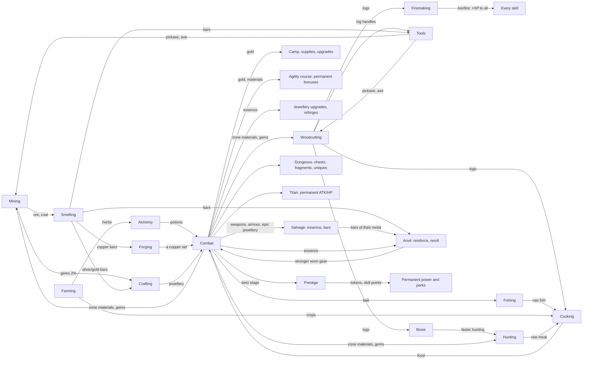

# Fantasy Idle — Game Design (v2)

This is the design the code in `src/` implements. Every number here comes from the code or from the
tools in `tools/`; if they disagree, the code is right and this file is stale. The evidence behind
each decision is in [`docs/reports/Fantasy Idle game design research.md`](reports/Fantasy%20Idle%20game%20design%20research.md)
and the six note files under `docs/research_notes/`. Nothing here is final — it is a tuned starting
point that the simulator can move.

**Contents:** [1 Vision](#1-vision-and-pillars) · [2 Core loop](#2-the-core-loop) · [3 Systems](#3-systems) ·
[4 Modifier pipeline](#4-the-modifier-pipeline) · [5 Balance](#5-balance-targets-measurements-and-knobs) ·
[6 Divergences from the research report](#6-where-this-differs-from-the-research-report) ·
[7 What was cut](#7-what-was-cut-from-the-concept) · [8 Code map](#8-code-map)

---

## 1. Vision and pillars

A browser idle RPG in the Melvor Idle / RuneScape tradition: you train gathering and production
skills, turn what you gather into gear, and use that gear to push through combat zones — then
prestige for permanent power and push further.

1. **Everything feeds something.** Every resource has at least one consumer, and combat hands
   materials back to the skills. No dead-end items (the prototype had five unused woods).
2. **Gear tiers are the spine.** Each metal tier roughly doubles power; a new tier is the big
   milestone of each stretch of play. Rarity adds flavour and affixes, never a bigger jump than a tier.
   Combat drops and dungeons are a second route to the same tiers, tuned to run beside crafting
   rather than past it.
3. **Idle is first-class, active is a bonus.** Leaving the game running (or closed, up to the
   offline cap) is the main way to progress, and leaving it alone for a minute earns the Focus bonus.
   Clicking and mini-games help — at most ~1.5× — but are never required.
4. **No permanent walls.** Every stall has at least two ways out: better gear (skills or drops), more
   combat levels (fighting), camp upgrades (gold), dungeons and the Titan, or prestige tokens.
5. **Honest numbers.** Every bonus shown in the UI goes through one modifier pipeline, so what the
   UI says is what the game does (the prototype's achievement rewards were text only).

## 2. The core loop



**Minute to minute:** one action runs at a time — a skill node, a workshop recipe, or combat
(starting one stops the other, like Melvor). **Hour to hour:** push a zone for the next tier's drops →
gather and smelt bars of the metal you wear → reinforce it at the anvil → when a boss stops you, farm
a dungeon, train a skill, or prestige. **Day to day:** prestige when a run stalls (the first one, which
teaches it, a few minutes in, after the stage-20 boss, with the guide's hand on it: §3.24), spend skill
points on perks, challenge the Titan when it wakes, claim banked daily crates,
let offline progress run overnight.

## 3. Systems

### 3.1 Skills and the XP curve

- **Curve:** the Old School RuneScape / Melvor table, `XP(L) = floor(¼ · Σ_{l=1}^{L-1} floor(l + 300·2^(l/7)))`,
  cap 99 (`src/core/xp.js`). Level 92 is the halfway point to 99 (13,034,431 XP). The prototype's
  `nextXp × 1.5` put mining 50 at 322 years of play; this puts it at ~2.5 hours.
- **Skills (12):** Mining, Woodcutting, Fishing, Hunting (gathering); Cooking, Firemaking, Alchemy
  (production); Farming (parallel, on the clock); Agility (a course you build); Smithing, Crafting
  (workshop); Combat (earned by fighting). Every skill's level matters — workshop levels gate recipes,
  farming levels open plots, agility levels open course slots, combat level gates wearing gear.
- **Nodes** (`src/data/skills.js`): base XP per action grows ~15× across a skill while intervals
  grow only 1.4–2×, so base XP/hour roughly doubles every 15 levels. At Melvor pace an action opening
  past level 20 gives less than its base (runite 62 instead of 130; `src/data/pace.js`, §5.1).
  Example (mining, base XP):

| Node | Level | Interval | XP | | Node | Level | Interval | XP |
|---|---|---|---|---|---|---|---|---|
| Copper | 1 | 3.0 s | 8 | | Mithril | 40 | 3.4 s | 48 |
| Iron | 10 | 3.0 s | 14 | | Gold | 50 | 3.6 s | 65 |
| Coal | 15 | 3.0 s | 18 | | Adamantite | 60 | 3.8 s | 88 |
| Silver | 30 | 3.2 s | 32 | | Runite | 75 | 4.2 s | 130 |

- **Interval model:** `interval = max(250 ms, base / (1 + Σ speed bonuses))` (`actionInterval`
  in `src/core/modifiers.js`). Speed bonuses add within the skill: tools, the Forager perk,
  achievements, pets, agility obstacles, weekend events, mini-game boosts and Focus, plus the
  action's own mastery (§3.20).
- **Gems:** every mining action has a 2% chance to also yield a gem of roughly the rock's tier.
- **Skill capes** (`src/data/capes.js`, Melvor's skillcapes): level 99 in a skill earns its cape
  for good. Each gives a small bonus to its own skill, counted whichever cape is worn: a second ore,
  log, fish, catch, dish, bar, herb or potion 10% more often (a log burning twice, for firemaking),
  +10% crops a harvest, +10% quality on everything made (crafting), +3% speed in every skill
  (agility), +5% attack and defence (combat). The hero puts the new cape on as it is earned (a DCSS
  cloak in the cape's own cloth with a gold hem, `hero/capes/<skill>`); in Settings, once one is
  earned, any earned cape or the rank's cloak can be worn, with the next cape (the skill nearest 99)
  as a silhouette. Capes are worked out from the levels; the save keeps only the one worn
  (`hero.cape`). The 99 card shows the hero in it, and the chronicle's line wears it too.

### 3.2 Resources and dependencies

`src/data/resources.js` defines 73 resources, and a test checks that every one has a consumer. Who
consumes what:

| Resource | Made by | Consumed by |
|---|---|---|
| Ores, coal | Mining, zone drops | Smelting (coal: 0 / 1 / 2 / 2 / 3 per bar for copper / iron / mithril / adamant / runite) |
| Bars | Smelting, salvaging weapons and armour | Forging copper (1–5 per piece), the anvil (reinforcing and rerolling worn gear), tools, bows, jewellery (silver/gold only) |
| Gems | Mining (2%), zone drops, chests | Jewellery |
| Logs | Woodcutting, zone drops | **Cooking fuel (1 per dish)**, Firemaking, tool handles, bows and rods, agility obstacles, Defense potion (oak) |
| Raw meat | Hunting, zone drops | Cooking; Evasion potion (raw fox) |
| Raw fish | Fishing, zone drops | Cooking |
| Crops | Farming | Cooking (one potato, or two of the others, per dish) |
| Food | Cooking (meat, fish, farm dishes) | Combat auto-eat (smallest dish that fills the gap); Health potion (roast boar) |
| Herbs | Alchemy foraging, Farming, zone drops | Potions |
| Fishing bait | Zone drops (Marsh, Ruins, Frozen Wastes), the Shop | Fishing: one per catch, 50% chance of a second fish |
| Potions | Alchemy | Combat buffs (15 charges each) |
| Essence | Combat, salvaging drops, dungeon chests, the Titan, daily crates | The anvil, jewellery upgrades and reforges |

Sell prices: `base[category] × 1.6^(tier−1)` with bases ore 3, bar 8, gem 25, log 2, raw 3, food 6,
herb 4, crop 3, potion 30. Selling is a bootstrap; combat gold is the real economy (§3.8).

### 3.3 Tools

Crafted, not bought (`src/data/workshop.js`): pickaxes, axes, tinderboxes and hoes are forged in
Smithing; bows and fishing rods are made in Crafting. Each tier gives **+5% speed and +5% "double"
chance** to its skill (tier 5 pickaxe: +25% speed, 25% doubles). For the tinderbox the double is a log
that burns twice (XP and bonfire time); for the hoe, speed is crop growth and the double is a double
harvest. Tools are the main reason a gathering player visits the workshop and a smith visits the woods.

### 3.4 Workshop

- **Smelting:** 2.0–2.6 s per bar; smithing level 1 / 10 / 20 / 35 / 45 / 55 / 75 for copper / iron /
  silver / mithril / gold / adamant / runite; 10–90 XP per bar.
- **Forging:** copper only (§3.25): 3 s per piece, Weapon at level 1 and each piece a few levels on —
  Boots +1, Gloves +2, Head +3, Shield +5, Legs +7, Body +9. Bars per piece: Weapon 3, Shield 3,
  Head 2, Body 5, Legs 4, Boots 1, Gloves 1 (19 for a full set); 18 XP a bar. Every stronger weapon
  and piece of armour drops in the fight. (Until October 2026 each metal forged its own set, from
  levels 10 / 35 / 55 / 75.)
- **The anvil** (`src/systems/anvil.js`, from Smithing 5): reinforces a worn weapon or piece of armour
  (+5% base stats a step, to +10) and rerolls its bonuses, with bars of its metal — copper, iron,
  mithril, adamant, runite for tiers 1–5; Dragonbone takes twice the runite, Abyssal three times — and
  essence; no gold. Step n takes `ceil(bars per piece × 1.5^(n−1))` bars (a body: 5, 8, 12 … 193;
  about 113 pieces' worth for +10) and `2 × n × tier` essence, needs Smithing `5n`, and pays the bars'
  XP (as forging did: 18 / 30 / 57 / 90 / 135 a bar, paced). A reroll takes a piece's worth of bars
  and the old reforge's essence. The metal's mastery grows a second a bar and takes up to 19.6% of
  the bars off. Smelting a metal needs its level, so the bars are the real gate (runite at 75), or they
  come from salvaging gear of that metal. A piece put on in place of a reinforced one of its kind is
  refitted: it takes the levels but one, and their bars (§3.25).
- **Jewellery:** 1 silver or gold bar + 1 gem → Ring, Earring or Amulet. The gem sets the base level
  (1 / 10 / 25 / 40 / 55 / 70), the tier and the power (0.8 × the tier's power, like dropped
  jewellery); a gold setting adds 20%. Earrings add +2 and Amulets +4 levels; gold bars need crafting
  30. Silver and gold are jewellery-only metals. (Power used to average the bar and the gem, which
  made a gold-and-amethyst ring a tier-1 item stronger than mithril.)
- **Crafted gear rolls Common to Rare**, forged and below Crafting 75 alike. Jewellery's best rises with
  Crafting (October 2026, §5.7): Epic possible from level 75, Legendary at 99, at the roll's own odds
  (about 3% and under 1% a piece, more with the quality bonuses; `CRAFT_RARITY_LEVELS` in `src/data/items.js`).
- **The Voidstone** (tier 7, Crafting 85): no rock holds it. The Abyss's bosses leave one at a quarter of
  their first falls from depth 5 (stage 141) on (`VOIDSTONE_DEPTH`, `VOIDSTONE_CHANCE` in
  `src/data/workshop.js`), and a Voidstone piece is cut to the deepest depth the hero has reached: its
  power grows ×1.45 a depth past 5, like the fight's drops there (`abyssDropMult`), so a crafted piece
  can stand beside what drops late, and the essence that upgrades jewellery has a piece worth it.

### 3.5 Equipment

`src/data/items.js`, generator in `src/core/formulas.js`, bag and actions in `src/systems/inventory.js`.

- **Base stats** = `5 × material power × slot multiplier × quality × variance(0.95–1.05)`.
  Material power: copper 1, iron 2.2, mithril 4.8, adamant 10.6, runite 23.4, and the two
  **drop-only tiers** Dragonbone 51 and Abyssal 112 (×2.2 per tier). Slot multipliers (ATK / DEF):
  Weapon 4/0, Shield 0/3, Body 0/3, Legs 0/2, Head 0/1.5, Gloves 0.7/0.7, Boots 0.3/1, Ring 0.8/0.8,
  Neck 1.2/1, Ear 0.6/0.6. Twelve slots (two rings, two earrings).

| Tier | Weapon ATK | Weapon + armour ATK / DEF (common) | Same, legendary | Wear at combat |
|---|---|---|---|---|
| Copper | 20 | 25 / 56 | 35 / 78 | 1 |
| Iron | 44 | 55 / 123 | 77 / 172 | 10 |
| Mithril | 96 | 120 / 269 | 168 / 376 | 25 |
| Adamant | 212 | 265 / 594 | 371 / 831 | 40 |
| Runite | 468 | 585 / 1,310 | 819 / 1,835 | 60 |
| Dragonbone (drop only) | 1,020 | 1,275 / 2,856 | 1,785 / 3,998 | 70 |
| Abyssal (drop only) | 2,240 | 2,800 / 6,272 | 3,920 / 8,781 | 80 |

- **Rarity = quality + affixes**, never a raw multiplier: Common ×1.00 / 0 affixes, Uncommon ×1.08 / 1,
  Rare ×1.16 / 2, Epic ×1.25 / 3, Legendary ×1.40 / 4. Because tiers are ×2.2 apart, **a common of
  tier N always beats a legendary of tier N−1** (a test enforces this). The prototype multiplied stats
  by up to 64× and let legendary copper beat runite.
- **Affixes** (8 kinds): crit chance, crit damage, attack speed, dodge, lifesteal, gold find, combat
  XP, max HP. Values roll once and scale +8% per tier. Totals are capped in the pipeline (§4).
- **Upgrades:** +5% base stats per level, max +10. Weapons and armour are reinforced at the anvil
  with bars and essence (§3.4). Jewellery is upgraded with `2 × level × tier` essence plus
  `4 × level × (gold per kill at your best stage)` gold, so the price keeps pace with gold income.
- **Reforge:** rerolls an item's affixes (not its rarity or base stats) for `3 × tier × min(10, 1 +
  reforges so far)` essence and, for jewellery, 10 kills of gold (weapons and armour: bars, at the anvil).
- **Salvage:** dropped gear → essence (`ceil(0.8 × tier × (rarity rank + 1))`), crafted gear → ~40% of
  its bars back (whole bars, fair on average). Either way, half of the essence spent upgrading the
  item comes back. A dropped weapon or piece of armour also gives bars of its metal (1 common … 5
  legendary, ×2 / ×3 past runite), and any of them three quarters of the bars reinforcing it took.
- **Bag and lock:** 40 rolled items. Overflow auto-salvages the weakest unlocked item, but never the
  best upgrade for a slot — if nothing else can go, the bag overflows instead (a bag full of locked
  items once made every new drop, however good, salvage on arrival). An auto-salvage filter (off /
  common / uncommon / rare) salvages low drops on arrival unless they are upgrades. Locked items are
  never sold or salvaged. Nothing is ever silently deleted.

### 3.6 Combat

`src/systems/combat.js`, formulas in `src/core/formulas.js`, stats in `src/core/modifiers.js`.

- **Timers:** player and enemy attack on independent timers (player 1.5 s base, min 0.5 s; enemy
  2.2 s at stage 1, −8 ms per stage, min 1.3 s). Large time steps resolve attacks in time order.
- **Player stats:** `ATK = (5 + gear ATK) × (1 + Σ ATK%) × token layer × camp layer`; DEF likewise
  without the unarmed 5; `max HP = (100 + 12 × (combat level − 1)) × (1 + Σ HP%) × token layer × camp layer`.
  Combat level gives +1.2% ATK and DEF per level (×2.18 at 99).
- **Damage taken:** `dmg = max(ATK_e² / (ATK_e + DEF), 10% of ATK_e, 1)`. DEF equal to the enemy's ATK
  halves damage, and no amount of DEF blocks more than 90%. The prototype subtracted DEF flat, which
  made the player immune until a boss's ×2 ATK suddenly killed them — every wall was a boss.
- **Crits:** 5% × 1.5 base; affixes add. **Dodge**, **lifesteal** from affixes/potions.
- **HP:** no refill between enemies. Regen 0.1% of max HP per second in combat, 2% per second out of
  combat. **Auto-eat** below 50% HP (Gourmet perk raises it), "Auto" picks the smallest food that
  fills the gap. **Potions** hold 15 charges; one is used per player attack.
- **Clicks and combo** (cut in October 2026, the owner: fast clicking took his hero to stage 100 with no
  prestige, food or potion, and cleared dungeons in seconds that the Dungeons tab called out of reach):
  a strike lands a tenth of an attack (`BALANCE.combat.manualHitMult`), at most one every 250 ms
  (`strikeGapMs`, four a second), and adds a combo stack (diminishing, max 10, decays after 1.5 s
  without one). Each stack is +1% damage on every hit. It was half, then a fifth, of an attack, up to
  eight a second, with +3% a stack to 30 and, at 10, 20 and 30 stacks, +10% crit, +15% lifesteal and
  echo strikes. The game has no anti-cheat, so an auto-clicker is assumed: a minute's damage at every
  interval between clicks from 1 ms to 2 s (each click also ends Focus) against an idle hero's was
  ×6.7 at best before, ×1.54 now (×1.5 for anything faster than four a second, ×1.2 at two a second,
  ×1.08 at one), and no healing. A player who taps through the first hour stands at stage 70 (110
  before) against 50 for one who only watches (`node tools/opening.mjs 60 3`).
- **Boss timer:** a boss must fall within **30 seconds of fighting** (the clock only runs while you
  fight, so it works the same offline). If it holds out you step back one stage and farm there for
  60 seconds before it is retried automatically; beating it sooner (by stepping forward) ends the
  wait. Bosses are the DPS checks; regular stages test survival.
- **Death** retreats to the start of the zone (from a zone's first stage, one stage back, never onto
  the previous zone's boss) with half HP. The hero then rests at the campfire until his health is full
  (about 25 s) and goes back into the fight by himself (`combat.recovering`); "Stay at camp", starting
  work or entering the fight at once call that off. Offline replay does the same, so a fall early in a
  long absence costs a rest, not the absence.
- **Death:** retreat to the start of the zone (a boss death sends you back 9 stages), HP set to 50%,
  a rest to full health, then the fight goes on from there. **Farm mode** ("Stay on this stage") keeps you on the current stage; the map, and the stones on
  the scene's stage path, take you back to any stage reached this run.
- **Boss payouts:** a boss pays its bonus (gold ×3, XP ×5, its loot table) only on its **first fall
  in a run** — the kill that moves you on — and the Titan always does. A boss you farm after beating
  it, and every dungeon boss, pays like the regular monsters its health is worth (a ×3-health boss
  rolls regular loot three times). Parking on a boss is never the best farm.
- **Modes:** the same loop runs the stage ladder, a dungeon run or a Titan fight
  (`state.combat.mode` = `stages` / `dungeon` / `titan`).

### 3.7 Zones, enemies and loot

`src/data/zones.js`. Ten authored zones of ten stages; stage 10 of each is a boss. After stage 100
the Abyss goes on with a depth counter and steeper growth, in named strata.

- **The Abyss's strata** (`src/data/strata.js`; `robust-and-fun/B_longterm_motivation.md` §8.2 item 1):
  past stage 100 the Abyss was one place, the same four monsters and boss for hundreds of stages. It is
  now a stack of sixteen layers of 25 stages from stage 101: The Abyss (its own monsters), the Weeping
  Dark, the Bone Reaches, the Ember Pits, the Frozen Void, the Writhing Maze, the Shadow Court, the Storm
  Wastes, the Starless Sea, the Iron Halls, the Hollow Throne, the Burning Choir, the Glass Garden, the
  Rotting Deep, the Spatial Rift and Pandemonium (476 on, without end). Each has four monsters and a boss
  of its own from the DCSS tiles (75 new bestiary pages, 183 kinds in all), a card the first time it is
  reached (its line, its boss as a silhouette), its name over the fight and on the world map's Abyss
  pin, and its own painting behind its fight and on its card (`assets/paint/<stratum id>.webp`, painted
  with Gemini in October 2026; until then each wore a colour grade over the Abyss's). The zone keeps the
  id `abyss` and everything else the Abyss had: its scaling, loot, depth and gear tiers.

- **Enemy HP** = `25 × 1.075^(s−1)` to stage 100 (×2.06 per zone), then ×1.085 per stage, and past
  stage 400 ×1.065 (`deepFrom`, `deepHpGrowth`: the deep Abyss eased, §5.6).
  **Enemy ATK** = `5 × 1.065^(s−1)`, then ×1.075, past 400 ×1.057. **Bosses** ×3 HP, ×1.6 ATK.
- **Two tiers per zone.** `tier` is the zone's richness (material quantities, gems, boss essence);
  `gearTier` is the tier of gear that drops there. Prestige carries players through the early zones
  far faster than they can smith (stage 60 in ~1.5 h, mithril in ~2–4 h), so the gear tier follows
  the crafting timeline instead of the zone number: each zone drops about the tier a typical player
  crafts when they first get there, and a drop one tier up is the lucky case. The drop-only tiers
  live in the Abyss: Dragonbone from depth 3 (stage 121), Abyssal from depth 5 (stage 141).
- **Deeper Abyss drops keep pace.** Past depth 5 there is no new tier, so every further depth makes
  dropped gear **×1.45** stronger (`BALANCE.abyss.dropGrowth`; an item level, the card shows
  "depth N"). Monsters grow ×2.26 per depth (×1.085 per stage), so gear alone never quite keeps up
  and the climb slows as it goes, but it never stops: without this, every simulated player stalled
  for good at the stage 200 boss.

| Stage | Zone | Enemy | HP | ATK | Gold (first fall) | Combat XP | Loot tier | Tokens if best |
|---|---|---|---|---|---|---|---|---|
| 1 | Sunlit Meadow | Slime | 25 | 5 | 6 | 3 | 1 | 0 |
| 10 | Sunlit Meadow | Goblin Chieftain (boss) | 143 | 14 | 107 | 168 | 1 | 1 |
| 30 | Glimmering Caves | Crystal Golem (boss) | 610 | 49 | 458 | 533 | 2 | 11 |
| 50 | Stormy Highlands | Orc Warlord (boss) | 2,594 | 175 | 1,946 | 912 | 2 | 27 |
| 70 | Ember Volcano | Ember Drake (boss) | 11,021 | 616 | 8,266 | 1,299 | 3 | 46 |
| 90 | Skyreach Spire | Thunder Roc (boss) | 46,818 | 2,173 | 35,114 | 1,691 | 4 | 70 |
| 100 | The Abyss | Abyss Warlord (boss) | 96,493 | 4,080 | 72,370 | 1,888 | 4 | 82 |
| 120 | The Abyss, depth 2 | Abyss Warlord (boss) | 493,280 | 17,332 | 369,960 | 2,287 | 5 | 110 |
| 130 | The Weeping Dark, depth 3 | Dread Lich (boss) | 1,115,299 | 35,723 | 836,474 | 2,487 | 6 | 125 |
| 150 | The Weeping Dark, depth 5 | Dread Lich (boss) | 5,701,460 | 151,748 | 4,276,095 | 2,891 | 7 | 156 |

- **Rewards per kill:** gold `0.25 × enemy max HP` (a boss's first fall ×3 on top of its ×3 HP);
  combat XP `3 × stage^1.05` (first fall ×5); a zone material with 35% chance (first-fall bosses
  always), quantity `1 + floor(zone tier / 3)`; a gem 3% (first-fall bosses 30%); essence 10% for 1–2
  (first-fall bosses 3–6 × zone tier / 2).
- **Gear drops:** 0.2% of regular kills, 50% of a boss's first fall. Tier = the zone's gear tier −1
  (25%) / same (65%) / +1 (10%) (`DROP_TIER_OFFSETS`, §3.25). Rarity weights common → legendary:
  regular 50 / 35 / 12 / 2.5 / 0.5, boss 20 / 40 / 28 / 9 / 3, with epic and legendary
  ×(1 + 0.15 × (tier − 1)). An AFK fighter sees a few drops an hour and salvages most of them.
- **Zone loot tables** feed the skills at the zone's tier — e.g. the Forest drops iron ore, coal,
  oak logs and raw fox; the Volcano drops runite ore, yew logs and raw bear. Combat is never a dead end.
- **Gilded monsters:** one regular monster of the stage ladder in 150 comes gilded (never a boss, a
  dungeon elite or the Titan): the same fight for 5× gold, 2× XP, a gem and 3–6 × zone tier / 2
  essence for certain. The scene turns it gold with a banner and a chime as it arrives; it counts
  toward its kind in the bestiary and in `stats.gildedKills`, and the Gold Rush medal (25 of them)
  makes them come 50% more often (`gildedMult`). About +3% gold over a run: in the simulator the
  runs with and without them land within each other's spread (DESIGN §5.2 is chaotic past 50 h).

### 3.8 Economy: gold, camp and supplies

- **Sources:** combat kills (dominant), the Titan, selling materials and items, daily crates.
- **Sinks:** camp upgrades, jewellery upgrades and reforges (with essence), supplies, farming seeds,
  and agility obstacles and their upgrades. Since the camp's prices follow the best stage, the camp is
  the big one: about half of all gold earned in 150 simulated hours (45–53%; 70–85% for a player with
  Auto on), against about 1% before, when 95–99% of gold was lost at prestige unspent.
- **Camp** (`src/data/camp.js`) — the run-scoped power layer, bought with gold and **reset on
  prestige**: Whetstone +5% ATK, Armour Rack +5% DEF, Hearth +4% HP per level, multiplicative, max
  25 levels each (×3.39 / ×3.39 / ×2.67 when maxed). A level costs `max(base, 0.008 × a kill's gold at
  the best stage) × 1.36^level` (base 20 / 20 / 15): the base price until about best stage 85, so a new
  player's camp is as it was (§3.24); past that, a whole upgrade costs about 50 kills at the best stage,
  so each run buys its camp again as it nears its best (the owner's choice 3a). At 0.016 the camp took
  80% of gold but each late run took 0.7 h instead of 0.5 h. It turns each new run into a climb and
  gives gold a job.
- **Supplies** (gold shop): coal, logs, herbs, rabbits, bait and the Essence Cache (10 essence for 80
  kills — the open-ended late-game sink) priced in "kills at your best stage" (25–40 regular kills;
  a boss stage prices like its regular monsters), so the price scales with income and can never be
  resold at a profit (the prototype's Coal Wagon printed +350 gold per purchase). Once Crafting is open,
  a **gem pouch** too: ten Amethysts (50 kills) to Crafting 9, ten Topaz (80) from 10 to 24, ten
  Sapphires (120) from 25 on, one at a time as the level climbs (`craft` on the entry, `goldShopOpen`).
  The fight's and the mine's gems follow their zone's or rock's tier, so a deep hero found only gems a
  new crafter cannot cut; the pouches keep Crafting's first forty levels open at any point of the game,
  as Melvor's shop sells Leather (`docs/research_notes/crafting-gems.md`). The higher gems are never sold.
- **Gold resets on prestige.** It is run currency, like Clicker Heroes' gold.

### 3.9 Prestige, tokens, skill points and perks

`src/systems/prestige.js`, `src/data/perks.js`.

- **Available** from stage 10, once the run has lasted **10 minutes** (otherwise a run that starts
  past stage 10 could be prestiged again at once, forever); the first prestige, which teaches the loop
  and comes once, need not wait (§3.24). Resets: stage (restart at 10% of your all-time best), gold,
  camp.
  Keeps: skills and mastery, gear, tools, materials, essence, achievements, tokens, perks, pets,
  dungeon clears and fragments, Titans defeated, the agility course and farming plots.
- **Tokens** = `floor(((best stage this run − 5) / 5)^1.5)`: 1 at stage 10, 27 at 50, 82 at 100,
  156 at 150. Tokens are **held, never spent**; each is a permanent +0.4% ATK and DEF and +0.2% HP
  (0.5% and 0.25% until the records came), in its own multiplicative layer, so the layer is
  `1 + 0.004 × tokens × records`. The Eternity achievement adds +10% tokens.
- **Records** (`recordsOf` in `src/core/modifiers.js`; the owner's choice 2, from
  `incremental-math.md` A1.3): every 25 stages of all-time best and every dungeon unique held is a
  record, and so is each Trial tier cleared (§3.26); each multiplies what the tokens give by 1.05 (stage
  300 with five uniques: ×2.29). Held
  tokens alone make each late run add less (+0.8% a run after the hundredth); a record lifts the whole
  stock. A new 25-stage record is a card ("Your tokens are ×1.05 stronger"), and a unique's card says
  so too, once the player has tokens; the token chip's tip counts them.
- **Auto** (`autoPrestigeIn`, `tickAutoPrestige`): after 5 prestiges, or 48 hours after the first one
  (`prestige.firstAt`), whichever comes first, the dock's Prestige button gets an Auto switch beside it
  (`settings.autoPrestige`, off until turned on). It took 20 prestiges until the check-in research
  found that a player who visits three times a day earned it on day 8, his runs sitting at their wall
  for 86–97% of his time away, and one who visits once a day never
  (`docs/research_notes/robust-and-fun/C_sessions_players.md`). With it on, a run that has spent 10
  minutes climbing without a new best stage (`combat.stallMs`, which runs only while the hero fights or
  rests to fight on), and may be prestiged, is: the hero
  walks straight into the next run's first fight, and a note says what it paid (a new rank still gets
  its card). Only while climbing the stage ladder: never while staying on a stage, in a dungeon or at
  the Titan, resting or working. Offline replay runs the same check, and the welcome-back summary
  counts the prestiges. The switch shows when it will go ("in 7m"). With Auto off, the Prestige button
  glows once a run may be prestiged and has stalled that long (`prestigeReady`); before Auto is earned,
  three minutes without a new best stage (`BALANCE.prestige.readyStallMs`: an early run's stages come in
  seconds, so three minutes is a wall), and the first prestige at once (§3.24).
- **Skill points:** 1 per prestige for a run that reached at least half your all-time best, plus 1
  for every 25 stages of all-time best (each threshold pays once). Spent on eight perks: Knight (+4% ATK), Warlord (+4% HP), Rogue (+3% attack speed), Forager
  (+3% skill speed), Scholar (+3% XP), Endurance (+2 h offline cap), Gourmet (+5% auto-eat threshold
  and food healing), Fortune (+5% gold and drop chance), and Paragon (+1% ATK, DEF and HP, 200 levels)
  so skill points always have a use once the others are full.
- **Why polynomial tokens:** see §6.1 — an exponential token formula ran away in the simulator.
- **A name** (`state.hero.name`, set in Settings, sanitised by `heroName` in `src/core/text.js`:
  one line of plain text, up to 20 characters; empty is "You") shows over the hero in the fight and
  on his panel in the Inventory.
- **Ranks** (`src/data/ranks.js`): prestiges earn the hero a title worn as his cloak's colour, the
  gear rarities' colours and then past them: Recruit (red), Adventurer (1, green), Veteran (5, blue),
  Champion (15, purple), Hero (40, gold), Legend (100, white), Mythic (250, black), at about 1, 5,
  12, 30, 60 and 150 hours of play in the simulator; then Exalted (500, a dragon-scale cloak), Eternal
  (1,000, cyan) and Immortal (2,000, void purple), added for the late game's long stretches
  (`robust-and-fun/B_longterm_motivation.md` §8.2: with Auto near hours 240, 500 and 930). No bonus: a
  mark of how far he has come. A rank
  badge sits by the hero in the Inventory and on the Prestige panel (with the count to the next), and
  a prestige that earns one is a card of its own with the hero in his new cloak.
- **Looks and name** (`src/data/looks.js`, `state.hero`): the player names the hero and picks one of
  ten looks (DCSS player bases and hairstyles: men and women of three skin tones, an elf pair, a
  dwarf), on the title card (arrows beside the hero) or in Settings (portraits). Six more are earned
  with medals (an orc for Dungeon Delver, a gold djinni for Gold Rush, a gargoyle for Titan Slayer,
  a mummy for Monster Scholar, a demonspawn for Abyss Walker, a ghoul for the secret Unbroken): the
  medal's card shows the hero in it, and Settings shows the next one as a silhouette naming its medal
  (never a secret one's). Cosmetic only; the gear and the rank's cloak go on top. Text addresses
  "your hero", never a pronoun.

### 3.10 Fishing, Firemaking, Farming and Agility

- **Fishing** (`src/data/skills.js`): seven spots from Shrimp Shallows (1) to Leviathan Deep (90),
  paced like Hunting. Fish cook into the best food per level (~10% more healing than meat). Each catch
  uses one **bait** if you have any, for a 50% chance of a second fish; bait drops in the wetter zones
  and the Shop sells tins. Rods (Crafting) are its tool.
- **Firemaking:** burns logs for XP (the log sink) and feeds the **bonfire**: each log adds 15 s × its
  tier, up to an hour, on the wall clock. While it burns every skill — combat included — earns +5% XP,
  rising to +10% at Firemaking 99. Tinderboxes (Smithing) are its tool.
- **Farming** (`src/data/farming.js`, `src/systems/farming.js`) — the first **parallel** skill: up to
  six plots (opening at levels 1, 1, 15, 30, 50, 70) grow on the wall clock while any other action runs
  and while the game is closed. Planting is a click and buys the seed at a flat price (25 gold for
  potatoes to 4,000 for starfruit); harvesting pays the crop and XP per unit. Eight crops: four herbs
  for Alchemy and potatoes, cabbages, pumpkins and starfruit for four new dishes. Harvest XP per
  plot-hour roughly doubles every ~15 levels. "Harvest ready & replant" replants the same crops.
  Hoes (Smithing) speed growth and can double a harvest.
- **Agility** (`src/data/agility.js`, `src/systems/agility.js`): a course of six slots (opening at
  levels 1, 10, 25, 40, 55, 70), each holding one of three obstacles. Building costs a fixed amount of
  gold — 20k, 200k, 1.5M, 10M, 60M, 300M, about an hour of one run's income where the slot opens — plus
  logs and bars (the last slot also 5 diamonds). Every obstacle is a **permanent bonus that survives
  prestige** (gathering or production speed, ATK/DEF/HP, gold, drops, crit, offline hours, workshop
  speed, farming yield, XP, attack speed, dodge, all-skill speed). Obstacles upgrade to **level 5**:
  each level adds the bonus again, costs the slot's price × 2^level and needs 7 more agility levels.
  Running the course is an action that takes as long as its obstacles together and pays their XP
  (+25% per obstacle level). Replacing an obstacle has no refund.

### 3.11 Dungeons and unique items

`src/data/dungeons.js`, `src/systems/dungeon.js`. A dungeon is an authored gauntlet: elite
monsters (×1.4 HP, ×1.15 ATK) and a boss (×1.5 on top of the boss multipliers) with a **60-second
timer**, fought with the gear you walk in with — gear is locked inside, and the run starts at full
health. Dying, leaving or running out of time loses the run; clearing it (the boss falls) is a win
that opens a chest. **After the first clear of a visit the hero waits at the open chest** (it stands in
the boss's place on the scene) and a dialog offers **Keep going** (the run starts again after every
clear, until the hero leaves; an ∞ marks it) or **End the dungeon** (back to the stage the hero left,
fighting on). A player watching goes back to the Dungeons tab when a visit is over: after End the
dungeon, Leave dungeon, or a lost run (a fall or the boss's timer, once the defeat has shown); map
Travel, the Titan and a prestige keep the fight on screen, and a player on another tab stays there. With no answer in `DUNGEON_CHOICE_MS` (30 s), or with nobody there while away, the hero
keeps going, so idle time is never lost; leaving while waiting is not a failure, as the run is won.
There is no standing repeat switch any more (old saves drop `combat.autoRepeat`). During a run the
fight's dock leads with a panel of its own: the clears, the unique's fragments (Assemble once there are
50), the choice while waiting with its countdown, and the run's orders (Leave dungeon, Map).

| Dungeon | Opens at | Like stages | Boss (HP / ATK) | Chest loot tier | Unique |
|---|---|---|---|---|---|
| Goblin Warren | 20 | 25–31 | 984 / 52 | 2 | Goblin King's Crown (Head, tier 2) |
| Crystal Depths | 50 | 55–62 | 9,269 / 372 | 3 | Crystal Heart (Amulet, tier 3) |
| Orc Stronghold | 80 | 85–93 | 87,243 / 2,625 | 4 | Warlord's Cleaver (Weapon, tier 4) |
| Dragon's Lair | 120 | 125–135 | 2,515,540 / 51,285 | 6 | Dragonheart Plate (Body, tier 6) |
| Void Citadel | 160 | 165–175 | 65,738,659 / 925,413 | 7 | Void King's Aegis (Shield, tier 7) |
| Abyssal Maw | 210 | 215–227 | 4,572,642,334 / 39,771,879 | 7 (at depth 12) | Starless Band (Ring, tier 7) |
| Sunken Necropolis | 240 | 245–257 | 52,851,750,768 / 348,201,024 | 7 (at depth 15) | Drowned King's Greaves (Legs, tier 7) |
| The Hellforge | 275 | 280–292 | 918,544,529,014 / 4,376,493,552 | 7 (at depth 18) | Hellforged Gauntlets (Gloves, tier 7) |

- **Worn, a unique shows on the hero:** the Goblin King's Crown as a gold crown, the Warlord's
  Cleaver as an executioner's axe, the Dragonheart Plate as red dragon armour and the Void King's
  Aegis as a violet tower shield (`hero/<layer>_unique/<id>` in the atlas; the Crystal Heart, an
  amulet, has no layer of its own).
- **Placement:** each dungeon sits about where a typical player reaches its unique's tier by crafting,
  so a unique rewards farming a little early instead of skipping tiers.
- **Monsters pay like ladder monsters of the same health** (the boss too, §3.6), so the chest is the
  whole bonus: one **fragment** (3% chance of three), `0.5 × zone tier` essence, three material
  picks from the zone, a gem 50% of the time, and boss-quality gear of the chest tier 4% of the time,
  as strong as the dungeon's depth in the Abyss makes it (like its monsters' own drops: ×3.2 in the
  Citadel, ×61 in the Maw; before, chest gear ignored the depth and was weaker than the drops beside
  it). A strong hero clears a run in well under a minute, so a chest is never a jackpot.
- **Uniques:** 50 fragments assemble the dungeon's unique; a chest holds it outright 0.2% of the time.
  Uniques are Legendary with fixed affixes (the Crown: +15% gold find, +4% crit, +5% HP) and 10% more
  base power than their tier — the best piece of that tier, not a tier skip. The first copy starts
  locked; a spare (assembled or found again) arrives unlocked, to salvage for essence. Uniques cannot
  be reforged.
- **The Sunken Necropolis and the Hellforge** (October 2026; `robust-and-fun/B_longterm_motivation.md`
  §8.2 item 2): two more past the Maw, a drowned city of the dead (twelve undead, the Sunken King) and a
  forge of the damned (twelve constructs, the Obsidian Colossus), from DCSS tiles. Their uniques (Legs
  and Gloves, the slots no unique had) are records too. Each has its painting (`necropolis`, `hellforge`;
  they borrowed the Drowned Ruins' and the Dragon's Lair's under a colour grade until October 2026);
  their map pins sit by the drowned ruins' lake and at the volcano's foot. With Auto they open at about
  56 and 74 hours of play.
- **The Abyssal Maw** is the long game's dungeon: it opens at stage 210, about 83 hours into the
  simulator's play at Melvor pace, and its careful player first clears it at about 177: twelve horrors of the deep Abyss and the Devourer. Its unique, the Starless Band, is
  worth its affixes rather than its power, since gear dropped that deep is dozens of times stronger
  than any tier's base: +8% prestige tokens, +15% combat XP, +10% drop chance, +30% crit damage. Its
  painting (`maw`) is a cavern like an open maw: black stone fangs at the edges, motes of dying light
  and a ring of cold teal light around the chasm, over a ledge of cracked basalt.
- **Clear milestones** per dungeon, permanent: 25 clears +2% ATK and DEF, 100 clears +3% gold and drop
  chance, 250 clears +3% max HP.
- **Readiness:** the Dungeons tab estimates the boss fight (time to kill vs the timer, and how long you
  last without food), coloured green / amber / red.

### 3.12 The Titan

Once an hour (from stage 20) you may challenge the Titan: a **60-second damage race** at full health
against a boss with ten times a boss's health. Unused attempts bank, up to three (`TITAN_BANK`), so a
player back after a few hours has them waiting. Titan level L fights like stage `10 × (L + 1)` for the
first 20 (level 1: 2,963 HP; level 10: 2.2 M HP), then 5 stages apart (`titanStage`). A win is
permanent: **+2% ATK and max HP** per Titan defeated (+1% from the 21st: `titanBonusUnits`), plus
`8 × L` essence, 30 kills of gold at your best stage and two gems; the next Titan is stronger. A loss
pays essence for the share of health you took off. A Titan fight never survives a reload. The late
line was halved when the long-term research found Titans falling once in 30–220 hours late in the
game: they now fall twice as often for the same power over the same stretch of the road.

### 3.13 Pets and the collection

`src/data/pets.js`. One pet per skill (twelve, combat included), found at random while training and
kept forever. Melvor's formula: the chance per action is `action seconds × skill level / 25,000,000`, so the
expected wait is about `25,000,000 / level` seconds of training (~70 h at level 99) whatever the
action's speed; combat rolls once per kill as a 4-second action and farming once per harvest as an
action as long as the crop's growing time. Each pet gives +3% speed to its skill (Fang, the combat
pet: +3% ATK and DEF; Sprout, the farming pet: +3% growth speed). The Achievements tab lists pets and uniques as a collection.
A pet found also keeps the hero company: Fang (or, until he comes, the first pet found) stands at his
feet in the fight, and each skill's pet beside him on that skill's stage, bobbing gently.

**The bestiary** (`src/data/bestiary.js`). Every kind of monster (183, `BESTIARY_SIZE`: five for each
of the ten zones and the fifteen strata below the Abyss's first, then the dungeons' own, each listed
once where it is first met; the Titans are left out, as each falls
only once) has a portrait in the Achievements tab's Bestiary (beside the Medals, the Collection and the
hero's Records: lifetime numbers as big figures, and the chronicle, the hero's firsts with their
dates, noted from the game's events as they happen, offline too, by `src/systems/chronicle.js`), with how many have fallen and up to three
stars: one at 10 defeats, two at 100, three at 1,000 (549 in all). Defeats are counted per kind in
`stats.killsByMonster` (dungeon elites count too), and the stars total is `stats.bestiaryStars`,
recounted from the table when a save loads; old saves start with an empty table and see the kinds
they have stood beside as met. A star is a toast with the monster's sprite. Two medals ride on it:
Naturalist (25 stars, +5% gold) and Monster Scholar (100 stars, +5% drop chance). The places reached
are shown, the next as silhouettes; a kind not met yet is a black shape and "???".

### 3.14 Achievements, unlocks and the daily crate

- **Achievements** (`src/data/achievements.js`): 45 (42 open, 3 secret), each with a named reward applied through the
  pipeline **plus** +1% ATK, DEF and skill speed per achievement (Antimatter Dimensions / Cookie
  Clicker "milk" pattern). Dungeon clears, Titans, pets, uniques, the new skills, a finished agility
  course and mastery (500 and 2,500 levels, a first 99) have their own. A test checks that every bonus in the data is well-formed (the Forager perk
  once had a malformed bonus and did nothing). Three are **secret** (`secret: true`): not shown nor counted in the Hall
  until earned (pat your pet 25 times, open a great crate, get back up after 100 falls), so finding
  one is a small surprise; the Hall's count is of the medals shown. Medals for systems met late (the
  first Ascension, twenty Trial tiers) wait, like the secret ones, until the player has met them
  (`after`, a disclosure id). Six medals mark the deep game (October 2026): stages 200, 300, 400 and 500
  (the bottoms of the Ember Pits, the Storm Wastes, the Burning Choir and Pandemonium's first 25), a
  first Ascension (+10% tokens) and twenty Trial tiers.
- **The gear codex** (`state.codex`, `CODEX_TYPES` in `src/data/items.js`): a page per kind of gear
  and tier, 70 in all, filled by `addItem` whenever a piece arrives (kept or salvaged on landing);
  shown in the Hall's Collection. The Armourer medal comes at 40 pages.
- **Completion** (`src/systems/completion.js`; `robust-and-fun/B_longterm_motivation.md` §8.2 item 8):
  how much of the game is done, as one figure with a decimal on the Hall's banner ("7.8% done"), and its
  parts as bars at the top of Records. Ten parts of equal weight, each its share done: skill levels to
  99, mastery to 99 on every action, the bestiary's stars, the codex, the medals, the pets, the uniques,
  the first 20 Titans, the Trials' tiers and the agility course's slots. The whole counts every part from
  the start, so it only rises; Records names only the parts the player has met. A cape for 100% is still
  to come.
- **Unlocks** (`src/data/unlocks.js`): tabs appear when a predicate on the state becomes true, each
  when it is of use (`docs/research_notes/robust-and-fun/A_onboarding_pacing.md` §5.4) — by work:
  Smithing after mining 5 times (ore that monsters drop no longer opens it for a hero who only
  fights), Woodcutting after the first bar, Cooking after the first hunt, Fishing after 5 dishes,
  Firemaking after 20 logs, Farming after 10 Alchemy actions or Cooking 15, Crafting with the first
  silver (or gold) bar once a gem has been found (its first piece can be made at once; it used to
  open hours before anything in it could be made); by climbing (`pace`), in this order when several
  wait: Hunting at stage 5, Prestige once the stage-20 boss falls (the first prestige needs no
  ten-minute run, so it can be used the moment it opens: §3.24), Dungeons at 20, Alchemy at 15, the
  Shop when the first boss falls, the Hall
  with five medals, the Clan after the first prestige, the weekend Events after it when a festival is
  on or due within a day, and Agility at stage 35 with Woodcutting and Smithing open and half of the
  first obstacle's gold in hand. **One at a time, a breather apart** (§3.24): a place reached by
  climbing waits until the attended time since the last place opened reaches `PLACE_GAPS_MS` (1.5,
  3, 4, 5, 7, 10, 15, 20, then 30 minutes); a place earned by work opens within 90 s
  (`WORK_GAP_MS`), never closer than that to another; none opens during a boss fight. Attended time
  (`meta.attendedMs`) runs while the page is in view or the player gave input in the last three
  minutes: a tab left in the background, and time away, do not count. A return after ten minutes or
  more opens the one place that was waiting, and the welcome-back report names it. Each goal
  carries a `task` in a few words and the `tab` where the work happens; the sidebar's Next card
  shows it with its progress, and a place earned but waiting as "On its way", its bar filling with the
  breather. On a local development host `?dev=1` unlocks all (Settings then shows a switch to turn it
  off); on any other host it is ignored and cleaned from the save, and the server flags an upload that
  carries it or a forced event.
- **Daily crates** (`src/systems/daily.js`): one ripens every 20 hours and **up to three wait for
  you**, so a missed day costs nothing; no streaks. A crate holds 40 kills of gold at your best stage,
  12 materials and a gem from that zone, and `3 × zone tier` essence. Every seventh crate opened
  (a count, not consecutive days, so still no streak to lose) is a **great crate**: three times the
  gold, twice the rest, and a gem of the next tier besides (+29% over a week). The crate's dialog
  shows seven little crates for the way there.
- **No suggestions.** There used to be an advisor: notes on what to do next (forge this, plant
  that, the Titan is awake, spend your skill points), first as a quest board and then as a strip
  under the scene. It was taken out to keep the screen simple. What is ready shows where it lives
  instead: the next unlock in the sidebar's Next card, a ▲ on gear that beats what you wear (and
  a one-tap Equip in the fight), a lit camp upgrade you can afford, a glowing Perks button when
  there are skill points, a crate button when one is ripe, and a badge on a place's tab in the
  sidebar when something waits there: the count of ripe plots on Farming, a gold "!" on Dungeons
  when the Titan is awake and the hero can beat him (a badge always on would say nothing) or a
  unique can be assembled, a ▲ on Inventory for better gear. The browser tab's title says what the
  hero is doing ("Ember Volcano stage 64", "Copper Vein"), with a ★ when a crate or crops wait.

### 3.15 Active play: mini-games and Focus

- **Mini-games** (`src/systems/minigame.js`) are **opportunities**, not a job: while you train a
  gathering or production skill, a first chance appears after 45–90 seconds and then one every 3–6
  minutes, each open for 20 seconds.
  A win gives +35% skill speed for 90 seconds (+5% per consecutive win, up to +55%); a miss costs
  nothing but the streak. A fully attentive player gains roughly +15% on average.
- **Focus** (Clicker Heroes' idle ancients): after **60 seconds without a click or key press** the hero
  settles in — +15% skill speed and +15% attack speed until the next input. It also applies to offline
  progress, so leaving the game alone is never strictly worse than clicking.

### 3.16 Offline progress

`src/systems/offline.js`. On load (and when a tab wakes after five minutes or more) the game replays
the time away with **the same code as online play**, silently: skill actions complete one by one
(consuming inputs, stopping when they run out, and going on from the progress the action had), workshop
actions forge real items, and combat — including a dungeon run on repeat — is replayed in 1-second
steps with food, potions, the boss timer and death (after a fall the hero rests to full health and
fights on, as online, so one early fall doesn't waste the absence). The replay runs on the clock, so
the bonfire burns out, Focus starts, a mini-game boost ends and a weekend event begins or ends when it
really did, and a medal, a level, a cape or a pet earned on the way counts from that moment (the
medals' cards show once the player is back). Farming plots run on timestamps and need no replay. A
tab that ticks less often (browsers slow hidden tabs to once a minute) is plain play, simulated in
5-second steps; a kill hands the rest of a step to the next monster, and a step is split where a
boss's clock runs out, so the step size never changes the result. Capped at
**24 hours** (+2 h per Endurance perk, up to 36 h, and +1 h per level of the Zipline, up to +5 h at
level 5; it was 12 until the check-in research found a once-a-day player losing 11 hours a day to it,
`docs/research_notes/robust-and-fun/C_sessions_players.md`). Absences under a minute
are ignored. The "Welcome back" summary lists gains, materials used, levels, dungeon clears, pets,
plots ready to harvest, how often the hero fell and got up, and why work stopped early. Since the
check-in research it leads with where the run stopped ("climbed to stage 57, then held there for
1h 44m", with a bar of climbing against time at the wall) and a row of what is ready, each a tap away:
a prestige with its payout (when Auto is off), crates to open, the Titan awake, skill points, better
gear to wear; a place that waited opens on the return and is named there too.

### 3.17 Saves, cloud and the API

- **Local save** (`src/core/save.js`): `localStorage['fantasyIdle.save.v2']`, versioned
  (`state.version = 3`), autosaved every 15 s and when the tab is hidden or closed. Prototype saves
  (`fantasyIdleSaveLocal`) are migrated on first load, known by their own marks (per-skill levels,
  their flags, their resource ids), not by a version number a damaged save may have lost; their gear
  is made again in this game by type, metal or gem and rarity, read from the name. v2 saves gain the
  banked daily crate. Item ids stay below 2^31 (an id near 2^53 used to spin the loader forever), and
  timers pointing further ahead than they ever can (a clock that was set ahead, a device that
  disagrees) are brought back within reach on load, as they are when the clock is turned back while
  playing.
  Broken records (an unknown dungeon, a missing Titan or pet record) load as defaults. Loading also
  takes each value only if it has the default's type, drops keys the game doesn't know (including
  `__proto__`, which could otherwise reach every object on the page or the server), and rebuilds
  every item from the game's own tables. A shared save string can't inject markup or break the save.
- **Backups:** three rotating automatic backups (every 10 minutes) plus one on load, one before each
  prestige and one before a hard reset, restorable from Settings.
- **Export/import:** `FI3:` compressed text (or `FI2:` base64 JSON); saves from a newer version are
  refused.
- **Cloud (optional):** the game works as a guest. Signing in uses the real API (`api/index.js`):
  bcrypt passwords, JWTs that expire after 30 days, validated usernames and passwords, 1 MB body cap,
  version-checked saves. The client uploads every 60 s. When a local and a cloud save disagree it
  prefers more play time, and asks the player if the save times disagree with that (compared from
  before offline progress) or if the saves come from two different games. Nothing is uploaded while
  the question is open. On a static host without the API, sign-in says cloud saves are unavailable
  instead of failing.
- **Server secret:** `JWT_SECRET` must be set outside local development (`NODE_ENV=development`);
  tokens are HS256 only.
- **Time away is measured on the server's clock** for cloud saves: `/api/load` returns the time of the
  last upload and the server's current time, and the client replays exactly that gap, so changing the
  device clock doesn't buy offline progress.
- **Plausibility flags:** every ranked number (best stage, Titans, dungeon clears, total XP, tokens),
  read from the server's own reading of the save (the migrated save the boards use, so a raw field
  can't be dressed up), may grow only as fast as play could in the real time since that number's
  highest value so far, and none may pass a ceiling no save reaches (checked on the first upload too).
  The best stage may grow by its depth (`honestClimb` in `src/core/power.js`): three times the fastest
  climb of the simulator's players, as a burst plus a rate an hour from the earlier best. First fitted to
  166 runs of 150 to 400 hours; from stage 200 refitted in October 2026 to 378 runs of 150 to 1,000
  hours, because the game had grown faster (Auto, Ascension, the records, the deep Abyss eased) and an
  honest hero came within 1.3 times of the allowance at stage 300: now from stage 200 about 70 stages in
  an hour and 240 in a day, from 300 about 210 in a day, past 400 160 and past 500 95, each at least
  three times the fastest honest climb from there. It was 30 plus 60 an hour at any depth, which let a
  late save gain 1,470 stages in a day against an honest 20 to 70. Trial tiers
  a save's best stage could not have cleared are flagged (§3.26). Attack beyond what the best stage allows (`plausibleAttackDamage` in `src/core/power.js`: felling a
  boss 40 stages further in 5 s; honest play stays under ~12% of it) is flagged too. Going back, as
  when restoring a backup, and coming forward again are not flagged. Nothing is rejected (the save
  belongs to the player), but flagged accounts are left out of leaderboards and of clan boss sizing
  for 30 days. A determined cheat can still fake a save that grows plausibly, or a first upload just
  under the ceilings; that is the limit of a client-side game, until the online side decides fights
  and rewards itself.
- **Rate limits:** ten wrong passwords for a name (or fifty from an address) in 15 minutes and logins
  wait; an address makes at most ten accounts an hour. A name with no account still costs a bcrypt
  check, so the time a guess takes doesn't tell whether the name exists. A business-rule refusal
  answers 409, never 403, which the client reads as a lost session.

### 3.18 Clans and leaderboards

`api/index.js` (routes), `api/store.js` (all SQL), `src/core/power.js` (the numbers). Everything is
asynchronous and **every number another player sees is computed on the server from the stored save**
with the game's own stat code; the client never submits damage or scores.

- **Clans** of up to 20, with a name, tag, description and "looking for" line; the longest-serving
  member takes over if the owner leaves, and the last one out closes the clan. Members hold numbered
  places (unique per clan), so parallel joins can't overfill a clan. The owner can remove a member.
- **The weekly clan boss** (ISO weeks, UTC). Its health is set when the week's boss first appears:
  12 × the combined attack of members who aren't flagged, each member's counted no higher than their
  best stage allows, capped so no save can overflow it. Each member's share is kept: one who leaves or
  is removed before fighting that week takes it away again (a stranger could join just before Monday
  with a huge save, size the boss and leave). Every
  member has **three attacks a day** (enforced by a unique
  per-player-per-day slot, so parallel requests or switching clans don't add more); an attack uploads
  the save and deals what that hero does in 60 seconds (`expectedDps × 60`, no dice, Focus, potions or
  timed boosts). Rewards, claimed from the Clan tab: 100 essence and 2 diamonds to everyone who fought
  when the boss falls, 50 essence and a diamond for the last hit, and when the week ends 50 essence for
  taking part plus 100 / 60 / 30 essence and a diamond for the top three. Claiming twice pays once; a
  week is settled by whichever request claims it first, and weekly, kill and last-hit rewards are paid
  once per player per week even for someone who fought for several clans.
- **Leaderboards** are opt-in with a plain-language consent line: username plus best stage, total
  level, Titans or dungeon clears, all time or this week (from each player's first save of the week).
  The numbers are computed once per upload and stored, so a board is one query.
- **Polling:** the Clan tab refreshes on opening and then at most once a minute, only while it is open.
  A Discord invite link appears if `DISCORD_INVITE` (`src/data/social.js`) is set — there is no in-game
  chat.

### 3.19 Weekend events

`src/data/events.js` (content), `src/systems/events.js` (logic). A template for timed content that
needs no server: the schedule is the UTC calendar, so events run offline too.

- **Festival cloaks** (October 2026, the long-term research's calendar drips): each event sells its own
  cloak, first in its shop, for 120 tokens (two days' worth): a look only, the cloak dyed the event's
  colour with a silver hem where a skill cape's is gold (`FESTIVAL_CLOAKS` in `src/data/capes.js`, drawn
  by `tools/resource_art.py`). Owned for good (`events.cloaks`), worn from Settings like a cape, and a
  part of the Hall's completion; one missed comes back with its event six weeks on. The card shows
  the hero in it. For a late player, for whom essence and diamonds matter little, it is the weekend's
  big moment.

- **When:** every weekend, Friday 00:00 to Monday 00:00 UTC. Six events rotate week by week:
  **Harvest Festival** (+25% farming yield, +15% cooking and fishing speed), **Titan's Fury** (+20%
  combat XP and gold, +10% drop chance), **Miner's Rush** (+20% gathering speed, +10% XP in every
  skill), **Guild Fair** (+20% smithing, crafting and firemaking speed, +5% crafted quality) and
  **Gold Fever** (gilded monsters three times as often, +10% gold from combat), and from 16 October
  2026 **Lucky Paws** (pets three times as likely, +10% XP in every skill). An event joins as a new era
  of the rotation (`ROTATION_ERAS` in `src/systems/events.js`) starting at a future weekend, so no
  weekend already run changes its event and nobody loses a running event's milestones. The
  bonuses go through the modifier pipeline like any other source. None of them touch combat stats, so
  clan damage is the same during an event.
- **Festival Tokens:** every 20 skill actions or kills earn one (a harvest counts as 5), up to 60 a
  day (UTC), so a weekend pays at most 180 and nobody has to grind past a normal session. Tokens keep
  between events.
- **Milestones** per event, paid automatically: 50 tokens → 100 essence, 100 → 200 essence and a
  diamond, 150 → 300 essence and two diamonds.
- **The event shop** (open only while an event runs): 60 essence for 20 tokens, a diamond for 40,
  100 bait for 10, ten of each herb for 15, ten runite bars for 60.
- **Adding an event** is one entry in `EVENTS` (id, name, icon, colour, description, `mods`). For
  testing on a local host, `?dev=1&event=<id>` runs one immediately; it is never kept in the save.

### 3.20 Mastery

`src/data/mastery.js` (rules and numbers), `src/systems/mastery.js`. Melvor's mastery without the
pool: every repeatable action has its own level from 1 to 99, earned by doing it.

- **Which actions:** every gathering, cooking, firemaking and alchemy node, every smelting recipe, and
  one mastery per metal for forging and per gem for jewellery (all pieces of that metal or gem share
  it) — 77 in all. Tools, the agility course and farming have none.
- **Mastery XP** per action = the action's base time in seconds, so an hour on anything is worth the
  same; faster actions (tools, boosts) master faster. Levels use the skill XP table ÷ 72: level 25
  after about two minutes, 50 after ~25 minutes, 75 after ~5 hours, 90 after ~21 hours and 99 after
  ~50 hours on one action at base speed. Players reach 99 in a skill long before its best action is
  mastered, so mastery is the long tail after 99.
- **What each level gives** (above level 1, linear, so every level counts): +0.1% speed on that
  action (+9.8% at 99); +0.25% chance to double its output (+24.5%) when it produces resources —
  gathering, cooking, alchemy, smelting, and a log burning twice in Firemaking; +0.2% chance to keep
  the ingredients and fuel (+19.6%) when it has any, forging and jewellery included. These add to the
  skill's own speed and double chance.
- **Checkpoints** (Melvor's mastery-pool checkpoints without the pool; `MASTERY_CHECKPOINTS`, from
  `robust-and-fun/B_longterm_motivation.md` §8.2): at 10, 25, 50 and 95% of a skill's whole mastery
  (the levels gained over all its actions, out of their most), every action of that skill gets +2, +3,
  +5 and +10% speed, for good, with a card. The skill header's Mastery pill fills with that share and
  marks the next checkpoint; its tip gives the levels and what the next one brings. Nothing is saved:
  they come from the levels. The simulated fighter reaches its first at about 2 hours, the fifth at
  12–14, the tenth at 37–46 and the fifteenth at about 150 (16–17 in 400 hours); one who skills more
  gets them sooner.
- **Skill-wide:** the skill header shows the share of the skill's mastery gained (it showed the levels). Three
  achievements reward the total: Well Practised (500 levels: +5% speed in every skill), Polymath
  (2,500: +5% double chance in every skill) and Grandmaster (a first 99: +5% XP).
- **Kept through prestige**, replayed offline (the replay speeds up as levels come), and on each save
  load unknown actions are dropped and the mastery stats are rebuilt from the levels.

### 3.21 Presentation: the battle scene

The Combat tab opens on a stage (`src/ui/scene.js`) rather than a table of numbers. The rules it
keeps:

- **Read-only.** It reads the state and the tick's events (`hit`, `enemyHit`, `dodge`, `kill`,
  `itemDropped`, `death`, `bossTimeout`, `levelUp`, `titan`, `dungeonClear`, `prestige`); the player's
  clicks go back through the same `Game` actions as every button (strike, enter or leave, go to a stage).
- **Built once.** The tab re-renders several times a second; the scene is a separate element that
  only updates text, widths and classes, so an animation is never cut short by a re-render.
- **Two layers of motion.** Idle loops (breathing, bobbing, particles) are CSS on inner elements;
  one-shot moves (lunge, knockback, entrances, the fall) are Web Animations on the outer one, ranked
  so a monster's entrance isn't interrupted by the first hit.
- **Bounded.** At most 8 effects per frame and 14 coins in flight, nothing while the tab is hidden, and
  no floating effects under reduced motion (the setting or the system preference).
- **Clicks on the real clock.** A strike first runs the game up to the current time, so the
  auto-clicker guard (120 ms) measures real time rather than the last 100 ms tick; the first input
  after a long absence gets its welcome-back report the same way.
- **Places.** Each zone has a palette and two silhouette layers (hills, pines, stalactites, reeds,
  peaks, drowned columns, the volcano, ice, cloud spires, void crystals); each dungeon has its own
  painting (a goblin warren under the roots, a crystal lake, an orc courtyard, a dragon's hoard;
  `DUNGEON_ART` in `src/ui/features.js`), shown on its card too, and the Titan looms behind its fight.

Reward moments (`src/ui/rewards.js`) follow the same rules. A level-up gets a celebration card only
when it is a milestone (every tenth level, and 99) or opens something, and the card names what
(`unlocksAtLevel` reads the nodes, recipes, metals, gems, crops, tools and obstacle slots); other
levels stay a toast, so the cards keep their weight. Cards queue one at a time (at most four waiting,
merged by key, so a burst of levels shows the highest). A new place's card carries its painting and
stays long enough to read (seven seconds, or until tapped); its tab also gets a "New" badge until it
is opened (remembered in the browser, not the save). Two more moments get a card on a painting: the
first step ever into a zone (`zoneReached`: its ruler a silhouette, its stages, its drops) and a
dungeon's lasting bonus at 25, 100 and 250 clears (`dungeonMilestone`). A dungeon clear itself is a
banner on the scene with the chest's contents popping out as pictures. Offline replay is silent, so
none of these queue up behind the welcome-back report.

The skill stage (`src/ui/stage.js`) is the same idea for work: a strip of the place's painting above
every skill tab, built once, with the hero holding that skill's tool and facing what he works on. His
swing follows the real action progress and lands on the beat. Farming and Agility have it too: on the
farm he hoes while anything grows (crops grow on the clock, so the hoe keeps its own time) and the ring
is the nearest crop's growth; on the course he runs empty-handed, a bounce every stride and a leap at
the end of each lap. At rest he faces the place's own picture, dimmed, with a line on what to pick.

### 3.22 Presentation: a screen that grows with the player

A new player used to meet everything at once: nineteen tabs (fifteen padlocked), four currencies
(three at zero), seven combat numbers, and under the first fight a camp, prestige, a world map,
potions and a log. The game hid *tabs* until they were earned, but drew every *piece* inside a
screen from the first second. Now the same rule holds inside the screens. The rules:

- **Hidden, not locked.** The sidebar lists the places that are open and one "next" slot (the
  place's painting, its name, the task and a bar). Group headings come when the list is seven long.
  The clan, the shop and the bag come first, above the headings (the owner's order: the clan is the
  online heart of the game); then Combat, the skills, and the Hall, Events and Settings.
  Inside a screen, a piece opens the first time it means something (`src/systems/disclosure.js`):
  a currency when you hold some, the camp with the gold for its first upgrade, the food row with
  Cooking, the potion row with Alchemy, "Stay on this stage" after the first defeat or boss escape
  or once past stage 10, the world map with the second zone, the jewellery slots with Crafting, the
  bag's tools once there is a bag to tidy, mastery after 20 mastery levels, the mini-game with the
  first chance to play. What has opened is saved (`state.seen`) and never closes again: a currency
  spent to zero keeps its place. A loaded save opens with what it has earned, without fanfare; a
  piece that opens during play glows once where it appears.
- **One step ahead, no further.** A ladder shows what is unlocked and the next rung as a
  silhouette: mining shows two cards on day one, not eight; the smithy three, not eighteen. The
  same goes for farm plots, agility slots and dungeons.
- **Each thing is said once.** The next goal lives in the sidebar's Next card, not also in the
  header. The crate has one button. The battle scene starts the fight; the tab below only
  holds the orders. The header says what the hero is doing only when the tab in view doesn't show
  it. The hero's numbers are in the Inventory, by the hero.
- **Cards are quiet at rest.** An action card shows its art, its name, what it needs and how long
  it takes. The card being worked opens up: the pile it has made, XP, luck, mastery, the progress
  bar. The rest is in the tooltip. Smithing is three steps (Smelt, Forge, Tools), one on screen.
  What an action needs is a row of chips, each the item's icon and how many you hold of how many it
  takes ("0/1", red when short); hovered (tapped on a phone), a chip names its item in the game's own
  tooltip, with where it comes from ("Raw Fox · needs 1, you have 11 · from Hunting"). The figures
  of the card being worked name themselves the same way: XP and time (with what the bonuses make of
  the base), the double chance (what doubles, and how much comes from tools and from mastery), the
  keep chance and the mastery bar. Anything with
  a `data-tip` gets that tooltip at once on a mouse (`tipAttrs` in render.js, main.js), and holds
  back the browser's slower one of the card beneath.
- **Every action card has its own picture.** A small painting runs across the card's top, the
  medallion set on its lower edge: the vein, the tree, the fish leaping, the animal, the herb, the
  potion, the ingot, the piece on the anvil, the dish (ninety in all, `assets/paint/cards/`).
  Gemini paints them nine to a sheet and `tools/cards.py` cuts them out; `src/data/cardart.js`
  lists the ones that exist, so a card without its own uses its workshop's (the smithy, the
  jeweller's bench, the kitchen hearth) or none. A locked card shows its picture in grey, and a
  planted farm plot shows its crop's (dimmed while it grows).
- **No plain panels.** Every panel stands on a painting (`painted()` in `src/ui/render.js`, CSS
  `.painted`): a skill's panel continues its stage's painting, the other places reuse their card
  pictures, and nine rooms (`ROOMS` in `tools/paint.py`: the guild hall behind the page, the
  armory, chest, storeroom and vault of the inventory, the perks' library, the settings' study, the
  fight's supply table and war table) cover the rest. A shade lighter at the top keeps titles on the
  painting and cards readable; cards let a little of it through. The sidebar stands on the hall's
  own painting (its red banner behind the mark, its trophy cabinet behind the places); only the
  header is smoked glass over the guild hall. In the sidebar each place is a medallion ringed in its
  skill's colour (gold for the rest) with its XP bar in that colour and its level on a gold-rimmed
  badge (solid gold at 99); the place being worked breathes, its tool bobs and its bar shines.
- **Places have pictures; rules live behind a "?".** `src/ui/features.js` holds, for every place,
  its painting, one line and the rules in a few short points. That one entry is the card shown when
  the place opens, the banner on tabs without a scene or a skill stage (shop, achievements, events,
  clan, dungeons) and the About card behind every "?", which is where the "How it works"
  paragraphs went.
- **Pictures, not emoji.** Everything the player handles has a sprite: perks are DCSS spell and god
  icons in a gold frame, the tools are items (two from DCSS, four drawn in its manner), each agility
  obstacle has its own picture, the daily crate is a DCSS chest and Settings a cog (`build_icons` in
  `tools/resource_art.py`). Controls that are switches rather than things (sound, cloud save, the
  map, retreat, resting, full screen) are drawn line icons in `src/ui/render.js`. Toasts take a
  sprite beside their text.
- **One card per moment.** Places that open together share a card (the first boss opens five), so
  nothing queues up. A card is a button: it goes to the place.
- **Dialogs on a phone are cards, not screens** (October 2026: the owner found every popup took a phone
  browser's whole screen; its bars leave a 390 px phone about 660 px). Under 600 px a dialog has less
  padding and smaller type, a painting is a strip with the title on its foot, Prestige puts what starts
  over beside what stays, the perks stand three across, the crate's haul two across, and no dialog is
  taller than 84% of the screen (a longer one scrolls under its buttons, which stay in view). At
  390 × 664, Prestige covers 73% of the screen (it was taller than the screen), the perks 84%, an About
  card 81%, the crate about 70%; at 390 × 844, 57%, 68%, 64% and about 55% (92%, 96% and scrolling,
  96% and 79% before).
- **Cards on a phone are banners.** The celebration cards (a medal, a level-up, a new land, a place, a
  rank, a pet) were columns over the middle of the fight: at 390 × 664 a new land covered 45% of the
  screen and the top of both fighters' bars, a level-up 36%, a medal 30%. Under 600 px each is now a
  banner at the top of the screen, like a phone's own notices: its picture at the left, the words beside
  it, a land's or a place's painting behind the whole banner, darker under the words (`.cel-text` holds
  the words; on a wide screen it is no box, and the card is the column it was). 80 to 114 px tall,
  12–17% of that screen.
- **The world map** (`src/ui/worldmap.js`) is a painting with the ten zones as pins, opened from
  the zone's name on the scene or the Map button. A pin puts its zone under the map (stages, drops,
  gear tier) with a Travel button; on a phone the pins lose their labels and the zone card names them.
  Once the Dungeons tab has opened, the dungeons stand on it too as arched gates (`DUNGEON_PINS`):
  the open ones and the next as a silhouette, as on the tab. A gate's card has the run's estimate,
  the unique's fragments and Enter. The map opens in a dungeon run too (from the dock, the title or M),
  on that dungeon's gate; Travel from there gives the run up (`travelTo`). Not during the Titan's fight.
  The hero himself, dressed as in the fight, stands beside the pin of where he is.

### 3.23 Presentation: the fight on the whole screen

Entering combat lets the fight take the screen (`battleMode` in `src/ui/render.js`; `main.js` sets
`body.battle-full`). The sidebar and the phone hotbar go out of sight, the header becomes a thin bar,
the battle scene takes all the room that is left with the fighters drawn bigger (whole-number scales,
sized by the room the scene has), and the tab under it becomes a dock. The point is that a run never
needs another screen: fight, spend, prestige and fight on.

- **The dock holds the loop.** The food and the potion with what drops here below them, the orders
  on the side (retreat, the map, stay on this stage),
  the camp as three tokens to tap, and the loop's own buttons: Prestige with what it would pay now,
  Perks (a window over the fight, so skill points are spent there), and the best piece of gear
  waiting in the bag as a one-tap Equip. On a wide screen the groups sit in one row; on a phone they
  stack with prestige and the camp first, and the dock scrolls while the scene keeps its share.
- **Prestige walks on.** `Game.prestige({ resume: true })` starts the new run's first fight if the
  hero was fighting, so the screen never drops back to the menu between runs.
- **The way out is always there.** On the top bar, "Menu" (with a dot when a new place is
  waiting) and the leave-full-screen button both fold the fight back into the page while it goes
  on, and so does Esc; a Full screen button on the combat tab brings it back, and the next fight
  opens full again (a fold is remembered across a reload until then). Retreat ends the fight and
  the mode. "Full screen" means the game fills the browser's window. It does not ask the browser
  for its own full screen: that was tried and taken out, because its button read as the way *out*
  of the full-screen fight, and on a Mac the system menu bar slides over the top bar there.
- **The perks window is everywhere skill points are.** The SP chip in the header opens it on any
  screen, and so do Perks buttons beside Prestige (the fight's dock, the combat tab's prestige strip);
  the Shop shows the same list. Every level costs one point, so the price is said once above the
  list and each row's button says what it does: Learn, then Upgrade, lit only while there are points.
- **Dialogs stay on top.** The map, the prestige confirmation, perks and About cards open over the
  fight; toasts move under the top bar so they never cover the dock.

### 3.24 The first session

A new player's first minutes were measured with a script that plays them three ways (never touching
the monster, taking only what the screen offers, or striking five times a second) and the findings
are in `docs/research_notes/first-session.md`, beside what Tap Titans 2 and other idle games do. One
who only watched met a kill every 7–10 s, fell at stage 5 within a minute, rested 25 s, and fell
again; after five minutes he was below stage 10 with no upgrade, no gear and nothing new for 80 s at a
time. One who struck reached stage 30 in two minutes and had ten places open in seventy seconds. Now:

- **A gentle start.** On the stage ladder the monsters hit at 30% and have 60% of their health at
  stage 1, rising evenly to their full figures after stage 30 (`BALANCE.enemy.ease`); gold and a
  farmed boss's loot are paid on the full figures (`enemy.worth`). Dungeons and the Titan are not
  eased.
- **The first monster leaves a sword.** A hero who has never had a weapon gets a Rusty Sword from
  his first kill (+5 attack, doubling his), rising out of the monster in a gold beam; the dock offers
  it at once. The first boss he beats always leaves a piece of armour he is seen to wear (a helm, a
  body or a shield).
- **Levels carry him.** The first combat levels come quickly (a kill's XP is tripled at level 1, the
  bonus fading to none at level 10: `BALANCE.rewards.fastStart`), and a combat level-up restores his
  health; the health a Hearth adds is health he has at once. Attack and defence are rounded, not cut,
  so a first +5% shows (10 becomes 11).
- **The camp from the first minute.** Its first levels cost 20 and 15 gold, growing ×1.36 (the last
  levels cost what they did), and the Armour Rack waits until the hero has defence for it to raise.
- **One place at a time, a breather apart.** Stage gates alone opened eight places in 28 s for a
  player who taps and in under four minutes for one who watches (the owner found it far too much at
  once). Now a place reached by climbing waits for a breather of attended time since the last one,
  growing from a minute and a half to half an hour (§3.14), and what breaks the wall in front of the
  hero comes first, after the loop itself: one who watches meets Hunting at 1:30, Prestige at 4:30
  (it opens once the stage-20 boss has fallen, first of the places waiting), Dungeons at 8:30, Alchemy
  at 13:30 and the Shop at about 20; one who taps the same. A place earned by work
  answers within 90 s; the clan and the events wait for the first prestige; a tab left in the
  background opens nothing, and a return opens the one place that waited. `node tools/opening.mjs 60`
  checks it for five players (idle, watcher, tapper, skiller, background) against the caps of the
  research: at most 1 place by minute 3, 3 by 10, 5 by 20 and 7 by 60 for one who only fights, no two
  within 90 s, none in a boss fight, none unattended. The Next card says "On its way" for a place
  earned and waiting. Celebration cards wait while a boss fight is on screen, so the first boss is
  seen.
- **A hand on the thing itself, for those who need it.** `src/systems/guide.js` (pure, from stats the
  game keeps) names the one thing to do, and `src/ui/guide.js` points a white glove at it, pressing,
  with a ring where it presses: the monster until the player has struck three times, the sword's
  Equip, the cheapest camp upgrade the first time one is affordable, the boss's skull on the stage
  path while the hero regroups after it held out (a tap fights it again at once; the skull pulses
  then for everyone), and on the Mining tab, before any skill has been worked, the first vein. No
  words. It comes only after a pause in which a player who would do the thing anyway has done it
  (3 s on the monster, 4 s on the camp, about a second elsewhere), never takes a click, hides under
  dialogs and cards (all but the two below), points down from above where there is no room below,
  gives up on the monster after 15 s if the player would rather watch (and comes back for the first
  boss), and shows these only to a hero with no prestige in the first three zones.
- **The first prestige teaches the loop** (October 2026: the owner climbed to stage 41 and combat
  level 27 in a first run with nothing to say that a prestige was the way past the wall, then asked that
  the first prestige come after a short while, for a skill point, to teach prestiging and perks). The
  Prestige place opens once the stage-20 boss has fallen, first of the places then waiting (4:30 for one
  who watches or taps), and the first prestige needs no ten-minute run (`prestigeWaitMs`). As it opens,
  the hand points at the dock's Prestige, which glows (not in a boss fight); in the dialog at "Prestige
  now" after three seconds, time to read what is gained and what stays; after it, at the dock's Perks
  and, in that dialog, at the first perk the skill point buys (`firstPrestigeDue`; the steps `prestige`,
  `prestige-confirm`, `perks`, `perk-learn`). Once only: a hero who has prestiged sees no Prestige hand,
  one who has learned a perk no Perks hand. At stage 21 to 24 it pays 5 to 7 tokens and one skill point
  (two from stage 25); the climb back is quick, as ground already cleared is one fight a stage. From then
  on the button glows at each wall (three minutes without a new best stage, until Auto is earned).
  Measured (`node tools/opening.mjs 60 9`, players who press what the hand points at and a glowing
  Prestige): one who watches prestiges at 4.5 minutes at stage 23, again at the stage-30 wall at about
  21 minutes, and stands at stage 63 after an hour (50 when the first prestige waited for the stage-30
  wall and fourteen minutes); one who strikes prestiges at 4.5 minutes at stage 46 and stands at 110
  (100). The simulated all-rounder (`tools/batch.mjs`, 30 seeds, 150 hours), who trains skills between
  fights so that Prestige comes about half an hour in, prestiges first at 0.54 hours (1.64), reaches
  stage 100 at 4.5 hours (5.3) and is where it was from stage 150 on (stage 320 at the end, as before).
  An earlier version (the same day) pointed only once the run had stood three minutes at a wall after a
  14-minute Prestige place.
- **The first places last** (October 2026: the owner saw the first three of the map's ten places go by
  in seconds). One kill moves the hero a stage and a place is ten stages, so one who watched crossed
  two places in two minutes, and one who struck five times a second crossed five in a minute: a strike
  hit for half his attack, up to eight a second, and the combo it builds raises every hit by up to 90%.
  Now a stage never cleared in places 2 to 5 (stages 11–50) holds a pack of three monsters (a boss stands
  alone; pips under the stage on the path fill as they fall), and a strike hit for a fifth of his
  attack (a tenth since the strikes were cut again: §3.6) (`BALANCE.combat.firstPack`, `manualHitMult`; `packSize` in `src/systems/combat.js`). The meadow
  stays one monster a stage, so the first boss still falls within the first minute, and ground already
  cleared is one fight, so a run after a prestige climbs as fast as ever. Tried and dropped: tougher
  early monsters stalled one who watches at stage 20 and hardly slowed one who strikes, and strikes
  weaker than a fifth barely mattered, the combo doing the rest. Measured (`node tools/opening.mjs 30
  3`): one who watches reaches place 2 at 48 s and place 3 at 3.6 minutes (2 before) and meets the
  stage-30 boss, the wall before the first prestige, at about 9 minutes; one who strikes reaches places
  2 to 6 at 14 s, 56 s, 2.0, 3.4 and 5.8 minutes (7, 17, 34, 64 and 112 s before).
- **A visitor early.** A new hero meets his first gilded monster at stage 7 (one in 150 kills, the
  usual chance, is too rare for the first minutes).
- **Strikes feel like strikes.** The hero swings with each one, a light slash crosses the monster,
  and the number is bigger.

Measured over five seeds (`node tools/opening.mjs`): one who only watches but takes what is offered
gets his sword at 4.5 s and his first camp level at 10.5 s, meets the first boss at 35 s and beats it
at 48 s, is at stage 30 after five minutes and first falls after about four; a new place opens at
1:30, 4:30 and 8:30, and something new (a level, a drop, a boss, a place) comes at least every
56 s. One who strikes beats the first boss in 8 s (14 s since strikes hit for a fifth). The long game is
unchanged: over seeds 1–4 the 150-hour simulation ends at stage 255 on average (259 before; most of
the spread is the simulator farming the Void Citadel for hours on some seeds, old code and new alike),
a little ahead in the first hours.

### 3.25 Gear from the fight

The research behind it is `docs/research_notes/gear-sources.md` and `incremental-math.md` A4: worn gear
was all dropped by hour 5–10 anyway (forged sets lasted about four hours), and gear is about 60% of a
late hero's log power, so where it comes from decides what a run is for. Since October 2026 (the
owner's choice of option 1a):

- **Weapons and armour past copper only drop.** Forging makes a copper set (§3.4); bosses, regular
  monsters (one kill in 500), dungeon chests and the Abyss make the rest. Old forged pieces stay; an old
  order to forge iron stops by itself when the save loads.
- **Drops are mostly of the place's own tier:** one below 25%, the same 65%, one above 10% (it was
  60 / 35 / 5 while forging carried the tiers). **What the hero lacks comes more often:** a kind with
  an empty slot is four times as likely, one whose worn piece is of a lower tier than the place's
  twice (`dropTypesFor` in `src/systems/inventory.js`; chests too).
- **Ordinary jewellery is Crafting's:** a ring, amulet or earring drops only epic or legendary (the
  rarity is rolled first; a lower one picks among weapons and armour).
- **The bosses' due** (pity): a boss's first fall in a run, where a common piece of the place's tier
  at its Abyss depth would outscore one of the hero's worn weapon or armour (`laggingSlot`: worn
  score under 95% of it, an empty slot always), marks one when it leaves no upgrade; the eighth mark
  leaves a sure piece of the place's own tier, at its depth, for that most lagging slot, and an
  upgrade wipes the marks. Saved in `combat.pity`, kept through prestige; shown as eight marks of a
  gold ring round the boss's node on the stage path where the marks count, once there are two
  (disclosure `pity`). It first compared tiers only, and every Abyss depth from 5 on is tier 7, so a
  re-climb through shallow depths filled the ring and paid 127–229 pieces in 150 simulated hours, of
  which 4–9% were ever worn; comparing drop power it pays 2–7 times, where it can help
  (`docs/research_notes/robust-and-fun/D_robustness_methods.md` §4).
- **Smithing's job is the anvil** (§3.4): bars of the worn piece's own metal make it stronger, and
  salvaging pieces gives their bars back. The anvil is a step of Smithing (Smelt · Forge · Anvil ·
  Tools) from level 5; a worn piece in the bag's detail has an Anvil button instead of Upgrade.
- **The smith refits the reinforcing** (October 2026): a weapon or piece of armour put on in place of a
  reinforced one takes its levels but one and the bars that went into them, and the old piece comes off
  plain (`refitLevel` in `src/systems/inventory.js`; a toast says so). Whether a new piece is better is
  judged refitted, by the bag's ▲, the dock's Equip and the bosses' due, and the bag's detail compares
  it so ("refitted to +6"). The anvil's work used to be lost with every better drop, and the hero
  changes gear at almost every new depth, so a player who never reinforced lost nothing to stage 200
  (§5.7). Swapping back and forth loses a level each time, so nothing is gained by it. Against the same
  build without it (30 seeds, 150 hours): the same pace to stage 200, stages 250 and 300 2–3% sooner
  (at 82.9 and 129 hours, from 84.5 and 133), the worn gear at +8.6 on average by the end (+7.3), and
  the best stage 320 (310). Its larger part is fairness: a player's reinforcing is never thrown away.

Simulated over seeds 1–3 for 150 hours as first built (old figures in brackets): stage 100 at 3.7–5.3 h
(5.0–5.2), 150 at 13.2–16.5 h (16–18), 200 at 46.8–51.5 h (48.3–48.9); best 320–330 (270–310); the
simulated smith wore Abyssal pieces at +4 to +10 by the end. With the records, Auto and the camp's new
prices the whole game was retuned (§5.2). The skiller who fights least lost the most: its weapons and
armour no longer come from the forge (stage 100 at 32–45 h, from 14–22 h). A new player's first
minutes are unchanged (`tools/opening.mjs`).

### 3.26 Trials

The long-term research (`docs/research_notes/robust-and-fun/B_longterm_motivation.md` §8.2) found the
late resets alike: past stage 200 a run was the last run again, a few hundred tokens on a hundred
thousand. Trials make some of them different. From best stage 200 (`TRIALS_FROM`; the disclosure
`trials`) the prestige dialog lays out eight Trials as cards (each its place's painting, icon, name and
rule, its tiers as five pips, the stage the next one asks for); ticking one turns the dialog's button
into "Prestige into ...": the prestige as ever, and the next run plays under the Trial's rule until the
next prestige (by hand or by Auto) ends it. Reaching a tier's stage in that run clears the tier for good,
several at once if the run is past them, with a card; a run in a Trial wears it beside the stage in the
fight. Five tiers each, 25 stages apart; **each tier cleared is a record** (§3.9): the tokens grow ×1.05
stronger, as for 25 stages of best stage or a unique. The run earns its tokens as any run does, from the
stage it reaches under the rule, so a Trial costs a little of a run (about 15% fewer tokens): a choice.
`src/data/trials.js`, `src/systems/trials.js`; saved as `trials: { active, cleared }`.

| Trial | Rule (`bite`) | First tier | Stages the rule cost a run at best 200 / 260 / 320 |
|---|---|---|---|
| Brutes | Monsters hit four times as hard (`enemyAtk` 4) | 175 | 20 / 14–20 / 20 |
| Thick Hides | Monsters have ten times the health (`enemyHp` 10; they pay as before) | 175 | 10–20 / 20 / 20–30 |
| Glass Hero | A tenth of the hero's health (`heroHp` 0.1) | 175 | 19–20 / 20–25 / 29–30 |
| Rusted Gear | Gear gives a quarter of everything (`gear` 0.25: stats and affixes) | 175 | 20 / 20 / 20 |
| Swift Bosses | A stage boss gives a tenth of the time (`bossTime` 0.1: 3 s) | 180 | 10 / 10–20 / 20 |
| No Camp | The camp stays packed (`noCamp`: no levels, none bought) | 180 | 10–11 / 11–20 / 11–12 |
| Fasting | No food, and no health back while fighting (`noFood`, `noRegen`: no regeneration, no lifesteal; resting heals) | 185 | 10 / 10–12 / 12–20 |
| Faithless | Tokens give nothing (`noTokens`) | 125 | 70 / 90 / 110 |

How the rules were sized (`tools/trials.mjs`, heroes the simulator saved at best 200, 260 and 320 with
`--save-at`, three seeds each): a rule costs a run about the same number of stages at any depth, since
power grows by a steady factor a stage, and the cost comes in steps of ten (each tenth stage is a boss,
and the bosses are the walls). The first rules, a weaker set (monsters ×2 attack, half health, half the
boss's time, half the gear, no food), cost 0–10 stages: food heals a fixed amount, nothing to a late
hero; a boss falls long before its clock runs out; and the tokens' layer is most of a late hero's power,
so gear barely mattered. Past a point, stronger rules cost no more: a boss that kills the hero in one
blow stops him at the same place however hard it hits, so Brutes at ×10 or ×25 and Glass Hero at a
twentieth or a fiftieth cost what ×4 and a tenth do. Faithless costs more the deeper the hero, since the
tokens are an ever larger share of his power, and the records the other Trials bring don't help it. Each
first tier is about what a hero at the door reaches under its rule, so one falls soon after the Trials
open, and the fifth asks for about a hundred stages more: a hero at 320 clears all five of the seven in a
run each, and four of Faithless. The simulator's bot goes into the Trial with the lowest next target every fifth prestige
once they are open (`--trials`).

What they do to the pace (`tools/simulate.mjs --hours=400`, seeds 1–3, the bot going into a Trial every
fifth prestige, against `--trials=0`): the first tier falls at 57–61 hours, just after the Trials open;
stage 300 at 135–150 hours (183–315 without); best stage 370–380 at 400 hours (320–329); all forty tiers
by 213–296 hours, in 44–56 Trial runs. Between hours 150 and 300 a big moment came every 11–15 hours,
the longest wait 29–87 hours (one every 30–50, waits of 97–112, without): the long-term targets (one a
day, no wait past three days) are met for the rate, and for the wait in two seeds of three, where the
game had failed both. Forty records multiply the
tokens by about seven, so the Trials are a large part of late power: a player who never tries one
climbs as before, one who does climbs well past him. Past 300 hours, with every tier cleared, the
moments thin out again (one every 25–33 hours); that is for the next late-game work.

**The week's Trial** (October 2026, the long-term research's calendar drips, §5.6): each week, Monday to
Monday UTC, one Trial is the week's, in turn through all eight (`weeklyTrialAt`, with eras like the
weekend events' so a new Trial never changes a week already played). Its card comes first in the
dialog with a "This week" ribbon, and it can be played even when its tiers are all cleared. Beating
your best stage in it from before the week began (or its first tier's stage, if higher) wins a
**laurel**: a record, one a week at most. The best in each Trial is kept (`trials.best`; on loading an
older save, at least the stage its cleared tiers asked), and the week's first tick notes it as the
week's bar (`trials.weekly`), so the goal scales with the hero and a Trial cleared at hour 300 is still
worth a run every eighth week. The simulator's bot tries for the laurel first when a Trial is due,
three times a week at most. The server flags more laurels than weeks since the save began. The week
has a **board** too: the save keeps the week's best stage in its Trial (`trials.weekly.best`), the server
reads it with the week it belongs to (`weeklyTrial`, `weeklyTrialWeek` in `powerSummary`), and the
leaderboards' "Week's Trial" tab lists this week's runs only (a weekly number already, it has no "this
week" toggle); a run in it past the hero's best stage is flagged.

The server keeps a Trial out of what the boards compare (`powerSummary` drops the run's rule) and flags a
save with tiers its best stage could not have cleared (`trialTiersBeyondBest`).

### 3.27 Ascension

The outer reset of the long-term research (`robust-and-fun/B_longterm_motivation.md` §5.4 and §8.2 item 5;
`incremental-math.md` §2.6): late in the game a prestige adds well under 1% to the tokens held, and an
outer layer pays big again. From best stage 300 (`ASCEND_FROM`; disclosure `ascension`) the prestige
dialog has an "Or ascend" row: the Stars it would pay, big, what every prestige would pay after it, and a
button that asks first in its own dialog (a backup is written before). An Ascension is a prestige that
also takes the tokens back to nothing, the run's own tokens included, and pays **Stars**: 10 for every
tenfold of the tokens given up past 1,000 (100,000 tokens: 20 Stars). Stars are kept, and each makes every
later prestige pay +25% tokens (20 Stars: ×6). The best stage and its records, skills, gear, perks,
mastery, Trials and collections all stay; an Ascension ends a Trial. It is the biggest card there is,
the Stars show in the purse once there are some, and Ascension then **rests for a day**: a log pays small
stocks better than big ones, so without the rest ascending every second run would pay about 2.8 Stars a
run against 20 a day for a player who waits. `src/data/ascension.js`, `src/systems/ascension.js`; saved
as `ascension: { count, stars, firstAt, lastAt }`. The server checks Stars (at most 2,000; 40 plus 3 an
hour) and lets the tokens grow as much faster as the save's Stars make a prestige pay.

What it does (`tools/simulate.mjs --hours=1000`, seeds 1–3; the bot ascends with its run near its best,
the first time when it may, later when the Stars would raise the tokens by half and a day has passed):
- **With Auto:** four Ascensions, at about 85, 110, 135 and 215 hours, about 97 Stars in all; best stage
  420–430 at 200 hours (370–379 without), 470 at 400 (400), 510 at 1,000 (430).
- **Without Auto:** four, at about 140, 165, 190 and 285–330 hours; best 480 at 1,000 hours (410).
- **Then it stops.** With prestiges at ×25, a new Ascension can't add half again, and giving the stock up
  costs more than it pays: by a rough model (the stock grows with time, the gain only with the log of
  it), ascending each day falls behind waiting after about two days. So Ascension
  is four big moments and a lasting lift, not a rhythm. Hours 500 to 1,000 still have a big moment about
  every 100 hours (the research asks for one every 48), with waits of 155–237 hours: they need new
  things to reach (named Abyss strata, two more dungeons, an end boss), which need paintings. The
  research's other idea, each early Ascension opening something new, is still to do.

## 4. The modifier pipeline

`collectModifiers(state)` in `src/core/modifiers.js` gathers every bonus — gear and affixes, combat
level, perks, achievements, pets, skill capes, dungeon milestones, Titans defeated, agility obstacles
(× their level), potions, tools, mini-game boosts, the bonfire, a running weekend event and Focus — into one
object; `deriveStats` turns it into the numbers combat and skilling use. Mastery is the one bonus
that belongs to a single action rather than a skill: `resolveAction` attaches it to the action, and
`intervalFor` and `completeAction` add it on top of the skill's numbers.
Rules:

1. **Inside a layer, percentages add.** All of the sources above add into `ATK%`, `DEF%`, `HP%`,
   `skillSpeed[skill]` and so on.
2. **Layers multiply:** content layer × **token layer** (`1 + 0.005 × tokens`) × **camp layer**.
   Health's base is `100 + 12 × (combat level − 1) + 0.05 × gear defence` (`BASE.hpPerDef`: armour
   carries one point of health for every 20 defence) before its layers multiply it. Gear is the only
   source that grows with depth, so health from armour is what keeps a deep hero from falling to
   every hit (§5.3).
3. **Caps:** crit chance 75%, dodge 60%, lifesteal 30%, attack speed +100% (attack interval ≥ 0.75 s),
   damage mitigation 90%, action interval ≥ 250 ms.
4. **Derived values are never saved** — they are recomputed from state, so a balance change applies
   to existing saves on the next load.

## 5. Balance: targets, measurements and knobs

### 5.1 Pure skill pacing

`node tools/pacing.mjs` — hours of continuous training with the best node, no boosts:

| Skill | Lv 10 | Lv 20 | Lv 30 | Lv 50 | Lv 75 | Lv 90 | Lv 99 |
|---|---|---|---|---|---|---|---|
| Mining | 7m | 17m | 42m | 3.3h | 28h | 105h | 250h |
| Mining + tools | 7m | 16m | 39m | 2.9h | 23h | 86h | 202h |
| Woodcutting | 6m | 18m | 43m | 3.5h | 29h | 106h | 248h |
| Woodcutting + tools | 6m | 17m | 39m | 3.1h | 25h | 87h | 200h |
| Fishing | 6m | 19m | 45m | 3.8h | 33h | 125h | 252h |
| Fishing + tools | 6m | 18m | 41m | 3.3h | 27h | 98h | 195h |
| Hunting | 6m | 20m | 47m | 3.9h | 34h | 124h | 250h |
| Hunting + tools | 6m | 19m | 43m | 3.4h | 27h | 97h | 194h |
| Cooking | 3m | 10m | 23m | 2.4h | 26h | 109h | 223h |
| Firemaking | 2m | 8m | 18m | 2.0h | 21h | 80h | 191h |
| Firemaking + tools | 2m | 7m | 17m | 1.7h | 17h | 65h | 154h |
| Alchemy (foraging only) | 7m | 20m | 43m | 3.2h | 24h | 98h | 237h |
| Smithing (smelting only) | 4m | 10m | 24m | 2.4h | 25h | 102h | 244h |
| Smithing (forging, bars in the bank) | 1m | 3m | 6m | 30m | 4.4h | 17h | 39h |
| Crafting (jewellery, bars and gems in the bank) | 3m | 8m | 19m | 2.0h | 21h | 85h | 204h |
| Smithing (mine → smelt → forge) | 4m | 15m | 43m | 5.1h | 55h | 248h | 606h |
| Farming (every plot, harvested on time) | 31m | 1.4h | 2.9h | 9.4h | 39h | 125h | 286h |
| Agility (a full course at each level) | 6m | 18m | 44m | 3.8h | 27h | 99h | 233h |

Targets from the research: Lv 20 ≤ 15 min (close: 10–20 min), Lv 50 in 2–4 h (met), Lv 99 in
150–400 h (met: 190–290 h, the owner's choice of **Melvor pace**). Before it, 99 took 58–129 h for
most skills. Each skill's late actions give less than their base XP: an action opening at level 20
or below keeps it all, one opening at 75 or above gives it divided by the skill's factor in
`PACE` (`src/data/pace.js`: mining 2.1, woodcutting 2.0, fishing 2.15, hunting 2.05, cooking 3.2,
firemaking 3.4, alchemy 1.1, smithing 2.3, crafting 4, agility 1.2, farming 1), and the division grows
evenly in between. The factors are applied once as the data loads, so every card, pop, the simulator
and this tool see the same XP; old saves keep their levels. Farming and Agility were already on
target. Forging from banked bars is the quick way to smithing 99 (39 h), but the bars come from
smelting or mining, which is the long part (the whole pipeline is ~600 h, mining 99 on the way).
The table leaves out mastery, which makes an action up to ~10% faster the longer it is trained
(§3.20), and the XP boosts a player earns (the simulator's player has +60% XP by 150 h from perks
and achievements): with them, 99 comes sooner.

Where the division would make a newer action pay less XP per hour than an older one of its kind
(the same first input: raw meat and fish, crops, herbs, ore; or gathering), the newer one is raised
to match, so the old one is never the better choice: emerald jewellery pays what sapphire does.
A skill that is not slowed (farming) keeps its XP as authored.

**Combat** is paced by the hero's combat level (`BALANCE.rewards.xpPace` in `src/core/formulas.js`):
up to level 60 a kill pays its full XP, from level 95 a twenty-fifth, evenly in between. A first try
paced it by the monster's stage instead, and that made stage 30 pay the most XP per kill of any
stage, so farming a shallow stage beat pushing; by level, a deeper stage always pays more. The
levels up to 60 (which open tier 5 gear) come as quickly as ever; combat 75 comes at ~30 h of the
simulator's play, 90 at ~88 h, 99 at 161–209 h (before, 99 came at 20–40 h). The simulator's player
fights about a third of the time, so a player who mostly fights gets there sooner.

### 5.2 Whole-game simulation

`node tools/simulate.mjs --hours=150 --seed=N` plays the game through the same `Game` API as the UI,
with a "sensible player" policy: wear what beats what it wears and salvage the commons, keep food
stocked, fight until stalled; when stalled, alternate between farming the deepest dungeon it clears
comfortably (while its chests or unique still help — otherwise it keeps fighting at the wall for half
an hour) and training a skill (Mining and Smithing first while they can't yet make the bars for the
weapon it wears; once Crafting is open, every third turn goes to it, with a gem pouch from the shop
when it has no gem to cut: until October 2026 Crafting never got a turn); put bars and essence into its
worn gear at the anvil; challenge the Titan whenever
it wakes; tend the farm; build and upgrade the agility course (training agility, and gathering its
materials, up to a quarter of the time); prestige when a run stalls and adds a fair share of the tokens
it holds (15% early, ~2% at 7,000 tokens), or when it has gone an hour without a new best in the run
(its own stall clock: until October 2026 a fresh fight restarted it, so at the wall near stage 310 the
bot never prestiged again and late runs read too slow); every fifth prestige, once they open, go into a
Trial (§3.26; `--trials=0` never, as every figure before them); claim the daily crate when it is ripe. `--auto` also turns on
the dock's Auto switch once earned; `--player=<schedule>` plays a login schedule (online, tab16,
evening, checkin5, checkin3, checkin2, daily1, alt2) with the offline replay between sessions;
`--set=ROOT.path:value` changes a constant; `--json` writes the run, with a log of big moments by band
of hours. `node tools/batch.mjs --seeds=30` runs many seeds in parallel (about 7 runs of 150 h a
minute on 8 cores) and reports medians with the 10th and 90th percentiles; `node tools/audit.mjs`
checks the batches against the research's thresholds (the report card, §5.7). A real player's rhythm can be
set beside it: Settings' **playtest log** (off unless turned on; `src/systems/playtest.js`) keeps a
timeline of the moments of play in the save, exported as a file that `node tools/playtest.mjs` reads.
Three seeds, 150 hours each:

| Milestone | Seed 1 | Seed 2 | Seed 3 |
|---|---|---|---|
| First prestige | 0.7 h (stage 48, +25 tokens) | 0.7 h (stage 40, +18) | 1.6 h (stage 58, +34) |
| Stage 50 / 100 / 120 | 0.8 / 4.3 / 7.6 h | 0.8 / 6.2 / 8.7 h | 0.8 / 5.4 / 9.7 h |
| Stage 150 / 200 · best at 150 h | 15.5 / 54.0 h · 280 | 19.8 / 55.9 h · 280 | 17.2 / 55.5 h · 280 |
| The same with Auto on | 15.5 / 44.8 h · 290 | 19.8 / 47.5 h · 300 | 17.2 / 45.3 h · 298 |
| Weapon tier 4 / 5 / 6 / 7 | 4.9 / 7.4 / 16.6 / 52.9 h | 8.6 / 12.6 / 19.6 / 54.6 h | 7.7 / 9.5 / 16.8 / 55.1 h |
| Crown / Heart / Cleaver / Plate / Aegis / Band | 1.7 / 2.6 / 6.5 / 20.1 / 55.1 / 105 h | 2.7 / 4.3 / 8.5 / 24.1 / 55.2 / 109 h | 1.6 / 3.9 / 7.6 / 22.4 / 57.1 / 111 h |
| Titans defeated by 12 h · by 150 h | 11 · 25 | 10 · 25 | 10 · 25 |
| Agility obstacles 1 / 4 / 6 | 3.5 / 23.7 / 64.5 h | 4.8 / 29.8 / 72.7 h | 3.5 / 24.5 / 71.1 h |
| Mining 50 · Smithing 50 / 75 | 19.4 · 40.8 / 113 h | 21.9 · 45.7 / 116 h | 21.2 · 38.8 / 119 h |
| Farming 50 / 75 · Agility 50 / 75 | 9.6 / 30.2 · 34.3 / 77.1 h | 9.8 / 30.3 · 41.0 / 80.6 h | 9.5 / 29.9 · 28.8 / 80.5 h |
| Combat 60 / 75 / 90 | 2.2 / 29.0 / 122 h | 3.9 / 28.3 / 124 h | 3.7 / 29.3 / 127 h |
| Prestiges in 150 h (with Auto) | 237 (304) | 241 (298) | 232 (306) |
| Deaths in 150 h (on non-boss stages) | 4,382 (25%) | 3,886 (21%) | 4,649 (35%) |

Measured on 7 October 2026 with everything above: weapons and armour from the fight with Smithing's
anvil (§3.25), records and Auto with tokens at 0.4% (§3.9), the camp priced by the best stage (§3.8),
and the deep Abyss's drops at ×1.45 a depth (§5.3). Against the table before them (stage 200 at
48–49 h, best 270–310): the bot's own rule is a little slower to stage 200 and ends at 280; a player
with Auto on is a little faster and ends at 290–300. Every gear tier now comes from drops, a few hours
later than the forge made it (weapon tier 5 at 7–13 h, was 7–17 h with the forge), and the camp, now
dear, holds back the agility course (obstacle 6 at 65–73 h, was 52–57 h). Two simulator fixes came
with this: a bot that needed Smithing 75 for an obstacle's runite bars smelted adamant for fifty hours
without fighting (its gathering now shares agility's quarter of the time), and its "stuck an hour,
prestige anyway" rule prestiged runs left at their start while it worked (now only a run near its best).

These runs include every fix from the code review (prestige needs a 10-minute run; kills keep the
rest of a time step; prices follow regular monsters) and the Abyss drop scaling. Earlier fixes found
by the mastery pass: a spare unique used to arrive locked, and a bag full of locked spares salvaged
every new drop on arrival; the bot also hunted gems in rocks whose gems it couldn't use.

**Play styles.** The same simulator with other policies, to check that no style dominates
(`--no-dungeons --no-titan` = a skiller who only fights to push; `--no-dungeons` = the same with the
Titan; `--farm-ladder=push` = an AFK player who keeps fighting at the wall instead of running dungeons;
`--farm-ladder` = farm the highest comfortable stage instead):

| Style (seeds 1–3) | Stage 100 | Stage 120 | Stage 150 | Stage 200 | Best at 150 h | Weapon tier 5+ |
|---|---|---|---|---|---|---|
| Skiller | 31.6–45.3 h | 97–140 h | 144 h (1 of 3) | — | 117–150 | 76–88 h |
| Skiller with the Titan | 11.6–13.6 h | 26.4–33.3 h | 65–124 h | — | 160–190 | 16–38 h |
| Ladder farmer | 12.3–17.3 h | 25.1–40.9 h | 38–57 h | 74–90 h | 230–250 | 25–45 h |
| AFK pusher | 5.3–8.0 h | 8.5–14.1 h | 18.3–22.9 h | 61–67 h | 268–270 | 10–18 h |
| Sensible (dungeons + Titan) | 4.3–6.2 h | 7.6–9.7 h | 15.5–19.8 h | 54.0–55.9 h | 280 | 7.4–12.6 h |
| Sensible with Auto on | 4.3–6.2 h | 7.6–9.7 h | 15.5–19.8 h | 44.8–47.5 h | 290–300 | 7.4–12.6 h |

(Measured 7 October 2026, with gear from the fight, records and the camp priced by the best stage.)
The sensible player reaches every milestone first, and Auto takes about a sixth off its road to stage
200 (×1.2, within the ×1.5 the research allows). The skillers lost the most when weapons and armour
left the forge: a hero who barely fights now waits on drops for every tier (the skiller's stage 100
went from 14–22 h to 32–45 h). Before, the sensible player spent long stretches farming the Void
Citadel (1,500–9,000 clears in 150 h), which its stopping rule does not end; worth fixing in the
simulator before the next dungeon change.

Dungeons and the Titan put the sensible player ahead through the milestones (dungeons were tuned to
about 1.5× the progress of pushing for the same time): stage 200 2–11 hours sooner than the AFK
pusher. The Titan alone moves a skiller's stage 100 forward by 4–11 hours. Farming a comfortable stage is weaker than pushing, because each boss's first fall is
worth the risk. Melvor pace hit the skiller hardest: its runite waits for smithing 75 and mining for
its ore, which now take twice as long. (The ladder farmer used to stall for good: when the Titan woke
during a farm, the bot left farm mode on and farmed one stage for the rest of the run. Fixed in the
simulator; the game was not at fault.)

The fifth dungeon, the Void Citadel (stage 160, chests of the top tier), changed the bot: it farmed a
dungeon while its chests could hold gear *at least as good as* its weapon, and a top-tier chest
always can, so it farmed the Citadel for the last 90 hours instead of pushing (best stage 219 and 226
on seeds 1 and 2). Now it stops once it holds the dungeon's unique and its weapon is already of the
chest's tier. With that rule the Citadel's Aegis comes at 41–46 h and the 150-hour runs end higher
than before the Citadel (best stage 258 and 295, against 236 and 277), with the milestones up to stage
200 in the same bands.

### 5.3 Known risks

- **The Abyss is a slow climb on purpose.** Tokens grow polynomially and monsters ×2.26 per depth,
  so late power comes mostly from deeper drops (×1.45 per depth since the records and the anvil; ×1.6
  before them). In the terms of `docs/research_notes/incremental-math.md`, the deep Abyss is
  near-critical: drops grow at about half the monsters' rate in log terms, and the gap between the two
  (with the records' ×1.05 every 25 stages) sets the late pace (about one stage an hour). The climb
  slows as it goes: stage ~200 at 45–56 h, 280–300 at 150 h.
  `BALANCE.abyss.dropGrowth` sets the pace: with drops at ×1.8 and no health from armour the best at
  150 h was 230–280; ×2.0 spread it to 250–334, and ×2.2 ran away (390–470); at ×2.26 or above there
  is no wall at all. A player who stops prestiging stops moving; the simulator prestiges after an hour
  stuck at the wall.
- **Survival used to drop out of the deep game.** The monsters' attack grows ×2.06 a depth, and the
  hero's health had no source that grew with depth, so past stage ~170–200 any hit killed (at 150 h the
  hero fell to 0.03–0.5 of a hit at the wall), defence piled up to 80–100 times the monsters' attack,
  far past the 90% mitigation cap where it does nothing, and food, lifesteal, the Hearth and the
  defence potion stopped mattering. Armour now carries health (one per 20 defence): at the wall the
  hero takes about one or two hits, his defence stays at 5–12 times the monsters' attack, and he
  falls half as often. With it, the drops' growth came down from ×1.8 to ×1.6 a depth to keep stage
  200 at the same time.
- **Late-game gold piles up.** Sinks keep pace while the agility course is being built (finished at
  about 57 h in the simulator); after that income dwarfs the bounded sinks, and over 150 hours only
  7–14% of all gold earned is spent. Most of the rest resets with the run. That is what run
  currency does; the Essence Cache (Shop) is the open-ended place for it, and the prestige screen
  says so.
- **Gear waits for combat levels.** The wear levels (`TIER_WEAR_LEVEL` in `src/data/items.js`) are
  the gates for drop-only gear. At Melvor pace with the old levels (75 and 90 for tiers 6 and 7) the
  sensible player carried its first Dragonbone 14–21 h and its first Abyssal 57–65 h before it could
  wear them (first in the bag at 10–15 h and 24–27 h, worn at 28–31 h and 81–92 h). Lowered to 70 and
  80 (October 2026), the waits are 3–7 h and ~30 h: Dragonbone at 17–18 h, Abyssal at 52–54 h, still a
  goal as in Melvor but not a wall; stage 200 comes a few hours sooner (53–55 h).
- **Bosses and regular stages share the walls.** Bosses are the DPS checks (a 30-second timer, and a
  boss that outlasts it is not a death), while regular stages test survival: 35–45% of the sensible
  player's deaths happen on regular stages, close to the Phase 1 target of half. In the deep Abyss the
  pusher dies more on regular stages (38–62%), as monsters' attack outgrows its defence.
- **Melvor pace is long** (§5.1), and it applies to old saves too: they keep their levels, but the
  XP still to come is slower, most of all for combat past level 60.
- **The simulator's player is simple.** It never uses mini-games, clicks or potions, buys perks in a
  fixed order, and only enters dungeons it clears comfortably. Treat its numbers as a floor for an
  engaged player.

### 5.4 Tuning knobs

| What you want | Change | File |
|---|---|---|
| Faster/slower skills | node `xp` / `interval` | `src/data/skills.js` |
| How long the late game is (Melvor pace) | `PACE` (a factor per skill), `PACE_FROM`, `PACE_TO`; combat: `BALANCE.rewards.xpPace` (`from`, `to`, `slow`) | `src/data/pace.js`, `src/core/formulas.js` |
| When gear can be worn | `TIER_WEAR_LEVEL` (combat level per tier) | `src/data/items.js` |
| Walls earlier/later | `BALANCE.enemy.hpGrowth`, `atkGrowth`, boss multipliers, `bossTimeMs` | `src/core/formulas.js` |
| Bigger gear jumps | `GEAR_TIERS` power | `src/data/items.js` |
| More/fewer gear drops | `GEAR_DROP_CHANCE`, `DROP_*` weights and slot multipliers, `PITY_MARKS`; zone `gearTier` | `src/data/items.js`, `src/data/zones.js` |
| The anvil | `ANVIL_LEVEL_PER_UPGRADE`, `ANVIL_BAR_GROWTH`, `ANVIL_REFUND`, `anvilBarMult` | `src/data/workshop.js` |
| Dungeon rewards | `CHEST_*`, `FRAGMENTS_PER_UNIQUE`, `DUNGEON_MILESTONES`, placement | `src/data/dungeons.js` |
| The Titan | `TITAN_*` | `src/data/dungeons.js` |
| Pet rarity | `PET_BASE` | `src/data/pets.js` |
| Farming | crop `growMs`, `yield`, `xp`, `seedGold`; `FARMING_PLOTS` | `src/data/farming.js` |
| Agility | slot `costGold`, `materials`, obstacle `mods`; `MAX_OBSTACLE_LEVEL` | `src/data/agility.js` |
| Mastery | `MASTERY_XP_DIVISOR` (how slow), `MASTERY_PER_LEVEL` (what each level gives) | `src/data/mastery.js` |
| The deep Abyss | `BALANCE.abyss.dropGrowth` (drop power per depth), `dropScalingFrom`; past stage 400 the monsters' growth, `BALANCE.enemy.deepFrom`, `deepHpGrowth`, `deepAtkGrowth` | `src/core/formulas.js` |
| Prestige pacing | `BALANCE.prestige.minRunMs`, `fullRunFraction` | `src/core/formulas.js` |
| Weekend events | `EVENTS` (bonuses), `EVENT_DAILY_CAP`, `EVENT_MILESTONES`, `EVENT_SHOP` | `src/data/events.js` |
| The bonfire | `BASE.bonfire*` | `src/core/modifiers.js` |
| More/less gold | `BALANCE.rewards.goldPerHp`; camp `growth`, `max` | `formulas.js`, `src/data/camp.js` |
| Stronger prestige | `BALANCE.prestige.token*`; `BASE.tokenAtk`, `recordStages`, `recordMult` | `formulas.js`, `src/core/modifiers.js` |
| The Auto switch | `BALANCE.prestige.autoAfter`, `autoStallMs` | `formulas.js` |
| The Prestige button's glow before Auto | `BALANCE.prestige.readyStallMs` | `formulas.js` |
| Offline length | `BASE.baseOfflineHours`; Endurance perk | `modifiers.js`, `src/data/perks.js` |
| Active-play weight | `BALANCE.minigame`; `BASE.focus*` | `formulas.js`, `modifiers.js` |

How hard the knobs pull (E7 in §5.7: the hours to stage 200 for each 1% a knob moves): the monsters'
growth (`hpGrowth`, `atkGrowth` and their Abyss twins, moved in their growth part) 1.3–1.7%; `tokenExp`
4.2% the other way, as an exponent does (move it a percent or two at a time); `dropGrowth`,
`goldPerHp`, `bossHpMult`, `hpPerDef`, `recordMult`, `startStageFraction`, the bosses' gear chance and
the tokens' bonuses under 0.4% each (they shape other things than the pace to stage 200).

After any change: `node --test test/*.test.mjs test/*.test.cjs`, `node tools/pacing.mjs`, and a
couple of `node tools/simulate.mjs --hours=150 --seed=N` runs (add `--farm-ladder=push` and
`--no-dungeons` to compare play styles).

### 5.5 Checked against the research (October 2026)

`docs/research_notes/incremental-math.md` (the mathematics of idle games, with an addendum on
prestige currencies, the idle-game literature and automated resets) and
`docs/research_notes/gear-sources.md` (where gear should come from, and the mathematics of loot)
end with an evaluation recipe: what to measure in the simulator, and the targets the sources give.
The game, measured against it after the owner's three choices were built (seeds 1–3, 150 h; the
figures before them, after the survival fix, in brackets):

| # | Measure | Fantasy Idle | Target | |
|---|---|---|---|---|
| 1 | Milestones | first prestige 0.7–1.6 h; stage 50 / 100 / 150 / 200 at 0.8 / 4.3–6.2 / 15.5–19.8 / 54–56 h, 45–48 h with Auto (0.8 / 5.0–5.2 / 16–18 / 48–49); something new every 50–60 s at most in the first minutes, a new place every 1.5–5 minutes | first prestige ~1 h; something new every 20–60 s at first; a new system every 3–5 minutes | ✓ |
| 2 | Time per stage, band to band | 0.13–0.22 → 0.25–0.37 → 0.72–0.77 → 1.2 h a stage (100–120, 120–150, 150–200, 200–280) | rises smoothly, no band over ~3× the last | ✓, at the edge |
| 3 | Walls | none longer than a session or two; no one-hit wall since armour carries health | each under a day of play, with two ways out | ✓ |
| 4 | Gain per prestige | median +15–19% of the tokens held over runs 1–20, +0.8% after run 100 (+0.7% with Auto); each record (every 25 stages of best, each unique) lifts the whole stock 5% at once, about six late runs' worth | +50% to +200% when a player chooses to reset; late resets either decisions or automated | ~ (late resets are records or automated) |
| 5 | Run lengths | median 0.8–0.85 h over the first 20 runs, 0.5 h after run 100 (0.4 h with Auto) | short at first, lengthening, with bumps | ~ |
| 6 | The deep Abyss's gap | drops ×1.45 against monsters ×2.26 a depth, the records' ×1.05 every 25 stages (δ ≈ 0.042 a stage) | above ~0.02 (nearer 0 runs away) | ✓ |
| 7 | Late pace | ~0.8–0.9 stage an hour from stage 200 | 0.5–1 an hour | ✓ |
| 8 | Power by source (share of log attack, from 20 h) | gear 58–59%, tokens 28–29%, levels and perks 8%, camp 4–6% (~60 / 25 / 8 / 6) | each major system 25–60% | ✓ (the camp is each run's climb) |
| 9 | Survival at the wall | 1–2 hits to fall; defence 5–12× the monsters' attack | 2–20 hits; defence under 9× | ~ (it was 0.03–0.5 hits and 76–104×) |
| 10 | Play styles | Auto reaches stage 200 ×1.2 sooner than the bot's own rule; the AFK pusher reaches it ×1.1 later and ends at 270 (280) | no style more than ~1.5× faster | ✓ |
| 11 | Gold spent | 45–53% of all gold earned goes to the camp (70–85% with Auto) (8–12% in all; 83–91% reset unspent) | gold matters late if it is meant to | ✓ |
| 12 | Gear by source | weapons and armour past copper all drop, reinforced at the anvil (+4 to +10 by 150 h) with bars from Smithing and salvage; jewellery crafted or dropped epic | each skill's products used | ✓ |

**Done.** Armour carries health (§5.3): measures 3, 9. The owner's three choices, each in its own
section: **weapons and armour from the fight** with Smithing's anvil (1a, §3.25; measure 12; a chest
favouring named slots per dungeon was not built), **records that multiply the tokens** with an earned
**Auto** switch (2, §3.9; measures 4, 10), and **camp prices that follow the best stage** (3a, §3.8;
measure 11). No brake on fast prestiging (4): Auto's edge is ×1.2. To hold the pace with them, tokens
give 0.4% (was 0.5%) and the deep Abyss's drops grow ×1.45 a depth (×1.6).

**Still open:** measure 4's per-run gain stays under 1% late (the research's +50% per chosen reset is
for runs a player decides on; late runs here are Auto's or records' business), and measure 5's runs
shorten rather than lengthen as the game goes on. If the speed edge grows: pay a run's tokens in full
only from 30 minutes on (×1.4 → ×1.07 in the simulator, the sensible player unchanged; 20 minutes was
not enough).

### 5.6 The whole game against the long-term targets (October 2026)

The robustness research (`docs/research_notes/robust-and-fun/`) asked for a big moment at least every 4,
6, 24 and 48 hours of play in hours 10–50, 50–150, 150–500 and 500–1,000, the longest wait at most 12,
24, 72 and ~150 hours. Measured with `tools/batch.mjs` (100 seeds, 150 hours) and `tools/simulate.mjs
--hours=1000` (seeds 1–3), each step added in turn:

| Band (h) | Target | Before (Trials only) | Ascension, strata | Now: and the week's Trial, festival cloaks (with Auto / without) |
|---|---|---|---|---|
| 10–50 | every 4 h, wait ≤ 12 | every 2.0 h, longest 9.7 (P90 13.6) | the same | every 1.8 h, longest 11.4 (P90 13.9) |
| 50–150 | every 6 h, wait ≤ 24 | every 5.3 h, longest 21 (P90 26) | the same | every 3.1 h, longest 18.7 (P90 24.6) |
| 150–300 | every 24 h, wait ≤ 72 | without Trials: every 30–50 h, waits of 97–112 | every 7–20 h, longest 31–88 | every 11–14 h, longest 28–50 / every 5–6 h, longest 27–35 |
| 300–500 | every 24 h, wait ≤ 72 | every 33–67 h, longest 61–100 | every 29–40 h, longest 59–123 | every 29 h, longest 56–62 / every 18–25 h, longest 49–73 |
| 500–1,000 | every 48 h, wait ≤ 150 | every 70–125 h, longest 106–237 | every 60–125 h, longest 110–182 | every 45–50 h, longest 95–128 / every 38–56 h, longest 167–168 |

With Auto, the realistic player, stage 200 comes at 42 hours (57 without), 300 at 89 (137) and 350 at
135; by hour 1,000 the best is 510 (480 without Auto), against 430 (410) before Ascension. The first
150 hours meet every target in every play style (the bot's own rule, Auto, the AFK pusher, the farmer,
the skiller, twenty randomised policies); the speed-prestiger, the exploit-seeker, reaches stage 200 at
38 hours, no faster than Auto.

**The late game, now.** Past hour 400 the hero gained about 50 stages in 600 hours (80 to 100 since the
deep Abyss eased, below), so what is tied to stages (records every 25, strata every 25, medals at 400
and 500, Titans) comes a few times in those 600 hours; the calendar carries the rest: a laurel from the
week's Trial each week (seven in 1,000 hours) and a festival cloak each event weekend (five of six by
hour 1,000). With them a player with Auto meets every band's target (hours 300–500 within a few hours
of it); one without Auto waited up to a week past hour 500 (108 hours since the easing). Two ways
further, for the owner to choose:
- **A faster deep Abyss: done** (the owner's choice, October 2026). Its drops grow ×1.45 a depth against
  the monsters' ×2.26 (§3.7, measure 6 above), and the gap sets the late pace. Past stage 400 the
  monsters now grow ×1.065 a stage in health and ×1.057 in attack (×1.085 and ×1.075 before;
  `BALANCE.enemy.deepFrom`, `deepHpGrowth`, `deepAtkGrowth`), which halves the gap to 0.024 a stage,
  still above the 0.02 where the climb would run away (`test/balance.test.mjs`). Seeds 1–3, 1,000 hours,
  after (before): with Auto the best stage is 540 (480) at hour 400 and 620 (530) at hour 1,000, the
  climb from hour 400 0.13 stage an hour (0.08); without Auto 460 (440) and 560 (490), 0.17 (0.08), and
  its longest wait for a big moment in hours 500–1,000 is 108 hours (168), inside the target. With Auto
  the big moments past hour 500 come a little less often than before (every 71 hours, from 62; the
  longest wait 118, from 120): the last strata and the medal at 500 now come before hour 500, and past
  stage 500 only the records and the calendar are left. A player with Auto reaches stage 400 at hour 146, so the first 150 hours are as
  they were. Also tried: ×1.07 (stage 590 by hour 1,000) and ×1.06 (680, at the edge of running away).
  The leaderboard's allowance was refitted with it (§3.17).
- **More on the calendar and to reach.** Built so far: the week's Trial with its board, the festival
  cloaks, the two late dungeons, and a painting for each stratum and both of those dungeons (§3.26,
  §3.19, §3.11, §3.7). Still open: an end boss, and something to reach past stage 500, which is
  Pandemonium without end (a layer or a medal every 50 stages would give the faster deep climb somewhere
  to arrive).

### 5.7 The report card (October 2026)

`node tools/audit.mjs` checks the batches of the robustness research's audit plan
(`docs/research_notes/robust-and-fun/D_robustness_methods.md` §6) against its thresholds. Run with
`tools/batch.mjs` on commit c948e34: 60 seeds for the baseline (the bot's own rule, 150 hours), 6 for
each knob moved 15% either way, 5 for each kind of player who checks in (two weeks of the calendar).
The systems and two of the check-ins were measured again after the two changes below (12 seeds for
each system left out, against a baseline of 30):

| | Experiment | Result | |
|---|---|---|---|
| E1 | Spread | stage 100 / 150 / 200 / 250 / 300 at 5.4 / 17.7 / 56.8 / 86 / 136 h; the 90th percentile at most 1.14× the median (1.05× at stage 200) | ✓ |
| E1 | First prestige | 1.6 h | ✗, the bot's patience (below) |
| E2 | The bot itself | agility at most a quarter of its time, never over an hour from a fight that could gain a stage, prestige counts within ±25% of each other | ✓ |
| E4 | Players | Auto ×1.02 faster to stages 100–200, not 1.5× (the other play styles in §5.6) | ✓ |
| E4 | A system left out: slower to stage 150 / 200 / 250 | dungeons ×2.47 / 1.98 / 1.74; the camp ×1.84 / 1.47 / 1.53; perks ×1.12 / 1.10 / 1.29; agility ×1.10 / 1.07 / 1.18; the Titan ×1.02 / 0.99 / 1.08; the anvil ×1.00 / 1.00 / 1.06; farming ×0.98 / 1.01 / 1.00; crafting ×0.98 / 0.99 / 0.98; essence bought with gold ×1.00 / 1.02 / 0.98 (with 12 seeds, ±5% is noise) | ~ |
| E5 | Big moments | hours 10–50: one every 1.8 h, the longest wait 11.4 h; hours 50–150: every 3.1 h, 18.7 h | ✓ |
| E6 | Luck: gear drops 40% rarer / commoner | ×1.04–1.07 slower / ×1.05–1.14 faster to stages 100–200; a median 5 pity drops in 150 h | ✓ |
| E7 | Sensitivity of the hours to stage 200 | the monsters' growth 1.3–1.7% more for each 1% more; `tokenExp` 4.2% fewer for each 1% more; the other eight knobs under 0.4% | ~ |
| E11 | The fastest climbs | at most 20 stages an hour past stage 250 (the 99.9th percentile), 30 from 150 | sets the board's allowance (§3.17) |
| P7 | Players who check in | five times a day: Auto after a day, stage 200 on day 3, 430–440 after two weeks; three times: Auto at 37 h, stage 200 on day 4, 350–430; once a day: Auto on day 3, stage 200 on day 7, 320; a tab open 16 hours a day: stage 200 at 38.5 h, 460. Every return found something new | ✓ |

**What it changed.**
- **The anvil's work moves with the hero** (§3.25): a piece put on over a reinforced one takes its
  levels but one. Reinforcing is still worth nothing to stage 200, and 6% by stage 250; the refit adds
  2–3% from there, and nobody loses their reinforcing to a better drop.
- **The bot's blind spot**: a session that ended in a dungeon on repeat left the next session's
  "climb" in it, where Auto (rightly) never prestiges, and two check-in runs in ten stood still for a
  week (best 140 and 180 after two weeks). Climbing again now leaves the dungeon; every seed climbs.
- **The card itself** looked at the systems to stage 200 only, and at each knob on one side. It looks to
  stage 250 too (the anvil tells only there) and takes each knob's steeper side.

**What stays, and why.**
- **Dungeons carry the climb**: without them the bot is twice as slow to stages 150–200. They are where
  the fight's gear comes from (the owner's 1a, §3.25) and their uniques are records; they open with a
  card, and the dungeons' tab shows a unique ready to assemble. Mandatory by design.
- **The Titan, farming and essence bought with gold hardly move the pace** (under 8%, near the noise).
  +2% attack and health a Titan is a stage or two against monsters whose health grows 7.5% a stage;
  he stays a moment (each kill is a big one, and the first twenty count for completion) rather than a
  lever. The bot brews no potions, so what the farm's herbs are worth through Alchemy is not measured.
  The bot has the essence it needs without buying any; the gold shop's essence is for a player short
  of it.
- **`tokenExp` is the strongest knob**, as an exponent is: 15% less takes stage 200 from 57 to 92
  hours. Move it a percent or two at a time (§5.4); every other knob is safe to move.
- **The first prestige at 1.6 hours** is the bot's patience: Prestige opens at stage 30 in a run ten
  minutes old, and the bot waits until a run has gone 20 minutes without a new stage. (Since the
  teaching prestige, §3.24, the bot takes the first one as the hand points at it, about half an hour in
  between its skills, and the rest by its own rule.)

**Crafting's late job: built (October 2026, the owner's choice).** Crafting made the hero's jewellery
only until epic pieces dropped: crafted jewellery stopped at rare and at Diamond (tier 6), while the
fight's is epic or legendary up to Voidstone (tier 7), so leaving Crafting alone cost the bot nothing.
Now its rarity rises with level (epic from 75, legendary at 99) and the Voidstone recipe at 85 is cut to
the hero's deepest depth (§3.4). The bot then never trained Crafting past level 1: its training went to
Mining and Smithing while its weapon's metal was out of their reach, and a new crafter could cut only the
low gems, which a deep hero no longer finds (at hour 25 it held 1,913 Diamonds and 25 Amethysts). Chosen
by the research (`docs/research_notes/crafting-gems.md`: Melvor and RuneScape keep the lowest gem the
commonest everywhere, never let a crafter use a gem above their level, and Melvor sells Crafting's first
material in its shop): the shop sells the three low gems (§3.8, Supplies), and the bot gives Crafting
one training turn in three. Measured: Crafting 44 after 150 hours (it was 1); 44 to 53 after 1,000 with
Auto, as the bot trains little once Auto fights for it. Crafting 75 takes 21 hours of crafting and 85
about 48, so the late jobs are a crafter's; the jewellery the bot wears at the end is dropped, epic and
legendary, from its own depth. With and without Crafting the pace is within about 4%, near the noise.

## 6. Where this differs from the research report

The report ([Redesign section](reports/Fantasy%20Idle%20game%20design%20research.md#the-redesign-change-these-formulas-add-these-systems-cut-these))
recommends formula *shapes* and asks for them to be tuned in a simulator. Where the simulator
disagreed, the implementation follows the simulator:

1. **Prestige tokens.** The report proposes `tokens = 2^((S−10)/5)` with +10% power per token, so
   prestige power grows at the enemy's rate. An exponential formula of this kind
   (`0.75 × 2^(S/10)`, +1% per token) was implemented first; within 20 simulated hours it reached
   10¹¹ tokens and stage 350, because camp upgrades and HP-proportional gold compound on top of it.
   The game uses `((S−5)/5)^1.5` with +0.5% per token (+0.4% since the records, §3.9) instead, and relies on gear tiers and the camp
   for within-run growth.
2. **Enemy growth.** The report keeps ×1.15 HP per stage. This design uses ×1.075 (×2.06 per zone)
   for the authored stages so the ×2.2 gear tiers set the pace and numbers stay readable (a stage 100
   boss has 96k HP instead of 5×10⁷), then ×1.085 in the Abyss.
3. **Boss timer** (30 s) as the report suggests, but a timeout steps back one stage for a 60-second
   regroup instead of resetting the zone; dying still retreats to the zone start.
4. **One gold currency, reset on prestige,** instead of separate skilling and combat gold. Material
   sale prices are small enough that the split wasn't needed yet.
5. **Skill points kept** as eight perks (the report folds them into achievements) — they are the
   main build choice in the game right now. The token shop is gone: tokens are held, not spent.
6. **Camp capped** at 25 levels with ×1.30 cost growth (report: ×1.07, uncapped with milestones) —
   the uncapped version ran away in the simulator.
7. **Coal per bar** 1 / 2 / 2 / 3 for iron / mithril / adamant / runite (report: 4 / 6 / 8 for the top
   three), because smithing was the bottleneck.
8. **Tools are crafted, not bought** — more interlock between skills than a gold shop.
9. **Fewer gear drops.** The report suggests trash tables with ≤ 1% gear and bosses at 100%. Regular
   kills drop gear 0.2% of the time and a boss's first fall 50%, and each zone's gear tier follows the
   crafting timeline rather than the zone number, because prestige carries players through zones far
   faster than the report's model assumed and 1% let an AFK fighter out-gear crafting by two tiers.
10. **Fragments:** 50 per unique at one per dungeon clear (report: 10 per item at 3–12% per kill) —
    a similar number of kills (~450 vs 80–330) with a steadier bar.
11. **Boss payouts by health** — not in the report; added when the simulator showed that farming a
    boss (or a dungeon's) beat every other way to farm.
12. **Offline cap 24 h** (+2 h per Endurance level, up to 36 h): it was 12 h, so the perk had
    something to give, until a once-a-day player was found to lose 11 hours a day to it.
13. **Mini-game numbers:** +35–55% for 90 s every 3–6 min (report: +50–100% for 60–120 s every
    3–8 min), plus the idle Focus bonus so that active play stays optional.
14. **Seeds cost a flat price** and **agility obstacles fixed gold amounts**, not "kills at your best
    stage" like the gold shop: gold resets on prestige and a new run earns far below best-stage rates,
    so best-stage pricing made permanent purchases nearly impossible to save for (and made farming
    depend on combat progress). Fixed prices also gate the later obstacles by progress naturally.
15. **Clan boss damage is a formula, not a replayed fight:** the server multiplies the hero's expected
    DPS by 60 seconds. It is deterministic and cheap, and nobody can reroll it.
16. **Events use the calendar, not the server:** a fixed weekend window in UTC with a daily token cap,
    so they work offline and cost no requests. A player can move their clock to reach one early;
    that only buys tokens for essence and diamonds, which don't show on any leaderboard.
17. **Mastery without the pool.** Melvor gives each skill its own mastery table (rock HP, cook success,
    potion tiers) and a mastery pool with checkpoints. Here every action gets the same three linear
    bonuses and the skill-wide reward is three achievements: one rule to learn, and the numbers stay
    small enough not to disturb the pacing in §5.

## 7. What was cut from the concept

| Cut | Why |
|---|---|
| `nextXp × 1.5` XP curve | Levels above ~25 were unreachable in a lifetime |
| Rarity multipliers 1–8× (applied twice) | Legendary copper beat common runite; ×64 stats |
| Flat DEF subtraction, HP refill on every spawn | Made every wall a boss; food had no job |
| `stage^1.5` tokens spent in a doubling-cost shop | Plateaued after 3–6 prestiges |
| Token shop ("Blade of Damocles", "Book of Shadows") | Replaced by held tokens + perks |
| Coal Wagon at a loss-making price, Healing Potion | Infinite gold loop; HP already refilled |
| Mock login ("Local Login Success") | Replaced by guest play + a real optional account |
| Clan tab with fake players and chat, "Clan War Raid" | Placeholder UI implied features that don't exist; a clan system is on the roadmap |
| Fish foods in the auto-eat list, duplicate `auto-eat-select` | Items that didn't exist |
| Forced unlock override and hidden tutorial banner | Replaced by predicate unlocks and a goal hint |
| "Combat Lv" = highest prestige stage | Combat is now a real skill |
| Drag-and-drop inventory ordering | Dropped in the rewrite; inventory is sorted by power instead. Easy to bring back if wanted |
| `alert()` errors | Replaced by toasts |

## 8. Code map

```
index.html            page shell (sidebar, header, scene, stage, tab, toasts, modals)
style.css             styles: theme tokens and components (dark fantasy), the battle scene, reward moments,
                      phone layout, reduced motion
src/main.js           browser bootstrap: loop, render-on-change, saves, backups, cloud, window.FI handlers
src/game.js           Game facade: state + tick + every player action (no DOM)
src/core/             xp · rng · state (defaults, migration) · modifiers · formulas · save (backups, export,
                      cloud client) · power (server-side numbers) · text (articles for names)
src/data/             resources · skills · workshop · items · zones · camp · perks · achievements · unlocks
                      · dungeons (dungeons, uniques, the Titan) · pets · farming (plots, crops) · agility
                      · events (weekend events, milestones, shop) · mastery (rules, actions) · social (clan settings)
                      · bestiary (every kind of monster, its stars) · pace (Melvor pace: late actions' XP)
                      · capes (skill capes at 99) · trials (the Trials: rules, first tiers)
                      · sprites, cardart (generated: the atlas's cells, the cards that have a picture)
src/systems/          skilling · combat · dungeon (runs, chests, Titan) · inventory (bag, salvage, reforge)
                      · anvil (reinforcing and rerolling worn gear with bars) · farming · agility · prestige · camp · minigame · offline · daily
                      · events · mastery · social (clan rewards) · progress (XP, pets, log)
                      · disclosure (which pieces of the screens have opened for the player)
                      · trials (prestiging into a Trial, its tiers as the run climbs) · playtest (the playtest log)
src/ui/               render.js (HTML per tab, the sidebar, the armory, the battle dock, the phone hotbar) · scene.js (the
                      battle scene above the Combat tab) · stage.js (the hero at work above each skill tab) ·
                      features.js (each place's painting, one line and rules: unlock cards, banners, About cards) ·
                      worldmap.js (the zones and the dungeons as pins on the painted map) ·
                      sprites.js (atlas cells for monsters, items, perks, tools, glyphs and the hero's layers, in the look picked) · sound.js (synthesized
                      sounds and haptics) · rewards.js (celebrations, the daily crate) · actionfx.js (what each
                      finished action makes, popping off its target) · format.js
assets/               sprites.png (the atlas, CC0 tiles from Dungeon Crawl Stone Soup) · backdrops/ (painted
                      parallax layers per place, WebP) · paint/ (hand-made paintings, when present) · CREDITS.md
wiki/                 the player wiki, its own Vercel project (fantasy-idle-wiki.vercel.app): build.mjs makes a
                      static site from src/ and assets/ (pages/*.mjs: tables, infoboxes and cross-links from the
                      data; content/**/*.md: the written explanations, with {{ }} numbers read from the game;
                      lib/: Markdown, layout, search, link check). test/wiki.test.mjs keeps it building
api/                  Express API for Vercel on Vercel Postgres: index.js (routes: accounts, saves, clans,
                      rewards, leaderboards) · store.js (every query) · database.js (the connection)
test/                 node:test suites (game, loot, endgame, skills, mastery, events, disclosure, card pictures, bestiary, saves, API; the API suite runs on an
                      in-memory store, or on a real Postgres with API_TEST_DATABASE_URL set)
tools/                simulate.mjs (whole-game balance sim, play styles) · pacing.mjs (skill pacing table) ·
                      atlas.py (packs assets/sprites.png and src/data/sprites.js from the DCSS tiles) ·
                      resource_art.py (the 73 resource icons: recolored DCSS tiles and drawn pixel art; the perk
                      badges, tools, crate, gear and the hero's hoe) ·
                      backdrops.py (paints assets/backdrops/*.webp from noise, gradients and the DCSS floor tiles) ·
                      paint.py (imports hand-made paintings into assets/paint/ and the paint block of style.css) ·
                      cards.py (cuts the action cards' pictures from sheets of nine, writes src/data/cardart.js) ·
                      icons.py (the app icons in assets/icons/, the hero on the meadow; manifest.json installs them) ·
                      serve.py (the local server: no stale modules after a change) ·
                      shots.mjs (screenshots at desktop and phone widths, fails on sideways scroll or errors) ·
                      trials.mjs (how far a run gets under each Trial's rule, from heroes the simulator saved)
docs/                 DESIGN.md (this) · ROADMAP.md · art/gemini.md (prompts for the paintings) · reports/ ·
                      research_notes/
```
