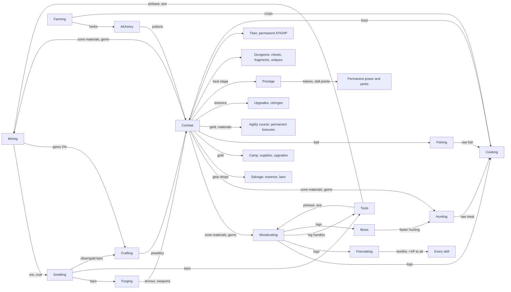

# Fantasy Idle — Game Design (v2)

This is the design the code in `src/` implements. Every number here comes from the code or from the
tools in `tools/`; if they disagree, the code is right and this file is stale. The evidence behind
each decision is in [`docs/reports/Fantasy Idle game design research.md`](reports/Fantasy%20Idle%20game%20design%20research.md)
and the six note files under `docs/research_notes/`. Nothing here is final — it is a tuned starting
point that the simulator can move.

**Contents:** [1 Vision](#1-vision-and-pillars) · [2 Core loop](#2-the-core-loop) · [3 Systems](#3-systems) ·
[4 Modifier pipeline](#4-the-modifier-pipeline) · [5 Balance](#5-balance-targets-measurements-and-knobs) ·
[6 Divergences from the research report](#6-where-this-differs-from-the-research-report) ·
[7 What was cut](#7-what-was-cut-from-the-concept) · [8 Code map](#8-code-map)

---

## 1. Vision and pillars

A browser idle RPG in the Melvor Idle / RuneScape tradition: you train gathering and production
skills, turn what you gather into gear, and use that gear to push through combat zones — then
prestige for permanent power and push further.

1. **Everything feeds something.** Every resource has at least one consumer, and combat hands
   materials back to the skills. No dead-end items (the prototype had five unused woods).
2. **Gear tiers are the spine.** Each metal tier roughly doubles power; a new tier is the big
   milestone of each stretch of play. Rarity adds flavour and affixes, never a bigger jump than a tier.
   Combat drops and dungeons are a second route to the same tiers, tuned to run beside crafting
   rather than past it.
3. **Idle is first-class, active is a bonus.** Leaving the game running (or closed, up to the
   offline cap) is the main way to progress, and leaving it alone for a minute earns the Focus bonus.
   Clicking and mini-games help — at most ~1.5× — but are never required.
4. **No permanent walls.** Every stall has at least two ways out: better gear (skills or drops), more
   combat levels (fighting), camp upgrades (gold), dungeons and the Titan, or prestige tokens.
5. **Honest numbers.** Every bonus shown in the UI goes through one modifier pipeline, so what the
   UI says is what the game does (the prototype's achievement rewards were text only).

## 2. The core loop



**Minute to minute:** one action runs at a time — a skill node, a workshop recipe, or combat
(starting one stops the other, like Melvor). **Hour to hour:** gather → smelt → forge the next
armour piece → push a zone → when a boss stops you, farm a dungeon, train the skill that gates your
next metal, or prestige. **Day to day:** prestige when a run stalls (the first one comes at about an
hour), spend skill points on perks, challenge the Titan when it wakes, claim banked daily crates,
let offline progress run overnight.

## 3. Systems

### 3.1 Skills and the XP curve

- **Curve:** the Old School RuneScape / Melvor table, `XP(L) = floor(¼ · Σ_{l=1}^{L-1} floor(l + 300·2^(l/7)))`,
  cap 99 (`src/core/xp.js`). Level 92 is the halfway point to 99 (13,034,431 XP). The prototype's
  `nextXp × 1.5` put mining 50 at 322 years of play; this puts it at ~2.5 hours.
- **Skills (12):** Mining, Woodcutting, Fishing, Hunting (gathering); Cooking, Firemaking, Alchemy
  (production); Farming (parallel, on the clock); Agility (a course you build); Smithing, Crafting
  (workshop); Combat (earned by fighting). Every skill's level matters — workshop levels gate recipes,
  farming levels open plots, agility levels open course slots, combat level gates wearing gear.
- **Nodes** (`src/data/skills.js`): XP per action grows ~15× across a skill while intervals grow
  only 1.4–2×, so XP/hour roughly doubles every 15 levels. Example (mining):

| Node | Level | Interval | XP | | Node | Level | Interval | XP |
|---|---|---|---|---|---|---|---|---|
| Copper | 1 | 3.0 s | 8 | | Mithril | 40 | 3.4 s | 48 |
| Iron | 10 | 3.0 s | 14 | | Gold | 50 | 3.6 s | 65 |
| Coal | 15 | 3.0 s | 18 | | Adamantite | 60 | 3.8 s | 88 |
| Silver | 30 | 3.2 s | 32 | | Runite | 75 | 4.2 s | 130 |

- **Interval model:** `interval = max(250 ms, base / (1 + Σ speed bonuses))` (`actionInterval`
  in `src/core/modifiers.js`). Speed bonuses add within the skill: tools, the Forager perk,
  achievements, pets, mini-game boosts and Focus.
- **Gems:** every mining action has a 2% chance to also yield a gem of roughly the rock's tier.

### 3.2 Resources and dependencies

`src/data/resources.js` defines 73 resources, and a test checks that every one has a consumer. Who
consumes what:

| Resource | Made by | Consumed by |
|---|---|---|
| Ores, coal | Mining, zone drops | Smelting (coal: 0 / 1 / 2 / 2 / 3 per bar for copper / iron / mithril / adamant / runite) |
| Bars | Smelting, salvaging crafted gear | Forging (1–5 per piece), tools, bows, jewellery (silver/gold only) |
| Gems | Mining (2%), zone drops, chests | Jewellery |
| Logs | Woodcutting, zone drops | **Cooking fuel (1 per dish)**, Firemaking, tool handles, bows and rods, agility obstacles, Defense potion (oak) |
| Raw meat | Hunting, zone drops | Cooking; Evasion potion (raw fox) |
| Raw fish | Fishing, zone drops | Cooking |
| Crops | Farming | Cooking (one potato, or two of the others, per dish) |
| Food | Cooking (meat, fish, farm dishes) | Combat auto-eat (smallest dish that fills the gap); Health potion (roast boar) |
| Herbs | Alchemy foraging, Farming, zone drops | Potions |
| Fishing bait | Zone drops (Marsh, Ruins, Frozen Wastes), the Shop | Fishing: one per catch, 50% chance of a second fish |
| Potions | Alchemy | Combat buffs (15 charges each) |
| Essence | Combat, salvaging drops, dungeon chests, the Titan, daily crates | Gear upgrades and reforges |

Sell prices: `base[category] × 1.6^(tier−1)` with bases ore 3, bar 8, gem 25, log 2, raw 3, food 6,
herb 4, crop 3, potion 30. Selling is a bootstrap; combat gold is the real economy (§3.8).

### 3.3 Tools

Crafted, not bought (`src/data/workshop.js`): pickaxes, axes, tinderboxes and hoes are forged in
Smithing; bows and fishing rods are made in Crafting. Each tier gives **+5% speed and +5% "double"
chance** to its skill (tier 5 pickaxe: +25% speed, 25% doubles). For the tinderbox the double is a log
that burns twice (XP and bonfire time); for the hoe, speed is crop growth and the double is a double
harvest. Tools are the main reason a gathering player visits the workshop and a smith visits the woods.

### 3.4 Workshop

- **Smelting:** 2.0–2.6 s per bar; smithing level 1 / 10 / 20 / 35 / 45 / 55 / 75 for copper / iron /
  silver / mithril / gold / adamant / runite; 10–90 XP per bar.
- **Forging:** 3 s per piece. Each metal has a base level (1 / 10 / 35 / 55 / 75) and each piece adds
  to it — Weapon +0, Boots +1, Gloves +2, Head +3, Shield +5, Legs +7, Body +9 — so a new metal starts
  with a sword and ends with a platebody, the way RuneScape's smithing ladder works. Bars per piece:
  Weapon 3, Shield 3, Head 2, Body 5, Legs 4, Boots 1, Gloves 1 (19 for a full set). XP = bars × 18 /
  30 / 57 / 90 / 135 per metal.
- **Jewellery:** 1 silver or gold bar + 1 gem → Ring, Earring or Amulet. The gem sets the base level
  (1 / 10 / 25 / 40 / 55 / 70) and most of the power; Earrings add +2 and Amulets +4 levels; gold bars
  need crafting 30. Silver and gold are jewellery-only metals.
- **Crafted gear rolls Common to Rare.** Epic and Legendary come only from combat (§3.5).

### 3.5 Equipment

`src/data/items.js`, generator in `src/core/formulas.js`, bag and actions in `src/systems/inventory.js`.

- **Base stats** = `5 × material power × slot multiplier × quality × variance(0.95–1.05)`.
  Material power: copper 1, iron 2.2, mithril 4.8, adamant 10.6, runite 23.4, and the two
  **drop-only tiers** Dragonbone 51 and Abyssal 112 (×2.2 per tier). Slot multipliers (ATK / DEF):
  Weapon 4/0, Shield 0/3, Body 0/3, Legs 0/2, Head 0/1.5, Gloves 0.7/0.7, Boots 0.3/1, Ring 0.8/0.8,
  Neck 1.2/1, Ear 0.6/0.6. Twelve slots (two rings, two earrings).

| Tier | Weapon ATK | Weapon + armour ATK / DEF (common) | Same, legendary | Wear at combat |
|---|---|---|---|---|
| Copper | 20 | 25 / 56 | 35 / 78 | 1 |
| Iron | 44 | 55 / 123 | 77 / 172 | 10 |
| Mithril | 96 | 120 / 269 | 168 / 376 | 25 |
| Adamant | 212 | 265 / 594 | 371 / 831 | 40 |
| Runite | 468 | 585 / 1,310 | 819 / 1,835 | 60 |
| Dragonbone (drop only) | 1,020 | 1,275 / 2,856 | 1,785 / 3,998 | 75 |
| Abyssal (drop only) | 2,240 | 2,800 / 6,272 | 3,920 / 8,781 | 90 |

- **Rarity = quality + affixes**, never a raw multiplier: Common ×1.00 / 0 affixes, Uncommon ×1.08 / 1,
  Rare ×1.16 / 2, Epic ×1.25 / 3, Legendary ×1.40 / 4. Because tiers are ×2.2 apart, **a common of
  tier N always beats a legendary of tier N−1** (a test enforces this). The prototype multiplied stats
  by up to 64× and let legendary copper beat runite.
- **Affixes** (8 kinds): crit chance, crit damage, attack speed, dodge, lifesteal, gold find, combat
  XP, max HP. Values roll once and scale +8% per tier. Totals are capped in the pipeline (§4).
- **Upgrades:** +5% base stats per level, max +10. Cost: `2 × level × tier` essence plus
  `4 × level × (gold per kill at your best stage)` gold, so the price keeps pace with gold income.
- **Reforge:** rerolls an item's affixes (not its rarity or base stats) for `3 × tier × min(10, 1 +
  reforges so far)` essence and 10 kills of gold.
- **Salvage:** dropped gear → essence (`ceil(0.8 × tier × (rarity rank + 1))`), crafted gear → ~40% of
  its bars back (whole bars, fair on average). Either way, half of the essence spent upgrading the
  item comes back.
- **Bag and lock:** 40 rolled items. Overflow auto-salvages the weakest unlocked item that isn't an
  upgrade; an auto-salvage filter (off / common / uncommon / rare) salvages low drops on arrival
  unless they are upgrades. Locked items are never sold or salvaged. Nothing is ever silently deleted.

### 3.6 Combat

`src/systems/combat.js`, formulas in `src/core/formulas.js`, stats in `src/core/modifiers.js`.

- **Timers:** player and enemy attack on independent timers (player 1.5 s base, min 0.5 s; enemy
  2.2 s at stage 1, −8 ms per stage, min 1.3 s). Large time steps resolve attacks in time order.
- **Player stats:** `ATK = (5 + gear ATK) × (1 + Σ ATK%) × token layer × camp layer`; DEF likewise
  without the unarmed 5; `max HP = (100 + 12 × (combat level − 1)) × (1 + Σ HP%) × token layer × camp layer`.
  Combat level gives +1.2% ATK and DEF per level (×2.18 at 99).
- **Damage taken:** `dmg = max(ATK_e² / (ATK_e + DEF), 10% of ATK_e, 1)`. DEF equal to the enemy's ATK
  halves damage, and no amount of DEF blocks more than 90%. The prototype subtracted DEF flat, which
  made the player immune until a boss's ×2 ATK suddenly killed them — every wall was a boss.
- **Crits:** 5% × 1.5 base; affixes and combo add. **Dodge**, **lifesteal** from affixes/potions.
- **HP:** no refill between enemies. Regen 0.1% of max HP per second in combat, 2% per second out of
  combat. **Auto-eat** below 50% HP (Gourmet perk raises it), "Auto" picks the smallest food that
  fills the gap. **Potions** hold 15 charges; one is used per player attack.
- **Clicks and combo:** clicking the enemy lands a half-damage hit (at most ~8 clicks/s count) and
  adds a combo stack (diminishing, max 30, decays after 1.5 s idle). Each stack is +3% damage; 10+
  stacks give +10% crit, 20+ give +15% lifesteal, 30 gives 20% echo strikes.
- **Boss timer:** a boss must fall within **30 seconds of fighting** (the clock only runs while you
  fight, so it works the same offline). If it holds out you step back one stage and farm there for
  60 seconds before it is retried automatically. Bosses are the DPS checks; regular stages test
  survival.
- **Death:** retreat to the start of the zone (a boss death sends you back 9 stages), HP set to 50%,
  combat stops. **Farm mode** keeps you on the current stage; the stage arrows let you move back.
- **Boss payouts:** a boss pays its bonus (gold ×3, XP ×5, its loot table) only on its **first fall
  in a run** — the kill that moves you on — and the Titan always does. A boss you farm after beating
  it, and every dungeon boss, pays like the regular monsters its health is worth (a ×3-health boss
  rolls regular loot three times). Parking on a boss is never the best farm.
- **Modes:** the same loop runs the stage ladder, a dungeon run or a Titan fight
  (`state.combat.mode` = `stages` / `dungeon` / `titan`).

### 3.7 Zones, enemies and loot

`src/data/zones.js`. Ten authored zones of ten stages; stage 10 of each is a boss. After stage 100
the Abyss repeats with a depth counter and steeper growth.

- **Enemy HP** = `25 × 1.075^(s−1)` to stage 100 (×2.06 per zone), then ×1.085 per stage.
  **Enemy ATK** = `5 × 1.065^(s−1)`, then ×1.075. **Bosses** ×3 HP, ×1.6 ATK.
- **Two tiers per zone.** `tier` is the zone's richness (material quantities, gems, boss essence);
  `gearTier` is the tier of gear that drops there. Prestige carries players through the early zones
  far faster than they can smith (stage 60 in ~1.5 h, mithril in ~2–4 h), so the gear tier follows
  the crafting timeline instead of the zone number: each zone drops about the tier a typical player
  crafts when they first get there, and a drop one tier up is the lucky case. The drop-only tiers
  live in the Abyss: Dragonbone from depth 3 (stage 121), Abyssal from depth 5 (stage 141).

| Stage | Zone | Enemy | HP | ATK | Gold (first fall) | Combat XP | Loot tier | Tokens if best |
|---|---|---|---|---|---|---|---|---|
| 1 | Sunlit Meadow | Slime | 25 | 5 | 6 | 3 | 1 | 0 |
| 10 | Sunlit Meadow | Goblin Chieftain (boss) | 143 | 14 | 107 | 168 | 1 | 1 |
| 30 | Glimmering Caves | Crystal Golem (boss) | 610 | 49 | 458 | 533 | 2 | 11 |
| 50 | Stormy Highlands | Orc Warlord (boss) | 2,594 | 175 | 1,946 | 912 | 2 | 27 |
| 70 | Ember Volcano | Ember Drake (boss) | 11,021 | 616 | 8,266 | 1,299 | 3 | 46 |
| 90 | Skyreach Spire | Thunder Roc (boss) | 46,818 | 2,173 | 35,114 | 1,691 | 4 | 70 |
| 100 | The Abyss | Abyss Warlord (boss) | 96,493 | 4,080 | 72,370 | 1,888 | 4 | 82 |
| 120 | Abyss — Depth 2 | Abyss Warlord (boss) | 493,280 | 17,332 | 369,960 | 2,287 | 5 | 110 |
| 130 | Abyss — Depth 3 | Abyss Warlord (boss) | 1,115,299 | 35,723 | 836,474 | 2,487 | 6 | 125 |
| 150 | Abyss — Depth 5 | Abyss Warlord (boss) | 5,701,460 | 151,748 | 4,276,095 | 2,891 | 7 | 156 |

- **Rewards per kill:** gold `0.25 × enemy max HP` (a boss's first fall ×3 on top of its ×3 HP);
  combat XP `3 × stage^1.05` (first fall ×5); a zone material with 35% chance (first-fall bosses
  always), quantity `1 + floor(zone tier / 3)`; a gem 3% (first-fall bosses 30%); essence 10% for 1–2
  (first-fall bosses 3–6 × zone tier / 2).
- **Gear drops:** 0.2% of regular kills, 50% of a boss's first fall. Tier = the zone's gear tier −1
  (60%) / same (35%) / +1 (5%). Rarity weights common → legendary: regular 50 / 35 / 12 / 2.5 / 0.5,
  boss 20 / 40 / 28 / 9 / 3, with epic and legendary ×(1 + 0.15 × (tier − 1)). An AFK fighter sees a
  few drops an hour and salvages most of them.
- **Zone loot tables** feed the skills at the zone's tier — e.g. the Forest drops iron ore, coal,
  oak logs and raw fox; the Volcano drops runite ore, yew logs and raw bear. Combat is never a dead end.

### 3.8 Economy: gold, camp and supplies

- **Sources:** combat kills (dominant), the Titan, selling materials and items, daily crates.
- **Sinks:** camp upgrades, gear upgrades and reforges (with essence), supplies, farming seeds, and
  agility obstacles and their upgrades — the long-term sink. In the simulator over 90% of gold is spent
  while the course is being built (the first ~50–90 hours), mostly on gear upgrades and agility; see
  §5.3 for the late game.
- **Camp** (`src/data/camp.js`) — the run-scoped power layer, bought with gold and **reset on
  prestige**: Whetstone +5% ATK, Armour Rack +5% DEF, Hearth +4% HP per level, multiplicative, max
  25 levels each (×3.39 / ×3.39 / ×2.67 when maxed), cost `base × 1.30^level` (60 / 60 / 50 base).
  It turns each new run into a climb and gives gold a job.
- **Supplies** (gold shop): coal, logs, herbs, rabbits, bait and the Essence Cache (10 essence for 80
  kills — the open-ended late-game sink) priced in "kills at your best stage"
  (25–40 kills), so the price scales with income and can never be resold at a profit (the
  prototype's Coal Wagon printed +350 gold per purchase).
- **Gold resets on prestige.** It is run currency, like Clicker Heroes' gold.

### 3.9 Prestige, tokens, skill points and perks

`src/systems/prestige.js`, `src/data/perks.js`.

- **Available** from stage 10. Resets: stage (restart at 10% of your all-time best), gold, camp.
  Keeps: skills, gear, tools, materials, essence, achievements, tokens, perks, pets, dungeon clears
  and fragments, Titans defeated, the agility course and farming plots.
- **Tokens** = `floor(((best stage this run − 5) / 5)^1.5)`: 1 at stage 10, 27 at 50, 82 at 100,
  156 at 150. Tokens are **held, never spent**; each is a permanent +0.5% ATK and DEF and +0.25% HP,
  in its own multiplicative layer. The Eternity achievement adds +10% tokens.
- **Skill points:** 1 per prestige, plus 1 for every 25 stages of all-time best (each threshold pays
  once). Spent on eight perks: Knight (+4% ATK), Warlord (+4% HP), Rogue (+3% attack speed), Forager
  (+3% skill speed), Scholar (+3% XP), Endurance (+2 h offline cap), Gourmet (+5% auto-eat threshold
  and food healing), Fortune (+5% gold and drop chance), and Paragon (+1% ATK, DEF and HP, 200 levels)
  so skill points always have a use once the others are full.
- **Why polynomial tokens:** see §6.1 — an exponential token formula ran away in the simulator.

### 3.10 Fishing, Firemaking, Farming and Agility

- **Fishing** (`src/data/skills.js`): seven spots from Shrimp Shallows (1) to Leviathan Deep (90),
  paced like Hunting. Fish cook into the best food per level (~10% more healing than meat). Each catch
  uses one **bait** if you have any, for a 50% chance of a second fish; bait drops in the wetter zones
  and the Shop sells tins. Rods (Crafting) are its tool.
- **Firemaking:** burns logs for XP (the log sink) and feeds the **bonfire**: each log adds 15 s × its
  tier, up to an hour, on the wall clock. While it burns every skill — combat included — earns +5% XP,
  rising to +10% at Firemaking 99. Tinderboxes (Smithing) are its tool.
- **Farming** (`src/data/farming.js`, `src/systems/farming.js`) — the first **parallel** skill: up to
  six plots (opening at levels 1, 1, 15, 30, 50, 70) grow on the wall clock while any other action runs
  and while the game is closed. Planting is a click and buys the seed at a flat price (25 gold for
  potatoes to 4,000 for starfruit); harvesting pays the crop and XP per unit. Eight crops: four herbs
  for Alchemy and potatoes, cabbages, pumpkins and starfruit for four new dishes. Harvest XP per
  plot-hour roughly doubles every ~15 levels. "Harvest ready & replant" replants the same crops.
  Hoes (Smithing) speed growth and can double a harvest.
- **Agility** (`src/data/agility.js`, `src/systems/agility.js`): a course of six slots (opening at
  levels 1, 10, 25, 40, 55, 70), each holding one of three obstacles. Building costs a fixed amount of
  gold — 20k, 200k, 1.5M, 10M, 60M, 300M, about an hour of one run's income where the slot opens — plus
  logs and bars (the last slot also 5 diamonds). Every obstacle is a **permanent bonus that survives
  prestige** (gathering or production speed, ATK/DEF/HP, gold, drops, crit, offline hours, workshop
  speed, farming yield, XP, attack speed, dodge, all-skill speed). Obstacles upgrade to **level 5**:
  each level adds the bonus again, costs the slot's price × 2^level and needs 7 more agility levels.
  Running the course is an action that takes as long as its obstacles together and pays their XP
  (+25% per obstacle level). Replacing an obstacle has no refund.

### 3.11 Dungeons and unique items

`src/data/dungeons.js`, `src/systems/dungeon.js`. A dungeon is an authored gauntlet: elite
monsters (×1.4 HP, ×1.15 ATK) and a boss (×1.5 on top of the boss multipliers) with a **60-second
timer**, fought with the gear you walk in with — gear is locked inside, and the run starts at full
health. Dying, leaving or running out of time loses the run; clearing it opens a chest, and
**Repeat** starts the next run. Runs continue offline.

| Dungeon | Opens at | Like stages | Boss (HP / ATK) | Chest loot tier | Unique |
|---|---|---|---|---|---|
| Goblin Warren | 20 | 25–31 | 984 / 52 | 2 | Goblin King's Crown (Head, tier 2) |
| Crystal Depths | 50 | 55–62 | 9,269 / 372 | 3 | Crystal Heart (Amulet, tier 3) |
| Orc Stronghold | 80 | 85–93 | 87,243 / 2,625 | 4 | Warlord's Cleaver (Weapon, tier 4) |
| Dragon's Lair | 120 | 125–135 | 2,515,540 / 51,285 | 6 | Dragonheart Plate (Body, tier 6) |

- **Placement:** each dungeon sits about where a typical player reaches its unique's tier by crafting,
  so a unique rewards farming a little early instead of skipping tiers.
- **Monsters pay like ladder monsters of the same health** (the boss too, §3.6), so the chest is the
  whole bonus: one **fragment** (3% chance of three), `0.5 × zone tier` essence, three material
  picks from the zone, a gem 50% of the time, and boss-quality gear of the chest tier 4% of the time.
  A strong hero clears a run in well under a minute, so a chest is never a jackpot.
- **Uniques:** 50 fragments assemble the dungeon's unique; a chest holds it outright 0.2% of the time.
  Uniques are Legendary with fixed affixes (the Crown: +15% gold find, +4% crit, +5% HP) and 10% more
  base power than their tier — the best piece of that tier, not a tier skip. They start locked and
  cannot be reforged.
- **Clear milestones** per dungeon, permanent: 25 clears +2% ATK and DEF, 100 clears +3% gold and drop
  chance, 250 clears +3% max HP.
- **Readiness:** the Dungeons tab estimates the boss fight (time to kill vs the timer, and how long you
  last without food), coloured green / amber / red.

### 3.12 The Titan

Once an hour (from stage 20) you may challenge the Titan: a **60-second damage race** at full health
against a boss with ten times a boss's health. Titan level L fights like stage `10 × (L + 1)` (level 1:
2,963 HP; level 10: 2.2 M HP). A win is permanent: **+2% ATK and max HP** per Titan defeated, plus
`8 × L` essence, 30 kills of gold at your best stage and two gems; the next Titan is stronger. A loss
pays essence for the share of health you took off. A Titan fight never survives a reload.

### 3.13 Pets and the collection

`src/data/pets.js`. One pet per skill (twelve, combat included), found at random while training and
kept forever. Melvor's formula: the chance per action is `action seconds × skill level / 25,000,000`, so the
expected wait is about `25,000,000 / level` seconds of training (~70 h at level 99) whatever the
action's speed; combat rolls once per kill as a 4-second action and farming once per harvest as an
action as long as the crop's growing time. Each pet gives +3% speed to its skill (Fang, the combat
pet: +3% ATK and DEF; Sprout, the farming pet: +3% growth speed). The Achievements tab lists pets and uniques as a collection.

### 3.14 Achievements, unlocks and the daily crate

- **Achievements** (`src/data/achievements.js`): 29, each with a named reward applied through the
  pipeline **plus** +1% ATK, DEF and skill speed per achievement (Antimatter Dimensions / Cookie
  Clicker "milk" pattern). Dungeon clears, Titans, pets, uniques, the new skills and a finished agility
  course have their own. A test checks that every bonus in the data is well-formed (the Forager perk
  once had a malformed bonus and did nothing).
- **Unlocks** (`src/data/unlocks.js`): tabs appear when a predicate on the state becomes true —
  Smithing after mining 5 times, Woodcutting after the first bar, Hunting at stage 5, Cooking after the
  first hunt, Fishing after 5 dishes, Firemaking after 20 logs, Alchemy / Shop / Prestige /
  Achievements at stage 10, Dungeons at stage 20, Agility at stage 30, Farming after 10 Alchemy actions
  or Cooking 15, Crafting at mining 20 or the first gem. The header shows the next goal. Settings has a developer switch (and
  `?dev=1`) that unlocks all.
- **Daily crates** (`src/systems/daily.js`): one ripens every 20 hours and **up to three wait for
  you**, so a missed day costs nothing; no streaks. A crate holds 40 kills of gold at your best stage,
  12 materials and a gem from that zone, and `3 × zone tier` essence.
- **Next steps** (`src/systems/advisor.js`): up to four suggestions from the state, most urgent
  first — a ready crate, a waking Titan, a unique ready to assemble, unspent skill points, an upgrade
  in the bag, the next piece to forge, food, an affordable camp upgrade, the next tool, a prestige
  worth taking, the skill gating the next metal, a newly opened dungeon, ready or empty farming plots,
  an affordable agility obstacle, the next unlock.

### 3.15 Active play: mini-games and Focus

- **Mini-games** (`src/systems/minigame.js`) are **opportunities**, not a job: while you train a
  gathering or production skill, a first chance appears after 45–90 seconds and then one every 3–6
  minutes, each open for 20 seconds.
  A win gives +35% skill speed for 90 seconds (+5% per consecutive win, up to +55%); a miss costs
  nothing but the streak. A fully attentive player gains roughly +15% on average.
- **Focus** (Clicker Heroes' idle ancients): after **60 seconds without a click or key press** the hero
  settles in — +15% skill speed and +15% attack speed until the next input. It also applies to offline
  progress, so leaving the game alone is never strictly worse than clicking.

### 3.16 Offline progress

`src/systems/offline.js`. On load (and when a tab wakes after a minute or more) the game replays the
time away with **the same code as online play**, silently: skill actions complete one by one
(consuming inputs, stopping when they run out), workshop actions forge real items, and combat —
including a dungeon run on repeat — is replayed in 1-second steps with food, potions, the boss timer
and death. Farming plots and the bonfire run on timestamps, so they need no replay. Capped at
**12 hours** (+2 h per Endurance perk, up to 24 h, +1 h from the Zipline). Absences under a minute
are ignored. The "Welcome back" summary lists gains, materials used, levels, dungeon clears, pets,
plots ready to harvest, and why work stopped early.

### 3.17 Saves, cloud and the API

- **Local save** (`src/core/save.js`): `localStorage['fantasyIdle.save.v2']`, versioned
  (`state.version = 3`), autosaved every 15 s and when the tab is hidden or closed. Prototype saves
  (`fantasyIdleSaveLocal`) are migrated on first load; v2 saves gain the banked daily crate.
  Broken records (an unknown dungeon, a missing Titan or pet record) load as defaults.
- **Backups:** three rotating automatic backups (every 10 minutes) plus one on load, one before each
  prestige and one before a hard reset, restorable from Settings.
- **Export/import:** `FI3:` compressed text (or `FI2:` base64 JSON); saves from a newer version are
  refused.
- **Cloud (optional):** the game works as a guest. Signing in uses the real API (`api/index.js`):
  bcrypt passwords, JWTs that expire after 30 days, validated usernames and passwords, 1 MB body cap,
  version-checked saves. The client uploads every 60 s. When a local and a cloud save disagree it
  prefers more play time, and asks the player if the save timestamps disagree with that. On a static
  host without the API, sign-in says cloud saves are unavailable instead of failing.
- **Server secret:** `JWT_SECRET` must be set in production; the old hard-coded fallback is gone.
- **Time away is measured on the server's clock** for cloud saves: `/api/load` returns the time of the
  last upload and the server's current time, and the client replays exactly that gap, so changing the
  device clock doesn't buy offline progress.
- **Plausibility flags:** each upload is compared with the previous one (play time growing faster than
  real time, XP beyond any possible rate, best stage or tokens going down). Nothing is rejected — the
  save belongs to the player — but flagged accounts are left out of leaderboards for 30 days.

### 3.18 Clans and leaderboards

`api/index.js` (routes), `api/store.js` (all SQL), `src/core/power.js` (the numbers). Everything is
asynchronous and **every number another player sees is computed on the server from the stored save**
with the game's own stat code; the client never submits damage or scores.

- **Clans** of up to 20, with a name, tag, description and "looking for" line; the longest-serving
  member takes over if the owner leaves, and the last one out closes the clan.
- **The weekly clan boss** (ISO weeks, UTC). Its health is set when the week's boss first appears:
  12 × the members' combined attack. Every member has **three attacks a day** (enforced by a unique
  per-player-per-day slot, so parallel requests or switching clans don't add more); an attack uploads
  the save and deals what that hero does in 60 seconds (`expectedDps × 60`, no dice, Focus, potions or
  timed boosts). Rewards, claimed from the Clan tab: 100 essence and 2 diamonds to everyone who fought
  when the boss falls, 50 essence and a diamond for the last hit, and when the week ends 50 essence for
  taking part plus 100 / 60 / 30 essence and a diamond for the top three. Claiming twice pays once.
- **Leaderboards** are opt-in with a plain-language consent line: username plus best stage, total
  level, Titans or dungeon clears, all time or this week (from each player's first save of the week).
- **Polling:** the Clan tab refreshes on opening and then at most once a minute, only while it is open.
  A Discord invite link appears if `DISCORD_INVITE` (`src/data/social.js`) is set — there is no in-game
  chat.

### 3.19 Weekend events

`src/data/events.js` (content), `src/systems/events.js` (logic). A template for timed content that
needs no server: the schedule is the UTC calendar, so events run offline too.

- **When:** every weekend, Friday 00:00 to Monday 00:00 UTC. Four events rotate week by week:
  **Harvest Festival** (+25% farming yield, +15% cooking and fishing speed), **Titan's Fury** (+20%
  combat XP and gold, +10% drop chance), **Miner's Rush** (+20% gathering speed, +10% XP in every
  skill) and **Guild Fair** (+20% smithing, crafting and firemaking speed, +5% crafted quality). The
  bonuses go through the modifier pipeline like any other source. None of them touch combat stats, so
  clan damage is the same during an event.
- **Festival Tokens:** every 20 skill actions or kills earn one (a harvest counts as 5), up to 60 a
  day (UTC), so a weekend pays at most 180 and nobody has to grind past a normal session. Tokens keep
  between events.
- **Milestones** per event, paid automatically: 50 tokens → 100 essence, 100 → 200 essence and a
  diamond, 150 → 300 essence and two diamonds.
- **The event shop** (open only while an event runs): 60 essence for 20 tokens, a diamond for 40,
  100 bait for 10, ten of each herb for 15, ten runite bars for 60.
- **Adding an event** is one entry in `EVENTS` (id, name, icon, colour, description, `mods`). For
  testing, `?dev=1&event=<id>` runs one immediately; it is never kept in the save.

## 4. The modifier pipeline

`collectModifiers(state)` in `src/core/modifiers.js` gathers every bonus — gear and affixes, combat
level, perks, achievements, pets, dungeon milestones, Titans defeated, agility obstacles (× their
level), potions, tools, mini-game boosts, the bonfire, a running weekend event and Focus — into one
object; `deriveStats` turns it into the numbers combat and skilling use.
Rules:

1. **Inside a layer, percentages add.** All of the sources above add into `ATK%`, `DEF%`, `HP%`,
   `skillSpeed[skill]` and so on.
2. **Layers multiply:** content layer × **token layer** (`1 + 0.005 × tokens`) × **camp layer**.
3. **Caps:** crit chance 75%, dodge 60%, lifesteal 30%, attack speed +100% (attack interval ≥ 0.5 s),
   damage mitigation 90%, action interval ≥ 250 ms.
4. **Derived values are never saved** — they are recomputed from state, so a balance change applies
   to existing saves on the next load.

## 5. Balance: targets, measurements and knobs

### 5.1 Pure skill pacing

`node tools/pacing.mjs` — hours of continuous training with the best node, no boosts:

| Skill | Lv 10 | Lv 20 | Lv 30 | Lv 50 | Lv 75 | Lv 90 | Lv 99 |
|---|---|---|---|---|---|---|---|
| Mining | 7m | 17m | 42m | 2.6h | 17h | 54h | 123h |
| Mining + tools | 7m | 16m | 39m | 2.3h | 14h | 44h | 99h |
| Woodcutting | 6m | 18m | 43m | 2.9h | 18h | 57h | 129h |
| Fishing | 6m | 19m | 45m | 3.0h | 20h | 62h | 121h |
| Fishing + tools | 6m | 18m | 41m | 2.7h | 16h | 49h | 94h |
| Hunting | 6m | 20m | 47m | 3.2h | 21h | 65h | 126h |
| Cooking | 3m | 10m | 22m | 1.7h | 11h | 37h | 72h |
| Firemaking | 2m | 8m | 18m | 1.3h | 8.4h | 26h | 58h |
| Alchemy (foraging only) | 7m | 20m | 43m | 3.2h | 23h | 93h | 224h |
| Smithing (smelting only) | 4m | 10m | 24m | 1.8h | 14h | 48h | 109h |
| Smithing (mine → smelt → forge) | 4m | 15m | 43m | 4.6h | 34h | 119h | 275h |
| Farming (every plot, harvested on time) | 31m | 1.4h | 2.9h | 9.4h | 39h | 125h | 286h |
| Agility (a full course at each level) | 6m | 18m | 44m | 3.7h | 25h | 89h | 208h |

Targets from the research: Lv 20 ≤ 15 min (close: 10–20 min), Lv 50 in 2–4 h (met), Lv 99 in
150–400 h (**faster** for most skills: 72–129 h — raise node XP less steeply if 99 should take
longer). The full smithing pipeline, Farming and Agility are on target; Firemaking is quick because
it is limited by how fast you can cut the logs it burns.

### 5.2 Whole-game simulation

`node tools/simulate.mjs --hours=150 --seed=N` plays the game through the same `Game` API as the UI,
with a "sensible player" policy: gear up (forging a piece only if it beats what it wears), keep food
stocked, fight until stalled; when stalled, alternate between farming the deepest dungeon it clears
comfortably (while its chests or unique still help) and training whatever gates the next metal tier;
challenge the Titan whenever it wakes; tend the farm; build and upgrade the agility course (training
agility up to a quarter of the time); prestige when a run stalls and adds a fair share of the tokens
it holds (15% early, ~2% at 7,000 tokens). Three seeds, 150 hours each:

| Milestone | Seed 1 | Seed 2 | Seed 3 |
|---|---|---|---|
| First prestige | 0.8 h (stage 37, +16 tokens) | 0.8 h (stage 37, +16) | 1.3 h (stage 50, +27) |
| Stage 50 / 100 / 120 | 1.1 / 5.0 / 7.9 h | 1.1 / 6.0 / 8.2 h | 0.9 / 6.0 / 7.7 h |
| Stage 150 · best at 150 h | 31.6 h · 179 | 15.1 h · 190 | 53.1 h · 200 (at 140 h) |
| Weapon tier 3 / 4 / 5 / 6 | 3.1 / 4.8 / 14.3 / 31.4 h | 6.6 / 7.6 / 11.5 / 15.6 h | 4.2 / 7.6 / 14.1 / 71.8 h |
| Crown / Heart / Cleaver / Plate | 1.7 / 4.0 / 6.9 / 35.6 h | 1.7 / 4.2 / 7.6 / 18.2 h | 1.9 / 4.0 / 7.5 / 54.8 h |
| Titans defeated by 12 h · by 150 h | 10 · 15 | 9 · 17 | 10 · 17 |
| Agility obstacles 1 / 4 / 6 | 1.4 / 21.5 / 92.1 h | 1.4 / 15.8 / 54.8 h | 1.7 / 23.4 / 71.4 h |
| Mining 50 / 75 | 14.0 / 31.5 h | 13.6 / — | 15.3 / 30.3 h |
| Smithing 50 / 75 | 15.9 / 56.8 h | 13.9 / 31.8 h | 15.5 / 65.3 h |
| Farming 50 / 75 · Agility 50 / 75 | 10.3 / 32.3 · 37.1 / 97.2 h | 10.3 / 34.3 · 20.0 / 77.5 h | 9.8 / 30.7 · 36.8 / 104.9 h |
| Combat 99 | 46.6 h | 34.5 h | 72.9 h |
| Prestiges in 150 h | 124 | 132 | 146 |
| Deaths on non-boss stages | 69% | 19% | 34% |

**Play styles.** The same simulator with other policies, to check that no style dominates
(`--no-dungeons --no-titan` = a skiller who only fights to push; `--farm-ladder=push` = an AFK player
who keeps fighting at the wall instead of running dungeons; `--farm-ladder` = farm the highest
comfortable stage instead):

| Style (seeds 1–3) | Stage 100 | Stage 120 | Stage 150 | Weapon tier 4 / 5 |
|---|---|---|---|---|
| Skiller | 10.8–12.5 h | 145 h or later | — | 11–12 h / 88 h |
| AFK pusher | 8.5–9.2 h | 13.3–14.5 h | 76–85 h | 14–37 h / 19–32 h |
| Ladder farmer | 12.3–20.5 h | 26–31 h | — | 9–20 h |
| Sensible (dungeons + Titan) | 5.0–6.2 h | 7.9–9.0 h | — (plateau 130–140) | 4.3–7.6 h / 8–11 h |

Dungeons were tuned to about 1.5× the progress of spending the same time pushing the ladder (they
are the active choice when a run stalls); the Titan alone brings a skiller's stage 100 forward by one
to four hours (6.8–11.2 h instead of 10.8–12.5 h). Farming a comfortable stage is weaker than pushing
— the first fall of each boss is worth the risk.

### 5.3 Known risks

- **The Abyss is a crawl on purpose.** Tokens grow polynomially with the stage and enemies ~8.5% per
  stage, so past ~150 each prestige at the wall adds only a few percent of power and the ladder moves
  ~10 stages per 20–40 hours (stage 180–200 at 150 h). By then the goals are skills to 99, pets,
  obstacle upgrades, Abyssal gear and the Paragon perk. A player who stops prestiging stops moving —
  the simulator did exactly that until its prestige rule scaled with the tokens it holds.
- **Late-game gold is mostly lost to prestige.** Sinks take over 90% of income while the agility
  course is being built (the first ~50–90 h); after that income dwarfs the bounded sinks and 60–90%
  of gold is still in hand when a run resets. That is what run currency does; the Essence Cache
  (Shop) is the open-ended place for it, and the prestige screen says so.
- **Drop-only tiers arrive with combat time.** The AFK pusher finds Dragonbone at ~37 h and Abyssal at
  57–99 h, before a skiller forges runite (~88 h). That is the combat route's reward, but watch it.
- **Bosses are the walls.** Since the 30-second boss timer, bosses are DPS checks and most deaths
  happen on boss stages for two seeds out of three (the Phase 1 target was at least half on regular
  stages). A boss that outlasts the timer is not a death, so the timer already absorbs most of the
  boss walls; if regular stages should bite more, raise `atkGrowth` rather than boss HP.
- **Level 99 is fast** relative to Melvor (see §5.1).
- **The simulator's player is simple.** It never uses mini-games, clicks or potions, buys perks in a
  fixed order, and only enters dungeons it clears comfortably. Treat its numbers as a floor for an
  engaged player.

### 5.4 Tuning knobs

| What you want | Change | File |
|---|---|---|
| Faster/slower skills | node `xp` / `interval` | `src/data/skills.js` |
| Walls earlier/later | `BALANCE.enemy.hpGrowth`, `atkGrowth`, boss multipliers, `bossTimeMs` | `src/core/formulas.js` |
| Bigger gear jumps | `GEAR_TIERS` power | `src/data/items.js` |
| More/fewer gear drops | `GEAR_DROP_CHANCE`, `DROP_*` weights; zone `gearTier` | `src/data/items.js`, `src/data/zones.js` |
| Dungeon rewards | `CHEST_*`, `FRAGMENTS_PER_UNIQUE`, `DUNGEON_MILESTONES`, placement | `src/data/dungeons.js` |
| The Titan | `TITAN_*` | `src/data/dungeons.js` |
| Pet rarity | `PET_BASE` | `src/data/pets.js` |
| Farming | crop `growMs`, `yield`, `xp`, `seedGold`; `FARMING_PLOTS` | `src/data/farming.js` |
| Agility | slot `costGold`, `materials`, obstacle `mods`; `MAX_OBSTACLE_LEVEL` | `src/data/agility.js` |
| The bonfire | `BASE.bonfire*` | `src/core/modifiers.js` |
| More/less gold | `BALANCE.rewards.goldPerHp`; camp `growth`, `max` | `formulas.js`, `src/data/camp.js` |
| Stronger prestige | `BALANCE.prestige.token*`; `BASE.tokenAtk` | `formulas.js`, `src/core/modifiers.js` |
| Offline length | `BASE.baseOfflineHours`; Endurance perk | `modifiers.js`, `src/data/perks.js` |
| Active-play weight | `BALANCE.minigame`; `BASE.focus*` | `formulas.js`, `modifiers.js` |

After any change: `node --test test/*.test.mjs test/*.test.cjs`, `node tools/pacing.mjs`, and a
couple of `node tools/simulate.mjs --hours=150 --seed=N` runs (add `--farm-ladder=push` and
`--no-dungeons` to compare play styles).

## 6. Where this differs from the research report

The report ([Redesign section](reports/Fantasy%20Idle%20game%20design%20research.md#the-redesign-change-these-formulas-add-these-systems-cut-these))
recommends formula *shapes* and asks for them to be tuned in a simulator. Where the simulator
disagreed, the implementation follows the simulator:

1. **Prestige tokens.** The report proposes `tokens = 2^((S−10)/5)` with +10% power per token, so
   prestige power grows at the enemy's rate. An exponential formula of this kind
   (`0.75 × 2^(S/10)`, +1% per token) was implemented first; within 20 simulated hours it reached
   10¹¹ tokens and stage 350, because camp upgrades and HP-proportional gold compound on top of it.
   The game uses `((S−5)/5)^1.5` with +0.5% per token instead, and relies on gear tiers and the camp
   for within-run growth.
2. **Enemy growth.** The report keeps ×1.15 HP per stage. This design uses ×1.075 (×2.06 per zone)
   for the authored stages so the ×2.2 gear tiers set the pace and numbers stay readable (a stage 100
   boss has 96k HP instead of 5×10⁷), then ×1.085 in the Abyss.
3. **Boss timer** (30 s) as the report suggests, but a timeout steps back one stage for a 60-second
   regroup instead of resetting the zone; dying still retreats to the zone start.
4. **One gold currency, reset on prestige,** instead of separate skilling and combat gold. Material
   sale prices are small enough that the split wasn't needed yet.
5. **Skill points kept** as eight perks (the report folds them into achievements) — they are the
   main build choice in the game right now. The token shop is gone: tokens are held, not spent.
6. **Camp capped** at 25 levels with ×1.30 cost growth (report: ×1.07, uncapped with milestones) —
   the uncapped version ran away in the simulator.
7. **Coal per bar** 1 / 2 / 2 / 3 for iron / mithril / adamant / runite (report: 4 / 6 / 8 for the top
   three), because smithing was the bottleneck.
8. **Tools are crafted, not bought** — more interlock between skills than a gold shop.
9. **Fewer gear drops.** The report suggests trash tables with ≤ 1% gear and bosses at 100%. Regular
   kills drop gear 0.2% of the time and a boss's first fall 50%, and each zone's gear tier follows the
   crafting timeline rather than the zone number, because prestige carries players through zones far
   faster than the report's model assumed and 1% let an AFK fighter out-gear crafting by two tiers.
10. **Fragments:** 50 per unique at one per dungeon clear (report: 10 per item at 3–12% per kill) —
    a similar number of kills (~450 vs 80–330) with a steadier bar.
11. **Boss payouts by health** — not in the report; added when the simulator showed that farming a
    boss (or a dungeon's) beat every other way to farm.
12. **Offline cap 12 h** (+2 h per Endurance level, up to 24 h) instead of a flat 24 h, so the perk
    has something to give.
13. **Mini-game numbers:** +35–55% for 90 s every 3–6 min (report: +50–100% for 60–120 s every
    3–8 min), plus the idle Focus bonus so that active play stays optional.
14. **Seeds cost a flat price** and **agility obstacles fixed gold amounts**, not "kills at your best
    stage" like the gold shop: gold resets on prestige and a new run earns far below best-stage rates,
    so best-stage pricing made permanent purchases nearly impossible to save for (and made farming
    depend on combat progress). Fixed prices also gate the later obstacles by progress naturally.
15. **Clan boss damage is a formula, not a replayed fight:** the server multiplies the hero's expected
    DPS by 60 seconds. It is deterministic and cheap, and nobody can reroll it.
16. **Events use the calendar, not the server:** a fixed weekend window in UTC with a daily token cap,
    so they work offline and cost no requests. A player can move their clock to reach one early;
    that only buys tokens for essence and diamonds, which don't show on any leaderboard.
17. **Not yet built:** mastery (optional).

## 7. What was cut from the concept

| Cut | Why |
|---|---|
| `nextXp × 1.5` XP curve | Levels above ~25 were unreachable in a lifetime |
| Rarity multipliers 1–8× (applied twice) | Legendary copper beat common runite; ×64 stats |
| Flat DEF subtraction, HP refill on every spawn | Made every wall a boss; food had no job |
| `stage^1.5` tokens spent in a doubling-cost shop | Plateaued after 3–6 prestiges |
| Token shop ("Blade of Damocles", "Book of Shadows") | Replaced by held tokens + perks |
| Coal Wagon at a loss-making price, Healing Potion | Infinite gold loop; HP already refilled |
| Mock login ("Local Login Success") | Replaced by guest play + a real optional account |
| Clan tab with fake players and chat, "Clan War Raid" | Placeholder UI implied features that don't exist; a clan system is on the roadmap |
| Fish foods in the auto-eat list, duplicate `auto-eat-select` | Items that didn't exist |
| Forced unlock override and hidden tutorial banner | Replaced by predicate unlocks and a goal hint |
| "Combat Lv" = highest prestige stage | Combat is now a real skill |
| Drag-and-drop inventory ordering | Dropped in the rewrite; inventory is sorted by power instead. Easy to bring back if wanted |
| `alert()` errors | Replaced by toasts |

## 8. Code map

```
index.html            page shell (sidebar, header, tab, toasts, modals)
style.css             styles (original theme + v2 layout, mobile tab strip, reduced motion)
src/main.js           browser bootstrap: loop, render-on-change, saves, backups, cloud, window.FI handlers
src/game.js           Game facade: state + tick + every player action (no DOM)
src/core/             xp · rng · state (defaults, migration) · modifiers · formulas · save (backups, export,
                      cloud client) · power (server-side numbers)
src/data/             resources · skills · workshop · items · zones · camp · perks · achievements · unlocks
                      · dungeons (dungeons, uniques, the Titan) · pets · farming (plots, crops) · agility
                      · events (weekend events, milestones, shop) · social (clan settings)
src/systems/          skilling · combat · dungeon (runs, chests, Titan) · inventory (bag, salvage, reforge)
                      · farming · agility · prestige · camp · minigame · offline · daily · advisor
                      · events · social (clan rewards) · progress (XP, pets, log)
src/ui/               render.js (HTML per tab) · format.js (numbers, time)
api/                  Express API for Vercel on Vercel Postgres: index.js (routes: accounts, saves, clans,
                      rewards, leaderboards) · store.js (every query) · database.js (the connection)
test/                 node:test suites (game, loot, endgame, skills, events, saves, API; the API suite runs on an
                      in-memory store, or on a real Postgres with API_TEST_DATABASE_URL set)
tools/                simulate.mjs (whole-game balance sim, play styles) · pacing.mjs (skill pacing table)
docs/                 DESIGN.md (this) · ROADMAP.md · reports/ · research_notes/
```
